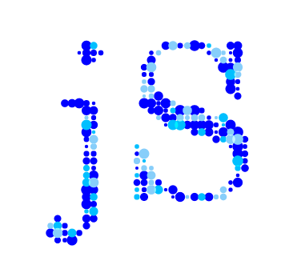

<div align="center">
<a href="https://www.jowoscript.web.id/" target="_self">
</img>
</a>
</div>
<div align="center">
<strong>
	PT JowoScript Technology Indonesia - The Hectocorn Values
</strong>
<br>
<strong>
	JowoScript | JowoStyle | Jowo Kingdom Machine | Kingdom Studio | Jowo Kingdom Server | Structured Query Jowo Language
</strong>
<br>
<strong>
	Introduction
</strong>
<br>
<strong>
	Hectocorns symbolize the enormous potential of a startup if it has the right product
</strong>
<br>
<strong>
	 Hectocorn startups have a higher value than US$ 100 billion dollars or about Rp 1501.5 trillion rupiah 
</strong>
<br>
<strong>
	my product still baby i know but you can see 10 years into the future between microsoft value more than US$ 2 trillion dollars and google value more than US$ 2 trillion dollars and my product 🙂🙂🙂🙂🙂🙂🙂🙂
</strong>
</div>
</div>

## PT JowoScript Technology Indonesia products list :
<div align="justify">
<ol>
	<li>JowoScript is The cross platform an front end programming language typing less, compile language, complex structure, small size and faster [file extension *.JOWO type JowoScript] (license must be purchased to activate all the features)</li>
	<li>Jowo Kingdom Machine is The cross platform an backend programming language with new methods to advancing complex data scientists, advancing complex data processing, and advancing complex enterprise applications [file extension *.JKM type Jowo Kingdom Machine] (license must be purchased to activate all the features)</li>
	<li>Kingdom Studio is The cross platform an integrated development environment [file extension *.KSS type Kingdom Studio Solution] (license must be purchased)</li>
	<li>Jowo Kingdom Server is The cross platform an server host (license must be purchased to activate all the features)</li>
	<li>Structured Query Jowo Language is The cross platform an query programming language [file extension *.SQJL type Structured Query Jowo Language] (license must be purchased to activate all the features)</li>
	<li>JowoStyleSheet is programming language for a pattern core of computation style sheet programming language used for describing the presentation of JowoScript programming language [file extension *.JS3 type Jowo Style Sheet] (license must be purchased to activate all the features)</li>
</ol>
</div>
<br>
<div align="center">
<strong>
	JavaScript and Java Virtual Machine is old concept
	<br>
	The new is JowoScript and Jowo Kingdom Machine the powerfull of native code of native jowo and super power of new technology concept that brings the future (license must be purchased)
	<br><br>
	The intellectual patent by Muhammad Nurcahyo Pratomo cannot be contested by any party, either in the future or now
</strong>
</div>
<br><br>
<details>
<summary><b>After (license be purchased) Support Technology :</b></summary>
<div align="justify">
<ul><li>Kingdom Studio Run and Debug binary code Jowo Kingdom Machine inside file extension *.JKM with type of binary code and deploy pack *.JKLASS with type of binary code</li>
<li>Kingdom Studio Run and Debug binary code Structured Query Jowo Language inside file extension *.SQJL with type of binary code</li><li>Kingdom Studio Run and Debug JowoScript of compile inside file extension *.JOWO with type of application/jowoscript or text/jowoscript</li><li>Kingdom Studio Run and Debug JowoStyle of compile inside file extension *.JS3 with type of application/jowostyle or text/jowostyle</li><li>JowoScript Technology and JowoStyle Technology undefined technology the mean is cannot be detected by third-party technology or the like because the source code of JowoScript Technology is end-to-end encryption, meaning that it is not easily read by bad hackers or cybercriminals.</li><li>Responsive mode user interface (Meaning i.e. when your design is in tablet mode, mobile or phone mode, television mode, LCD(Liquid Crystal Display) mode and laptop mode)</li><li>Native platform (For example, a cross-platform application may run on Microsoft Mobile, Microsoft Windows, Android, z/OS, Linux OS, Unix OS, iOS and macOS)</li><li>Smart automatic detection error in javascript engine</li><li>Smart automatic detection error in jowoscript engine</li><li>Smart automatic detection error in jowo kingdom engine</li><li>Handling array of objects and decided multiple of attributes and pseudo</li></ul>
</div>
</details>

```html
/*
 * $.version 	: xx.xx.xx
 * $.owner 	: Muhammad Nurcahyo Pratomo
 * $.creator	: Muhammad Nurcahyo Pratomo
 * $.architect	: Muhammad Nurcahyo Pratomo
 * $.author	: Muhammad Nurcahyo Pratomo
 * $.founder	: Muhammad Nurcahyo Pratomo 
 * $.developer	: Muhammad Nurcahyo Pratomo
 * $.copyright	: PT JowoScript Technology Indonesia
 * $.license 	: After (license be purchased) to Licensed under privilege of purchaser's license name. Example your company name or organization name or government name
 * $.legality 	: After (license be purchased) to Licensed under privilege of purchaser's legality name. Example your company name or organization name or government name
 */

Example :
global attribute 	: $("*object global attribute value");
mnp attribute		: mnp("mnp^object"), jowo("mnp^object"), mnp("^object"), jowo("^object");
jowo attribute		: mnp("jowo*object"), jowo("jowo*object"), mnp("*object"), jowo("*object");
jawa attribute		: mnp("jawa@object"), jowo("jawa@object"), mnp("@object"), jowo("@object");
id attribute		: mnp("id*object"), jowo("id*object"), mnp("id^object"), jowo("id^object"), mnp("id@object"), jowo("id@object"), mnp("#object"), jowo("#object");
class attribute		: mnp("class*object"), jowo("class*object"), mnp("class^object"), jowo("class^object"), mnp("class@object"), jowo("class@object"), mnp(".object"), jowo(".object");
name attribute		: mnp("name*object"), mnp("name^object"), mnp("name@object");
array of attribute 	: mnp("[ jowo*object, [jowo*object], element[attribute], node[node] ]")	mnp("element[attribute="value"], [attribute="value"], [attribute="value"] [attribute]");
array of pseudo		: mnp("[ element:pseudo, node:pseudo ], element:pseudo node:pseudo object:pseudo ");
```
<br>
<div align="center"><strong>Architecture of Jowo Kindom Machine</strong></div>
<details>
<summary>Click to view image</summary>	

</details>
<br>
<div align="center"><strong>Architecture of *JowoScript Technology and *JowoStyle Technology</strong></div>
<details>
<summary>Click to view image</summary>	

</details>
<br>
<div align="center"><strong>Installation information</strong></div>
<details>
<summary>Installation iOS - MacOS</summary>

```java
//Let's call class WKWebViewConfiguration(), WKWebView(frame, config), URL(url root) and URLRequest(base string url)
import UIKit
import WebKit
class ViewController: UIViewController, WKUIDelegate {
    var webView: WKWebView!
    override func loadView() {
        let webConfiguration = WKWebViewConfiguration()
        webView = WKWebView(frame: .zero, configuration: webConfiguration)
        webView.uiDelegate = self
        view = webView
    }
    override func viewDidLoad() {
        super.viewDidLoad()        
        let myURL = URL(string:"jowo-script.jowo")
        let myRequest = URLRequest(url: myURL!)
        webView.load(myRequest) //Load from url base webview class
	webView.loadHTMLString("<script>jowo.technology</script>", baseURL: myURL)
	//Result : JowoScript Technology
    }
}
```
iOS - MacOS, More information you can look at [here](https://developer.apple.com/documentation/webkit/wkwebview)
</details>
<details>
<summary>Installation server side Liferay Framework</summary>
	
```java
//Call this class JSTopHeadDynamicInclude extends BaseDynamicInclude (include, register)
@Component(immediate = true, service = DynamicInclude.class)
public class JSTopHeadDynamicInclude extends BaseDynamicInclude {
	@Override
	public void include(HttpServletRequest request, HttpServletResponse response, String key)
		throws IOException {
		PrintWriter printWriter = response.getWriter();
		String content = "<script href=\"http://localhost:8080/../../js/jowo-script.jowo\" type = \"text/javascript\" />";
		String jowoScript = "jowo.technology" type = \"text/javascript\" />";
		printWriter.println(jowoScript);
		//In console IDE like eclipse, rational application developer, jetbrains, netbeans, browser environment, etc. 
		//Result : JowoScript Technology
	}
	@Override
	public void register(DynamicIncludeRegistry dynamicIncludeRegistry) {
		dynamicIncludeRegistry.register("/html/common/themes/top_js.jspf#resources");		
	}  
}
```
Liferay Framework, More information you can look at [here](https://help.liferay.com/hc/en-us/articles/360018165751-Top-JS-Dynamic-Include-)
</details>
<details>
<summary>Installation Zkoss Framework</summary>
	
```javascript
<zk>
<script type="text/javascript" src="jowo-script.jowo"></script>
<window title="sample jowo script" border="none" width="100%" closable="true">	
	<script type="text/javascript">
		jowo.technology
	</script>
	//Result : JowoScript Technology
</window>
</zk>
```
</details>
<details>
<summary>Installation Android</summary>
	
```java
webview.loadDataWithBaseURL("file:///android_asset/javascript/jowo-script.jowo", page, "text/javascript", null, null);
```
Android, More information you can look at [here](https://developer.android.com/guide/webapps/webview#kotlin)
</details>
<details>
<summary>Installation Microsoft DOT NET</summary>

```cs
/* Let's call this function in server side */
/* 
@Function method call in server side
public string GetWebResourceUrl (Type type, string resourceName);
*/

using System;
using System.Web;
using System.Web.UI;
using System.Security.Permissions;
[assembly: WebResource("Samples.AspNet.CS.Controls.jowo-script.jowo", "application/x-javascript")]
namespace Samples.AspNet.CS.Controls
{
    [AspNetHostingPermission(SecurityAction.Demand, Level = AspNetHostingPermissionLevel.Minimal)]
    public class ClientScriptResourceLabel
    {
		Console.WriteLine(jowo.technology);
		//Result : JowoScript Technology
    }
}
```
Microsoft DOT NET, More information you can look at [here](https://docs.microsoft.com/en-us/dotnet/api/system.web.ui.clientscriptmanager.getwebresourceurl?redirectedfrom=MSDN&view=netframework-4.8#System_Web_UI_ClientScriptManager_GetWebResourceUrl_System_Type_System_String_)
</details>
<details>
<summary>Installation standart HTML</summary>

<b>Make sure your code JavaScript tag install.</b>
	
```html
<html>
<head>
<script type="text/javascript" src="jowo-script.jowo"></script>
</head>
<body>
	<script type="text/jowoscript">
		<string> strong = 'JowoScript walking alone';
		<int> count = 1 / 9999;
		jowo.information( strong );
		jowo.information('Result :'+count);
		//Result JowoScript walking alone
		//Result 0.00010001000100010001
	</script>
	<jowo-script>
		jowo.information( jowo.technology );
		//Result JowoScript Technology
	</jowo-script>
</body>
</html>
```
</details>

#### Prices | $.prices
```html
Price increases every each new version
```
#### Release | $.releaseDate
```html
Show release date version
```
#### Note
```html
Kingdom Studio do run and debug programing language only PT JowoScript Technology Indonesia products list
```
#### Important Notes
```html
JowoScript, JowoStyle, Jowo Kingdom Machine, Jowo Kingdom Server, Structured Query Jowo Language to RUN AND DEBUG in Kingdom Studio only outside of that it is not working
```
#### Creator Programing Language, Developer Programing Language and Architecture Programing Language
```html
Muhammad Nurcahyo Pratomo {This will break world history for centuries}
```
#### Copyright
```html
PT JowoScript Technology Indonesia
```
#### Copyright Note
```html
PT JowoScript Technology Indonesia is a company registered as a legal entity and is recorded in the database of the Directorate General of General Legal Administration
```
#### License Products | $.license
```html
After (license be purchased) to Licensed under privilege of purchaser's license name. Example your company name or organization name or government name
```
#### Legality Products | $.legality (Stronger in the eyes of the law) Thats rules baby
```html
After (license be purchased) to Licensed under privilege of purchaser's legality name. Example your company name or organization name or government name
```
## Legal Rights of Technology Creators | Basic regulatory requirements in registration
<div align="justify">
<ol>
<li>Must follow obey the legal policy rules and regulations in force in the country where you live and cannot be contested by any party</li>
<li>Sites that contain pornography and immorality are strictly prohibited, back to point number 7</li>
<li>Gambling sites are strictly prohibited, back to point number 1 and point number 7</li>
<li>Terrorism sites are strictly prohibited, back to point number 1 and point number 7</li>
<li>Strictly prohibited as an instrument of crime, back to point number 1 and point number 7</li>
<li>Price tag that has been applied cannot be contested by any party, either in the future or now, back to point number 7</li>
<li>The policy of the intellectual patent by Muhammad Nurcahyo Pratomo cannot be contested by any party, either in the future or now. Both in the form of binary code and inherethin or computed binary intellectual within patent and legal rights of technology creators by Muhammad Nurcahyo Pratomo. Legal Rights of Technology Creators</li>
<li>Alcohol or intoxicating drinks sites are strictly prohibited, back to point number 7</li>
<li>Applications that support drug or narcotics transactions are strictly prohibited (example case study like heroin, cocaine, morphine, opium, etc), back to point number 1 and point number 7</li>
<li>Must have a legality flag that is a legal entity, back to point number 1 and point number 7</li>
<li>It is strictly prohibited for weapons of war such as politics, crime and kindly, back to point number 1 and point number 7</li>
<li>Haters, abusers, bullies and two-faced friend (good in front but rotten behind) are strictly prohibited from obtaining licenses forever, be it a company or an individual, back to point number 7</li>
<li>Registered trademark products of PT JowoScript Technology Indonesia</li>
<li>Registered trademark logos of PT JowoScript Technology Indonesia</li>
</ol>
</div>
<br>
<div align="center">

## Legal Rights of Technology Creators | The regulatory requirements for purchase license tokens
<div align="justify">
<ol>
<li>Must follow and obey basic regulatory requirements in registration</li>
<li>Payment and purchase of the license is carried out by both parties with witnesses from the technology maker and a lawyer or legal entity, back to point number 1 and point number 7</li>
<li>Must have a legality flag that is a legal entity</li>
<li>Must have a domain name server live as your legality flag name masters (example of a live universal domain is *.gov.your name of goverment or any domain)</li>
<li>Technology remains in end to end encryption</li>
<li>Can use Technology features if the license token runs out will not be able to use</li>
<li>Technology can be controlled for localhost or 127.0.0.1 and can be changed choices to your own ip settings</li>
</ol>
</div>
<br>
<div align="center">

## Legal Rights of Technology Creators | Laws against violators of the Legal Rights of Technology Creators
<div align="justify">
<ol>
<li>Will deal with the laws in force in the country where you live or jail the future, back to point number 1</li>
<li>Lawyers, police and prosecutors will act to prosecute existing violations cannot be contested by any party, either in the future or now</li>
<li>Gambling The minimum fine for violation is the minimum price of the license purchased cannot be contested by any party, either in the future or now, back to point number 7</li>
<li>Case studies on the inability to pay the minimum fine for violations will be submitted to existing laws, both based on the legal basis in force in the country where you live and cannot be challenged by any party, back to point number 1 and point number 7</li>
<li>Payment of fines is made by both parties witnessed by the court and and lawyers or prosecutors or legal entities, back to point number 1 and number 7</li>
</ol>
</div>
<br>
<div align="center">
