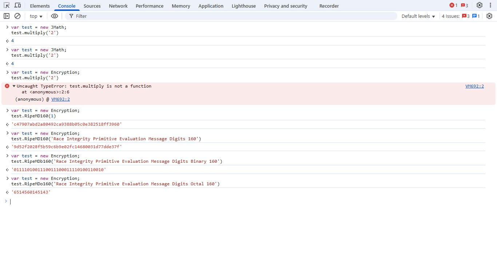

<div align="center">
<a href="https://github.com/JowoScript" target="_self">
</img>
</a>
</div>
<div align="center">
	
https://github.com/user-attachments/assets/daba2441-15d1-4658-b9e2-898c8da311a2

<strong>
	PT JowoScript Technology Indonesia - Always productive and move forward
	<br>
	Sekecil apapun perusahaan gue tetap gue bossnya
	<br>
	No matter how small my business is, I'm still the boss and only me can development my product
	<br>
	Orang bodoh itu selalu maki maki orang yg lebih cerdas
</strong>
<br><br>
<strong>
	Introduction
</strong>
</div>
</div>

#### Kingdom Studio Project Management Small talk
</img>
	 
### Muhammad Nurcahyo Pratomo Small talk
<ul>
<li>Mau transaksi pembelian lisensinya nilai mata uangnya di rubah ke setiap negara itu hak gue pribadi nantinya.</li>
<li>Gue di sebut firaun khusus hater gue dan pencudang saja. Setidaknya gue tidak mencuri uang negara ya apa lagi menuntut ke pemerintah selama ini seperti minta naik gaji dan tunjangan apa lagi minta proyek ya. sorry yee. target gue bukan indonesia tapi world wide market</li>
<li>Gue di sebut penjajah gimana yang lain seperti bayar listrik, bayar uang sekolah, bayar pajak, bayar perpanjang sim-stnk, makan-minum bayar, bayar bensin kendaraan, bayar internet dan banyak lagi ya. Fakta dan allah swt maha mengetahui segala galanya di masa depan and allah swt always with me.</li>
<li>Perusahaan milik sendiri gue mau berisik suka suka gue 10000% saham perusahaan milik gue kalo go publik</li>
<li>Kita lihat saja di danai selama ini banyak bacot tapi tidak ada hasil kerjanya. Mampus lu</li>
<li>Kingdom Studio berkembang terus setiap waktu dan setiap hari</li>
<li>Teman gue yang bermasalah anaknya sudah gue tandai semuanya baik baik kau. Jaga baik baik anakmu di luar sekolah masih SD dan SMP</li>
<li>Kabarin saja anakmu dj masih ada masa depannya ? baik baik yang tidak pernah terlihat di publik itu lebih bahaya seperti gue</li>
<li>Tidak butuh bantuan apa lagi beban seperti kau DJ skill coding biasa biasa saja</li>
<li>Akhir tahun pemegang saham pasti nanya hasil kerjanya ke publik. Siapa yang tutup dan bayar hutang ke pemegang saham</li>
<li>Diamkan saja yang pengangguran dan tidak punya perusahaan. Waktu terus maju</li>
<li>Kita lihat perusahaan mana lagi tutup bayar hutang dari saham. Kalo goblok itu sadar diri paham perusahaan gue tidak go publik ya</li>
<li>Lulusan sarjana asli dan gelar boleh sarjana tapi skill coding professor itu baru benar ya</li>
<li>Saiki siopo yang mencla mencle lambene hahahahaha</li>
<li>Orang bodoh itu selalu maki maki orang yg lebih cerdas seperti dj nya lambemu nothing, pecundang dan pengecut</li>
<li>Status gue pengusaha sendiri sekarang. Apa gunanya gue setiap hari buat. Cuekin saja yang pengangguran dan skillnya biasa biasa saja</li>
<li>Sekarang levelnya beda dong bukan Ai mainanya gue. Buat bahasa pemrograman sendiri. Dari 2021 sampai sekarang siapa yang tumbang</li>
<li>Dosen nguji gue saja dulu diam waktu skripsi gue buatnya beda sendiri face recognition di android tahun 2016 akhir dan lulus tahun 2017</li>
<li>Pak jokowi ipk di bawah 2 itu benar apa tidak ? kalo benar bikin malu gue saja. ipk gue saja di atas 3 jadi pengangguran tetap stay cool</li>
<li>Jadi pengusaha itu berat eh ada yang mau enaknya doang mau gratisan 😄. The checkmate forever</li>
<li>Example jhtml code future [div] small talk [/div] or can double with html &#x3C;div&#x3E; small talk &#x3C;/div&#x3E;[div] small talk [/div] available on Kingdom Studio</li>
<li>Jika tidak laku di pasaran gue bisa pakai sendiri nantinya siapa yg goblok itu bedanya gue sudah prediksi dulu sebelumnya</li>
<li>Kalo harganya naik tidak turun selama ini target pasar gue world wide. Biar pada turun gaji dan tunjangan di pemerintahan</li>
<li>Di danai pemerintah dan invenstor belum tentu hebat hasil kerjanya. Terbukti sampai sekarang ya</li>
<li>Siapa yang maju dalam Teknologi Informasi or IT dialah yang terdepan nantinya dan sebaliknya mereka akan berputar putar disitu saja tidak maju</li>
<li>Bapak saya berkata dulu anak saya di persulit masuk test kerja sekarang siapa yang tidak berguna ?</li>
<li>Bapak saya berkata tunggu waktu perusahaan mana lagi tutup tidak di danai</li>
<li>Bapak saya berkata jika tidak punya uang nonton saja kalian orang orang tidak berguna banyak gaya tapi tidak berkompoten</li>
<li>Selama belum beli ya nonton saja itu aturannya</li>
<li>Jowo Extensible Markup Language (JXML) available on kingdom studio</li>
<li>Jowo Style Sheets Language (JSS) available on kingdom studio</li>
<li>Jowo Hypertext Markup Language available on kingdom studio</li>
<li>JowoScript available on Kingdom Studio</li>
<li>Jowo Kingdom Studio available on Kingdom Studio</li>
<li>75 triliun perbulan mampu beli kingdom studio ? Gaji dan tunjangan jabatan mana mampu beli harga segini gue tanya. Oleh itu gue tidak gila jabatan dan kekuasaan seperti kalian</li>
</ul>


<!-- case closed i don't wanna teach more about tax
### Muhammad Nurcahyo Pratomo The smart person and smoothy intro of tax regulation (aturan pajak) in Indonesia 
<ul>
<li>PPh (Pajak Penambahan Hasil) Jika menerima gaji akan di kenakan pajak jika tidak menerima gaji tidak ada pajak. PPh ada ukurannya berapa persen. Do you understand baby ? </li>
<li>PPn (Pajak Penambahan Nilai) Jika anda menjual produk maka beban pajak di bayar oleh pembeli produk bukan pembuat produk atau penjual produk. PPn ada ukurannya berapa persen. Do you understand baby ?</li>
<li>Contoh kamu menjual perangkat lunak atau software produk akan kena pajak penambahan nilai yang beli software produk dan yang buat software tidak kena Pajak Penambahan Hasil (PPh) karena tidak menerima gaji dan hanya kena Pajak Penambahan Nilai (PPn) perusahaannya dari hasil pembelian produk. Perusahaan atau pemerintah mana berani beli Produk PT JowoScript Technology Indonesia kalo tidak habis bayar pajak penambahan nilai (PPn). Orang cerdas tidak perlu pujian dan maki maki karena tau dirinya berkualitas. Sudah paham sampai sini sekolah pajak nya</li>
<li>Contoh kamu membeli barang bajakan atau palsu tidak ada jaminannya dari yang buat produk (Contoh tidak dapat fiture baru dan udate terbaru). Produk PT JowoScript Technology Indonesia tidak di jual di pasar publik atau bebas karena pembeliannya wajib secara legal. Paham Orang bodoh selalu maki maki orang yang lebih cerdas dan Orang cerdas tidak perlu pujian dan maki maki karena tau dirinya berkualitas. Jika belinya secara legal tidak ada yang di rugikan. Jika tidak punya uang tidak usah beli. Simple logic</li>
<li>Contoh kamu menerima gaji dari hasil konten di platform sosial media akan kena pajak penambahan penghasilan (PPh) dan platform sosial media wajib setor pajak penghasilan dari konten kreator ke negara indonesia dan pendapatan platform sosial media hanya dari biaya administrasi saja karena menyediakan platform sosial media. Konten kreator di gaji dari hasil iklan atau spesial give away. Contoh biaya administrasi seperti iklan dan special give away icon (berbayar) di tempat platform sosial media hasilnya untuk bayar gaji dan sejenisnya di perusahaan tersebut. Sudah paham sampai sini sekolah pajak nya
</li>
<li>Contoh lagi kamu menjual barang di platform E-commerce atau perdagangan elektronik akan kena pajak penambahan nilai (PPn) dan platform E-commerce atau perdagangan elektronik wajib setor pajak penghasilan nilai (PPn) dari konten menjual barang ke negara indonesia dan pendapatan platform E-commerce atau perdagangan elektronik hanya dari biaya administrasi saja karena menyediakan E-commerce atau perdagangan elektronik. Contoh biaya administrasi seperti menyewakan tempat jual online di platform E-commerce atau perdagangan elektronik hasilnya untuk bayar gaji dan sejenisnya di perusahaan tersebut. Sudah paham sampai sini sekolah pajak nya
</li>
<li>Contoh lagi kamu menjual barang di toko supermarket itu hampir sama dengan perdagangan elektronik hanya beda caranya saja. Satu online dan satu lagi offline. Suka jalan jalan lebih suka offline dan sebaliknya males jalan jalan ya lebih suka online. Sudah paham sampai sini sekolah pajak nya
</li>
<li>Contoh lagi kamu menerima gaji dari kerja di perusahaan atau pemerintah ya hanya kena pajak penambahan hasil (PPh) saja ya tidak ada pajak penanbahan nilai (PPn). Sudah paham sampai sini sekolah pajak nya</li>
<li>Contoh lagi penghasilan dealer kendaraan pendapatannya hanya dari penjualan unit dari dari hasil unit di jual baru bisa bayar pajak penambahan hasil (PPh) dari pegawainya untuk di setor ke negara indonesia dan (PPn) di bebankan ke pembeli dari hasil ppn di setor ke negara indonesia. Sudah paham sampai sini sekolah pajak nya</li>
<li>Istansi pemerintah bayarnya gaji sampai tunjangan dari hasil pajak tapi yang minta jatah apbn paling banyak tapi kerjanya santai santai atau tidak ada hasil kerjanya di sebut beban pemerintah ada kamera publik yaitu rakyatnya sendiri</li>
<li>Oknum melakukan korupsi, pungli dan gratifikasi di pemerintahaan atau perusahaan merupakan tindak kejahatan</li>
<li>Oknum di pemerintahaan atau perusahaan bisa lulus masuk kerja tapi tidak bisa kerja kasih SP 1 terus SP2 Terakhir pecat</li>
<li>Negara bisa maju di lihat dari Sumber Daya Manusianya yang berkualitas bukan sebaliknya</li>
<li>Uang hasil korupsi, pungli dan gratifikasi di pemerintahaan atau perusahaan di balikan ke bangsa negara indonesia untuk pembangunan bangsa negara indonesia bukan sebaliknya</li>
<li>Uang hasil pajak untuk apa ? untuk pembangunan bangsa negara indonesia bukan sebaliknya</li>
<li>Pembangunan bangsa negara indonesia itu banyak kategorinya seperti pembangunan pendidikan, kesehatan, infrastruktur, pertahanan militer, dan banyak lagi</li>
<li>Kasus pedagang kaki lima jika di tertibkan barang tidak di ambil negara tapi di balikan ke pedagang tersebut untuk di data tidak melakukan lagi di tempat tersebut jika mengulangin lagi akan di kenakan sangsi, Oknum hanya melakukan tugas dan memberikan surat pengambilan barang tidak lebih dengan syarat jangan pakai kekerasaan kepada pedagang kaki lima karena melanggar kode etik. Kalo barang pedagang kaki lima di ambil oleh oknum melakukan tugas tapi tidak di balikan termasuk kategori pungli dan itu termasuk tindakan kejahatan. Ambil barangnya di pemrov terkait dengan surat yang dikasih pedagang kaki lima. Seperti melakukan penyitaan barang semua ada suratnya tanpa surat itu menyalah gunakan aturan hukum atau tidak resmi</li>
<li>Pajak Bumi Bangunan naik itu untuk gedung gedung saja dan perumahan elite atau mewah saja ya (Nilai jual tanah bisa di lihat setiap tempat pasti beda) kalo rumah sederhana dan rumah kpr kebawah di kasih pajak bumi bangunan naik ya salah kebijakan (Kebijakan yang benar itu tajam ke atas bukan ke bawah) Mau naik harga sewa gedung atau tidak bukan urusan gue ya</li>
<li>Pajak bumi bangunan di jakarta dan banten itu santai banyak pabrik dan gedung tidak perlu naikin pajak bumi bangunan ya dong. daerah lain pikir saja sendiri bukan daerah gue</li>
<li>Indonesia akan jadi negara maju bukan berkembang lagi kedepanya jika kerjanya benar dan sebaliknya. Paham sampai sini</li>
</ul>
-->
### Jaminan Produk
<ul>
<li>PT JOWOSCRIPT TECHNOLOGY INDONESIA, DAN AFILIASI, PENGECER, DISTRIBUTOR, DAN VENDOR, TIDAK MEMBERIKAN JAMINAN, BAIK TERSURAT MAUPUN TERSIRAT, GARANSI, ATAU KETENTUAN SEHUBUNGAN DENGAN PENGGUNAAN LAYANAN OLEH ANDA. ANDA MEMAHAMI BAHWA ANDA MENANGGUNG RISIKO PENGGUNAAN LAYANAN DAN KAMI MEMBERIKAN LAYANAN "SEBAGAIMANA ADANYA", "DENGAN SEGALA KEKURANGANNYA", DAN "SEBAGAIMANA TERSEDIA". PT JOWOSCRIPT TECHNOLOGY INDONESIA TIDAK MENJAMIN KEAKURATAN ATAU KETEPATAN WAKTU LAYANAN. ANDA MUNGKIN MEMILIKI HAK-HAK TERTENTU MENURUT HUKUM SETEMPAT ANDA. TIDAK ADA SATU BAGIAN PUN DALAM PERSYARATAN INI YANG DIMAKSUDKAN UNTUK MEMENGARUHI HAK TERSEBUT, JIKA MEMANG ADA. ANDA MEMAHAMI BAHWA KOMPUTER DAN SISTEM TELEKOMUNIKASI TIDAK BEBAS DARI KESALAHAN DAN LAYANAN MUNGKIN AKAN SESEKALI TIDAK TERSEDIA. KAMI TIDAK MENJAMIN LAYANAN TIDAK AKAN TERGANGGU, TEPAT WAKTU, AMAN, ATAU BEBAS DARI KESALAHAN ATAU BAHWA HILANGNYA KONTEN TIDAK AKAN TERJADI, ATAU KAMI TIDAK MENJAMIN SAMBUNGAN ATAU TRANSMISI APA PUN DARI JARINGAN KOMPUTER.
</li>
<li>SEJAUH YANG DIIZINKAN OLEH HUKUM SETEMPAT, KAMI MENGECUALIKAN JAMINAN TERSIRAT APA PUN, TERMASUK KELAYAKAN UNTUK DIPERDAGANGKAN, KUALITAS YANG MEMUASKAN, KESESUAIAN UNTUK TUJUAN TERTENTU, KECAKAPAN USAHA, DAN KETIADAAN PELANGGARAN.</li>
</ul>

### Legal Rights of Technology Creators | Basic Regulatory Requirements for Registration and Purchase
<div align="justify">
<ol>
<li>Must follow obey the legal policy rules and regulations in force in the country where you live and cannot be contested by any party</li>
<li>If an Indonesian citizen working abroad experiences injury, torture, or similar issues, but no legal proceedings are initiated by the relevant government, that government will be blacklisted. The exception is my two-faced friend who once had a problem with me. Read point 14, 15, 16, and 17 You can do whatever you want, back to point 7.</li>
<li>Sites that contain pornography and immorality are strictly prohibited, back to point number 7 (Website or app users must be 20+ for adult content movie warnings)</li>
<li>Gambling sites are strictly prohibited, back to point number 1 and point number 7</li>
<li>Terrorism sites are strictly prohibited, back to point number 1 and point number 7</li>
<li>User strictly prohibited as an instrument of crime, back to point number 1 and point number 7</li>
<li>The policy of the intellectual patent by Muhammad Nurcahyo Pratomo cannot be contested by any party, either in the future or now. Both in the form of binary code and inherethin or computed binary intellectual within patent and legal rights of technology creators by Muhammad Nurcahyo Pratomo. Legal Rights of Technology Creators</li>
<li>Minimum age required to be 18 years old in using programming language code and can use good logic, back to point point number 7</li>
<li>Price tag that has been applied cannot be contested by any party, either in the future or now, back to point number 7</li>
<li>Alcohol or intoxicating drinks sites are strictly prohibited, back to point number 7</li>
<li>User OR Applications that support drug or narcotics transactions are strictly prohibited (example case study like heroin, cocaine, morphine, opium, etc), back to point number 1 and point number 7</li>
<li>Must have a legality flag that is a legal entity, back to point number 1 and point number 7</li>
<li>It is strictly prohibited for weapons of war such as politics, crime and kindly, back to point number 1 and point number 7</li>
<li>Haters, abusers, bullies and two-faced friend (good in front but rotten behind) people from indentiy (Indonesia and Malaysia) are MUST DIE FIRST and there must be EVIDENCE OF THE BODY, back to point number 7</li>
<li>The company (Indonesia and Malaysia) that had problems with Muhammad Nurchayo Pratomo was the entrance test and etc before are strictly prohibited from obtaining licenses forever. back to point number 7 (i have big data private so no can lie)</li>
<li>Friends people (example playmates or school or work) and two-faced friend (good in front but rotten behind) from indentiy Of Muhammad Nurchayo Pratomo (Indonesia and Malaysia) and people (Indonesia and Malaysia) who have problems with Muhammad Nurchayo Pratomo are MUST DIE FIRST and there must be EVIDENCE OF THE BODY. Even if the problematic friend works for a government agency, the same rules apply to that agency. back to point number 7</li>
<li>Especially for those who insert sound into music in Disc Jockey (DJ) and the conclusion is that the sound is changed into music to curse and be alone, the perpetrator MUST DIE FIRST and there must be EVIDENCE OF THE BODY if there is a company or government that wants to buy the license. Life is a choice. Rules are rules. If you dare to insult and curse by inserting sound into music, it means you have to dare to take risks. There must be proof of death of the perpetrator who made the music insert all this time. back to point number 7</li>
<li>Registered trademark products of PT JowoScript Technology Indonesia</li>
<li>Registered trademark logos of PT JowoScript Technology Indonesia</li>
</ol>
</div>

### Legal Rights of Technology Creators | The regulatory requirements for purchase license tokens
<div align="justify">
<ol>
<li>Must follow and obey basic regulatory requirements in registration</li>
<li>Payment and purchase of the license is carried out by both parties with witnesses from the technology maker and a lawyer or legal entity, back to point number 1 and point number 7</li>
<li>Must have a legality flag that is a legal entity</li>
<li>Must have a domain name server live as your legality flag name masters (example of a live universal domain is *.gov.your name of goverment or any domain)</li>
<li>Technology remains in end to end encryption</li>
<li>Can use Technology features if the license token runs out will not be able to use</li>
<li>Technology can be controlled for localhost or 127.0.0.1 and can be changed choices to your own ip settings</li>
</ol>
</div>

### Legal Rights of Technology Creators | Laws against violators of the Legal Rights of Technology Creators
<div align="justify">
<ol>
<li>Will deal with the laws in force in the country where you live or jail the future, back to point number 1</li>
<li>Lawyers, police and prosecutors will act to prosecute existing violations cannot be contested by any party, either in the future or now</li>
<li>Gambling The minimum fine for violation is the minimum price of the license purchased cannot be contested by any party, either in the future or now, back to point number 7</li>
<li>Case studies on the inability to pay the minimum fine for violations will be submitted to existing laws, both based on the legal basis in force in the country where you live and cannot be challenged by any party, back to point number 1 and point number 7</li>
<li>Payment of fines is made by both parties witnessed by the court and and lawyers or prosecutors or legal entities, back to point number 1 and number 7</li>
</ol>
</div>

### Support Technology with license business :
<div align="justify">
<ol>
<li>JowoScript programing language Architecture, developer and designed by Muhammad Nurcahyo Pratomo in Java Island of Indonesia and will be the foundation pillar of native code technology for licensing business. This only for jowoscript programing language not for javascript programing language</li>
<li>Kingdom Studio Architecture, developer and designed by Muhammad Nurcahyo Pratomo in Java Island of Indonesia and will be the foundation pillar of IDE technology for licensing business.</li>
<li>Jowo Kingdom Machine Architecture, developer and designed by Muhammad Nurcahyo Pratomo in Java Island of Indonesia and will be the foundation pillar of backend programing language for licensing business.</li>
<li>PT JowoScript Technology Indonesia products list must be purchased license business to activate all the features</li>
<li>Buying the license business product must be legal and registered under the law</li>
<li>JowoScript programing language product copyright is PT JowoScript Technology Indonesia</li>
<li>Kingdom Studio product copyright is PT JowoScript Technology Indonesia</li>
<li>Jowo Kingdom Machine product copyright is PT JowoScript Technology Indonesia</li>
<li>Cant be read in Artificial Intelligence (AI) with license business jowoscript programing language</li>
<li>Cant be read in Artificial Intelligence (AI) with license business jowo kingdom programing language</li>
<li>Can lock in native code with license business jowoscript programing language</li>
<li>Can lock in Kingdom Studio with license business kingdom studio</li>
<li>Can lock in Jowo Kingdom Machine with license business jowo kingdom programing language</li>
<li>Auto compile and dive deeper JowoScript of compile inside file extension *.js or *.jowo with type of application/jowoscript or text/jowoscript with license business jowoscript programing language</li>
<li>Auto compile and dive deeper JowoStyle of compile inside file extension *.jss or *.js3 with type of application/jowostyle or text/jowostyle with license business jowoscript programing language</li>
<li>JowoScript Technology and JowoStyle Technology undefined technology the mean is cannot be detected by third-party technology or the like because the source code of JowoScript Technology is end-to-end encryption, meaning that it is not easily read by bad hackers or cybercriminals.</li>
<li>Very easy to install on multiplatform servers to deploy because it is a native technology with javascript technology standard</li>
<li>Responsive mode user interface (Meaning i.e. when your design is in tablet mode, mobile or phone mode, television mode, LCD(Liquid Crystal Display) mode and laptop mode)</li>
<li>Native platform (For example, a cross-platform application may run on Microsoft Mobile, Microsoft Windows, Android, z/OS, Linux OS, Unix OS, iOS and macOS)</li>
<li>Smart automatic detection error in javascript engine with license business jowoscript programing language</li>
<li>Smart automatic detection error in jowoscript engine with license business jowoscript programing language</li>
<li>Handling array of objects and decided multiple of attributes and pseudo with license business jowoscript programing language</li>	
</ol>
</div>

#### Kingdom Studio About Technology
</img>
     
#### Kingdom Studio Version 0.1.14 Account license your need the serial number key not more and not less too.
</img>
     
#### Only Product Of PT JowoScript Technology Indonesia support in kingdom studio
</img>
     
#### Configure your new project
</img>
     
#### Kingdom Studio Version 0.1.12
</img>
     
#### Legality Statement Letter of PT JowoScript Technology Indonesia
</img>

#### Kingdom Studio Version 0.1.8
</img>

#### JowoScript Native Code Version 8.7.6 in Chrome
</img>

#### JowoScript Native Code Version 8.7.6 in Edge
</img>

#### JowoScript Native Code Version 8.7.6 in FireFox
</img>

#### JowoScript Native Code Version 8.7.6 in Yandex
</img>
     
## PT JowoScript Technology Indonesia products list :
<div align="justify">
<ol>
	<li>
	<strong>
JowoScript is The cross platform an front end programming language typing less, compile language, complex structure, small size and faster [file extension *.JOWO type JowoScript] (license must be purchased to activate all the features)
	</strong>
	<br>
JowoScript adalah bahasa pemrograman front-end lintas platform yang mengetik lebih sedikit, bahasa kompilasi, struktur kompleks, ukuran kecil dan lebih cepat [ekstensi file *.JOWO jenis JowoScript] (lisensi harus dibeli untuk mengaktifkan semua fitur)
	<br><br>
	</li>
	<li>
	<strong>
Jowo Kingdom Machine is The cross platform an backend programming language with new methods to advancing complex data scientists, advancing complex data processing, and advancing complex enterprise applications [file extension *.JKM type Jowo Kingdom Machine] (license must be purchased to activate all the features)
	</strong>
	<br>
Jowo Kingdom Machine adalah bahasa pemrograman backend lintas platform dengan metode baru untuk memajukan ilmuwan data yang kompleks, memajukan pemrosesan data yang kompleks, dan memajukan aplikasi perusahaan yang kompleks [ekstensi file *.JKM jenis Jowo Kingdom Machine] (lisensi harus dibeli untuk mengaktifkan semua fitur)
	<br><br>
	</li>
	<li>
	<strong>
Kingdom Studio is The cross platform an integrated development environment [file extension *.KSS type Kingdom Studio Solution] (license must be purchased to activate all the features)
	</strong>
	<br>
Kingdom Studio adalah lingkungan pengembangan terintegrasi lintas platform [ekstensi file *.KSS jenis Solusi Kingdom Studio] (lisensi harus dibeli untuk mengaktifkan semua fitur)
	<br><br>
	</li>
	<li>
	<strong>
Jowo Kingdom Server is The cross platform an server host (license must be purchased to activate all the features)
	</strong>
	<br>
Jowo Kingdom Server adalah server host lintas platform (lisensi harus dibeli untuk mengaktifkan semua fitur)
  	<br><br>
	</li>
	<li>
	<strong>
Structured Query Jowo Language is The cross platform an query programming language [file extension *.SQJL type Structured Query Jowo Language] (license must be purchased to activate all the features)
	</strong>
	<br>
	Structured Query Bahasa Jowo adalah bahasa pemrograman query lintas platform [ekstensi file *.SQJL jenis Structured Query Bahasa Jowo] (lisensi harus dibeli untuk mengaktifkan semua fitur)
	<br><br>
	</li>
	<li>
	<strong>
JowoStyleSheet is programming language for a pattern core of computation style sheet programming language used for describing the presentation of JowoScript programming language [file extension *.JS3 type Jowo Style Sheet] (license must be purchased to activate all the features)
	</strong>
	<br>
JowoStyleSheet adalah bahasa pemrograman untuk inti pola bahasa pemrograman lembar gaya komputasi yang digunakan untuk mendeskripsikan presentasi bahasa pemrograman JowoScript [ekstensi file *.JS3 jenis Jowo Style Sheet] (lisensi harus dibeli untuk mengaktifkan semua fitur)
	<br><br>
	</li>
</ol>
</div>
<br>
<div align="center">
<strong>
	The new is JowoScript and Jowo Kingdom Machine the powerfull of native code of native jowo and super power of new technology concept that brings the future (license must be purchased)
	<br><br>
	The intellectual patent by Muhammad Nurcahyo Pratomo cannot be contested by any party, either in the future or now
</strong>
</div>
<br><br>
<details>
<summary><b>After (license be purchased) Support Technology :</b></summary>
<div align="justify">
<ul><li>Kingdom Studio Run and Debug binary code Jowo Kingdom Machine inside file extension *.JKM with type of binary code and deploy pack *.JKLASS with type of binary code</li>
<li>Kingdom Studio Run and Debug binary code Structured Query Jowo Language inside file extension *.SQJL with type of binary code</li><li>Kingdom Studio Run and Debug JowoScript of compile inside file extension *.JOWO with type of application/jowoscript or text/jowoscript</li><li>Kingdom Studio Run and Debug JowoStyle of compile inside file extension *.JS3 with type of application/jowostyle or text/jowostyle</li><li>JowoScript Technology and JowoStyle Technology undefined technology the mean is cannot be detected by third-party technology or the like because the source code of JowoScript Technology is end-to-end encryption, meaning that it is not easily read by bad hackers or cybercriminals.</li><li>Responsive mode user interface (Meaning i.e. when your design is in tablet mode, mobile or phone mode, television mode, LCD(Liquid Crystal Display) mode and laptop mode)</li><li>Native platform (For example, a cross-platform application may run on Microsoft Mobile, Microsoft Windows, Android, z/OS, Linux OS, Unix OS, iOS and macOS)</li><li>Smart automatic detection error in javascript engine</li><li>Smart automatic detection error in jowoscript engine</li><li>Smart automatic detection error in jowo kingdom engine</li><li>Handling array of objects and decided multiple of attributes and pseudo</li></ul>
</div>
</details>

```html
/*
 * [Command Line API]
 * $.version 	: xx.xx.xx
 * $.owner 	: Muhammad Nurcahyo Pratomo
 * $.creator	: Muhammad Nurcahyo Pratomo
 * $.architect	: Muhammad Nurcahyo Pratomo
 * $.author	: Muhammad Nurcahyo Pratomo
 * $.founder	: Muhammad Nurcahyo Pratomo 
 * $.developer	: Muhammad Nurcahyo Pratomo
 * $.copyright	: PT JowoScript Technology Indonesia
 * $.license 	: After (license be purchased) to Licensed under privilege of purchaser's license name. Example your company name or organization name or government name
 * $.legality 	: After (license be purchased) to Licensed under privilege of purchaser's legality name. Example your company name or organization name or government name
 */

Example :
global attribute 	: $("*object global attribute value");
mnp attribute		: mnp("mnp^object"), jowo("mnp^object"), mnp("^object"), jowo("^object");
jowo attribute		: mnp("jowo*object"), jowo("jowo*object"), mnp("*object"), jowo("*object");
jawa attribute		: mnp("jawa@object"), jowo("jawa@object"), mnp("@object"), jowo("@object");
id attribute		: mnp("id*object"), jowo("id*object"), mnp("id^object"), jowo("id^object"), mnp("id@object"), jowo("id@object"), mnp("#object"), jowo("#object");
class attribute		: mnp("class*object"), jowo("class*object"), mnp("class^object"), jowo("class^object"), mnp("class@object"), jowo("class@object"), mnp(".object"), jowo(".object");
name attribute		: mnp("name*object"), mnp("name^object"), mnp("name@object");
array of attribute 	: mnp("[ jowo*object, [jowo*object], element[attribute], node[node] ]")	mnp("element[attribute="value"], [attribute="value"], [attribute="value"] [attribute]");
array of pseudo		: mnp("[ element:pseudo, node:pseudo ], element:pseudo node:pseudo object:pseudo ");
```
<br>
<div align="center"><strong>Installation information</strong></div>
<details>
<summary>Installation iOS - MacOS</summary>

```java
//Let's call class WKWebViewConfiguration(), WKWebView(frame, config), URL(url root) and URLRequest(base string url)
import UIKit
import WebKit
class ViewController: UIViewController, WKUIDelegate {
    var webView: WKWebView!
    override func loadView() {
        let webConfiguration = WKWebViewConfiguration()
        webView = WKWebView(frame: .zero, configuration: webConfiguration)
        webView.uiDelegate = self
        view = webView
    }
    override func viewDidLoad() {
        super.viewDidLoad()        
        let myURL = URL(string:"jowo-script.jowo")
        let myRequest = URLRequest(url: myURL!)
        webView.load(myRequest) //Load from url base webview class
	webView.loadHTMLString("<script>jowo.technology</script>", baseURL: myURL)
	//Result : JowoScript Technology
    }
}
```
iOS - MacOS, More information you can look at [here](https://developer.apple.com/documentation/webkit/wkwebview)
</details>
<details>
<summary>Installation server side Liferay Framework</summary>
	
```java
//Call this class JSTopHeadDynamicInclude extends BaseDynamicInclude (include, register)
@Component(immediate = true, service = DynamicInclude.class)
public class JSTopHeadDynamicInclude extends BaseDynamicInclude {
	@Override
	public void include(HttpServletRequest request, HttpServletResponse response, String key)
		throws IOException {
		PrintWriter printWriter = response.getWriter();
		String content = "<script href=\"http://localhost:8080/../../js/jowo-script.jowo\" type = \"text/javascript\" />";
		String jowoScript = "jowo.technology" type = \"text/javascript\" />";
		printWriter.println(jowoScript);
		//In console IDE like eclipse, rational application developer, jetbrains, netbeans, browser environment, etc. 
		//Result : JowoScript Technology
	}
	@Override
	public void register(DynamicIncludeRegistry dynamicIncludeRegistry) {
		dynamicIncludeRegistry.register("/html/common/themes/top_js.jspf#resources");		
	}  
}
```
Liferay Framework, More information you can look at [here](https://help.liferay.com/hc/en-us/articles/360018165751-Top-JS-Dynamic-Include-)
</details>
<details>
<summary>Installation Zkoss Framework</summary>
	
```javascript
<zk>
<script type="text/javascript" src="jowo-script.jowo"></script>
<window title="sample jowo script" border="none" width="100%" closable="true">	
	<script type="text/javascript">
		jowo.technology
	</script>
	//Result : JowoScript Technology
</window>
</zk>
```
</details>
<details>
<summary>Installation Android</summary>
	
```java
webview.loadDataWithBaseURL("file:///android_asset/javascript/jowo-script.jowo", page, "text/javascript", null, null);
```
Android, More information you can look at [here](https://developer.android.com/guide/webapps/webview#kotlin)
</details>
<details>
<summary>Installation Microsoft DOT NET</summary>

```cs
/* Let's call this function in server side */
/* 
@Function method call in server side
public string GetWebResourceUrl (Type type, string resourceName);
*/

using System;
using System.Web;
using System.Web.UI;
using System.Security.Permissions;
[assembly: WebResource("Samples.AspNet.CS.Controls.jowo-script.jowo", "application/x-javascript")]
namespace Samples.AspNet.CS.Controls
{
    [AspNetHostingPermission(SecurityAction.Demand, Level = AspNetHostingPermissionLevel.Minimal)]
    public class ClientScriptResourceLabel
    {
		Console.WriteLine(jowo.technology);
		//Result : JowoScript Technology
    }
}
```
Microsoft DOT NET, More information you can look at [here](https://docs.microsoft.com/en-us/dotnet/api/system.web.ui.clientscriptmanager.getwebresourceurl?redirectedfrom=MSDN&view=netframework-4.8#System_Web_UI_ClientScriptManager_GetWebResourceUrl_System_Type_System_String_)
</details>
<details>
<summary>Installation standart HTML</summary>

<b>Make sure your code JavaScript tag install.</b>
	
```html
<html>
<head>
<script type="text/javascript" src="jowo-script.jowo"></script>
</head>
<body>
	<script type="text/javascript">
		var js = 'JowoScript Programming Language';
		const note = "if there is no PT JowoScript Technology Indonesia it is a fake file";
		var count = 1 / 9999;
		js.toLog();
		'Result :'+count.toLog();
		note.toLog();
		//Result JowoScript Programming Language
		//Result 0.00010001000100010001
		//Result if there is no PT JowoScript Technology Indonesia it is a fake file
	</script>
	<script>
		$.creator.toLog();
		//Result Muhammad Nurcahyo Pratomo
		$.copyright.toLog()
		//Result PT JowoScript Technology Indonesia
	</script>
</body>
</html>
```
</details>

#### Installation standart HTML
```html
<html>
<head>
<script type="text/javascript" src="jowo-script.jowo"></script>
</head>
<body>
	<script type="text/javascript">
		var js = 'JowoScript Programming Language';
		const note = "if there is no PT JowoScript Technology Indonesia it is a fake file";
		var count = 1 / 9999;
		js.toLog();
		'Result :'+count.toLog();
		note.toLog();
		//Result JowoScript Programming Language
		//Result 0.00010001000100010001
		//Result if there is no PT JowoScript Technology Indonesia it is a fake file
	</script>
	<script>
		$.creator.toLog();
		//Result Muhammad Nurcahyo Pratomo
		$.copyright.toLog()
		//Result PT JowoScript Technology Indonesia
	</script>
</body>
</html>
```
#### File JavaScript Example
```html
/*
 *
 * $.creator	: Muhammad Nurcahyo Pratomo
 * $.developer	: Muhammad Nurcahyo Pratomo
 * $.architect	: Muhammad Nurcahyo Pratomo
 * $.copyright	: Copyright © 2021 - Forever, PT JowoScript Technology Indonesia. All rights reserved.
 * mime-type	: javascript or text/javascript or application/javascript
 * extension	: *.js
 * 
 */

function helloJS(jowo){
	if(jowo.equal(101)){
		console.log('This file extension of hello.js');
	}
}

export {helloJS}
```
#### File JowoScript Example
```html
 /*
 *
 * $.creator	: Muhammad Nurcahyo Pratomo
 * $.developer	: Muhammad Nurcahyo Pratomo
 * $.architect	: Muhammad Nurcahyo Pratomo
 * $.copyright	: Copyright © 2021 - Forever, PT JowoScript Technology Indonesia. All rights reserved.
 * mime-type	: jowoscript or text/jowoscript or application/jowoscript
 * extension	: *.jowo
 *
 * Your need buy a license key for access the fiture of JowoScript Programming Language
 * Copyright (c) PT JowoScript Technology Indonesia, 2021 - Forever. All Rights Reserved.
 *
 */

import {helloJowo as JowoOfLegend} from "../../script/uat/hello.jowo";
import {helloJS as JSOfLegend} from "../../script/uat/hello.js"
import "../../script/uat/uat.jowo";
import "../../script/uat/uat.js";

console.log(JowoOfLegend(101));
JSOfLegend(101).toLog();
```
#### File JowoScript Example
```html
 /*
 *
 * $.creator	: Muhammad Nurcahyo Pratomo
 * $.developer	: Muhammad Nurcahyo Pratomo
 * $.architect	: Muhammad Nurcahyo Pratomo
 * $.copyright	: Copyright © 2021 - Forever, PT JowoScript Technology Indonesia. All rights reserved.
 * mime-type	: jowoscript or text/jowoscript or application/jowoscript
 * extension	: *.jowo
 *
 * Your need buy a license key for access the fiture of JowoScript Programming Language 
 * Copyright (c) PT JowoScript Technology Indonesia, 2021 - Forever. All Rights Reserved.
 *
 */

//This will easy to make design website smoothly too
//You can use this if you no need chain (But i love use the chain)
$('*AboutTechnology, *TheBusiness, *PrivacyPolicy, *LegalityCompany, *SponsorsWorkflow, *PartnersWorkflow, *PriceList').removeCss();

$('*Introduction').removeCss().chain('*IDE').removeCss();

$('class*icon-refresh').title('refresh').
chain('class*icon-maximize').title('full screen').
chain('html').background('#fff').
chain('body').background('#fff');

$('class*icon-refresh').addClass('left').addClass('icon-white').addClass('icon').addClass('icon-circle').addClass('cursor-pointer');
$('class*icon-minimize').addClass('right').addClass('icon-white').addClass('icon').addClass('icon-circle').addClass('cursor-pointer');
$('class*icon-maximize').addClass('right').addClass('icon-white').addClass('icon').addClass('icon-circle').addClass('cursor-pointer');
	
$('class*icon-refresh').click(function(){
	$.reload();
});

$('class*icon-maximize').click(function(){
	if($.isTrue($('class*icon-maximize').hasClass('icon-maximize'))) {
		$('class*icon-maximize').title('close screen').
		chain('class*icon-maximize').replaceClass('icon-maximize','icon-minimize');
	}
	else {
		$('class*icon-minimize').title('full screen').
		chain('class*icon-minimize').replaceClass('icon-minimize','icon-maximize');
	}
	$('body').screenToggle();
});

$('*fieldsetDocumentLegality').css('border-color:darkblue;border-width:5px').chain('*legDocumentLegality').fontSize('12px').fontCenter();
$('jowo*fieldset').append(
	$.createHTML('legend',{jowo:'field'},'value field')
).css('border-color:darkblue;border-width:5px').fontCenter().fontSize('16px').width('100%');

$('jowo*fieldsetArchitectureOfJowoScript').append(
	//Create legend Architechture Of JowoScript
	$.createHTML('legend',{jowo:'architectureOfJowoScript'},'Architechture Of JowoScript')
).
append(
	//Create img Architechture Of JowoScript
	$.createHTML('img',{jowo:'imgArchitectureOfJowoScript',src:'images/architecture of jowoscript technology.png',referrerpolicy:'origin'},'')
).
css('border-color:darkblue;border-width:5px').fontCenter().
chain('*architectureOfJowoScript').fontSize('16px').
chain('*imgArchitectureOfJowoScript').click(function(){
	$('*imgArchitectureOfJowoScript').screenToggle();
}).title('Architechture Of JowoScript','Architechture Of JowoScript').width('100%');
```
#### File JowoScript Example
```html
 /*
 *
 * $.creator	: Muhammad Nurcahyo Pratomo
 * $.developer	: Muhammad Nurcahyo Pratomo
 * $.architect	: Muhammad Nurcahyo Pratomo
 * $.copyright	: Copyright © 2021 - Forever, PT JowoScript Technology Indonesia. All rights reserved.
 * mime-type	: jowoscript or text/jowoscript or application/jowoscript
 * extension	: *.jowo
 *
 * Your need buy a license key for access the fiture of JowoScript Programming Language 
 * Copyright (c) PT JowoScript Technology Indonesia, 2021 - Forever. All Rights Reserved.
 *
 */

//Other fiture
console.log($.professorMindLevelText('JowoScript Programing Language'))
VM212:1 ▢▫▫▢▫▢▫□▢▢▫▢▢▢▢□▢▢▢▫▢▢▢□▢▢▫▢▢▢▢□▢▫▢▫▫▢▢□▢▢▫▫▫▢▢□▢▢▢▫▫▢▫□▢▢▫▢▫▫▢□▢▢▢▫▫▫▫□▢▢▢▫▢▫▫□▢▫▫▫▫▫□▢▫▢▫▫▫▫□▢▢▢▫▫▢▫□▢▢▫▢▢▢▢□▢▢▫▫▢▢▢□▢▢▢▫▫▢▫□▢▢▫▫▫▫▢□▢▢▫▢▢▫▢□▢▢▫▢▫▫▢□▢▢▫▢▢▢▫□▢▢▫▫▢▢▢□▢▫▫▫▫▫□▢▫▫▢▢▫▫□▢▢▫▫▫▫▢□▢▢▫▢▢▢▫□▢▢▫▫▢▢▢□▢▢▢▫▢▫▢□▢▢▫▫▫▫▢□▢▢▫▫▢▢▢□▢▢▫▫▢▫▢
console.log($.unprofessorMindLevelText('▢▫▫▢▫▢▫□▢▢▫▢▢▢▢□▢▢▢▫▢▢▢□▢▢▫▢▢▢▢□▢▫▢▫▫▢▢□▢▢▫▫▫▢▢□▢▢▢▫▫▢▫□▢▢▫▢▫▫▢□▢▢▢▫▫▫▫□▢▢▢▫▢▫▫□▢▫▫▫▫▫□▢▫▢▫▫▫▫□▢▢▢▫▫▢▫□▢▢▫▢▢▢▢□▢▢▫▫▢▢▢□▢▢▢▫▫▢▫□▢▢▫▫▫▫▢□▢▢▫▢▢▫▢□▢▢▫▢▫▫▢□▢▢▫▢▢▢▫□▢▢▫▫▢▢▢□▢▫▫▫▫▫□▢▫▫▢▢▫▫□▢▢▫▫▫▫▢□▢▢▫▢▢▢▫□▢▢▫▫▢▢▢□▢▢▢▫▢▫▢□▢▢▫▫▫▫▢□▢▢▫▫▢▢▢□▢▢▫▫▢▫▢'))
VM229:1 JowoScript Programing Language
console.log($.professorLevelText('JowoScript Programing Language'))
VM245:1 ∭∬∬∭∬∭∬∫∭∭∬∭∭∭∭∫∭∭∭∬∭∭∭∫∭∭∬∭∭∭∭∫∭∬∭∬∬∭∭∫∭∭∬∬∬∭∭∫∭∭∭∬∬∭∬∫∭∭∬∭∬∬∭∫∭∭∭∬∬∬∬∫∭∭∭∬∭∬∬∫∭∬∬∬∬∬∫∭∬∭∬∬∬∬∫∭∭∭∬∬∭∬∫∭∭∬∭∭∭∭∫∭∭∬∬∭∭∭∫∭∭∭∬∬∭∬∫∭∭∬∬∬∬∭∫∭∭∬∭∭∬∭∫∭∭∬∭∬∬∭∫∭∭∬∭∭∭∬∫∭∭∬∬∭∭∭∫∭∬∬∬∬∬∫∭∬∬∭∭∬∬∫∭∭∬∬∬∬∭∫∭∭∬∭∭∭∬∫∭∭∬∬∭∭∭∫∭∭∭∬∭∬∭∫∭∭∬∬∬∬∭∫∭∭∬∬∭∭∭∫∭∭∬∬∭∬∭
console.log($.unprofessorLevelText('∭∬∬∭∬∭∬∫∭∭∬∭∭∭∭∫∭∭∭∬∭∭∭∫∭∭∬∭∭∭∭∫∭∬∭∬∬∭∭∫∭∭∬∬∬∭∭∫∭∭∭∬∬∭∬∫∭∭∬∭∬∬∭∫∭∭∭∬∬∬∬∫∭∭∭∬∭∬∬∫∭∬∬∬∬∬∫∭∬∭∬∬∬∬∫∭∭∭∬∬∭∬∫∭∭∬∭∭∭∭∫∭∭∬∬∭∭∭∫∭∭∭∬∬∭∬∫∭∭∬∬∬∬∭∫∭∭∬∭∭∬∭∫∭∭∬∭∬∬∭∫∭∭∬∭∭∭∬∫∭∭∬∬∭∭∭∫∭∬∬∬∬∬∫∭∬∬∭∭∬∬∫∭∭∬∬∬∬∭∫∭∭∬∭∭∭∬∫∭∭∬∬∭∭∭∫∭∭∭∬∭∬∭∫∭∭∬∬∬∬∭∫∭∭∬∬∭∭∭∫∭∭∬∬∭∬∭'))
VM261:1 JowoScript Programing Language
console.log($.doctoralMindLevelText('JowoScript Programing Language'))
VM285:1 ▉██▉█▉█▊▉▉█▉▉▉▉▊▉▉▉█▉▉▉▊▉▉█▉▉▉▉▊▉█▉██▉▉▊▉▉███▉▉▊▉▉▉██▉█▊▉▉█▉██▉▊▉▉▉████▊▉▉▉█▉██▊▉█████▊▉█▉████▊▉▉▉██▉█▊▉▉█▉▉▉▉▊▉▉██▉▉▉▊▉▉▉██▉█▊▉▉████▉▊▉▉█▉▉█▉▊▉▉█▉██▉▊▉▉█▉▉▉█▊▉▉██▉▉▉▊▉█████▊▉██▉▉██▊▉▉████▉▊▉▉█▉▉▉█▊▉▉██▉▉▉▊▉▉▉█▉█▉▊▉▉████▉▊▉▉██▉▉▉▊▉▉██▉█▉
console.log($.undoctoralMindLevelText('▉██▉█▉█▊▉▉█▉▉▉▉▊▉▉▉█▉▉▉▊▉▉█▉▉▉▉▊▉█▉██▉▉▊▉▉███▉▉▊▉▉▉██▉█▊▉▉█▉██▉▊▉▉▉████▊▉▉▉█▉██▊▉█████▊▉█▉████▊▉▉▉██▉█▊▉▉█▉▉▉▉▊▉▉██▉▉▉▊▉▉▉██▉█▊▉▉████▉▊▉▉█▉▉█▉▊▉▉█▉██▉▊▉▉█▉▉▉█▊▉▉██▉▉▉▊▉█████▊▉██▉▉██▊▉▉████▉▊▉▉█▉▉▉█▊▉▉██▉▉▉▊▉▉▉█▉█▉▊▉▉████▉▊▉▉██▉▉▉▊▉▉██▉█▉'))
VM303:1 JowoScript Programing Language
```
#### File JowoScript Example
```html
 /*
 *
 * $.creator	: Muhammad Nurcahyo Pratomo
 * $.developer	: Muhammad Nurcahyo Pratomo
 * $.architect	: Muhammad Nurcahyo Pratomo
 * $.copyright	: Copyright © 2021 - Forever, PT JowoScript Technology Indonesia. All rights reserved.
 * mime-type	: jowoscript or text/jowoscript or application/jowoscript
 * extension	: *.jowo
 *
 * Your need buy a license key for access the fiture of JowoScript Programming Language 
 * Copyright (c) PT JowoScript Technology Indonesia, 2021 - Forever. All Rights Reserved.
 *
 */

//Your dont need import anything file class 
/* Encryption In JowoScript Programming Language */
var test = new Encryption;
console.log("Digits 160  : "+test.RipeMD160('Race Integrity Primitive Evaluation Message Digits 160'))
console.log("Digits Binary : "+test.RipeMDb160('Race Integrity Primitive Evaluation Message Digits Binary 160'))
console.log("Digits Octal : "+test.RipeMDo160('Race Integrity Primitive Evaluation Message Digits Octal 160'))
console.log("Digits Decimal : "+test.RipeMDd160('Race Integrity Primitive Evaluation Message Digits Decimal 160'))
console.log("Digits Duodecimal : "+test.RipeMDdd160('Race Integrity Primitive Evaluation Message Digits Duodecimal 160'))
console.log("Digits Hexadecimal : "+test.RipeMDhd160('Race Integrity Primitive Evaluation Message Digits Hexadecimal 160'))
console.log("Digits DuoTrigesimal : "+test.RipeMDdt160('Race Integrity Primitive Evaluation Message Digits DuoTrigesimal 160'))
console.log("Digits HexaTrigesimal : "+test.RipeMDht160('Race Integrity Primitive Evaluation Message Digits HexaTrigesimal 160'))
console.log("Digits Scientific : "+test.RipeMDs160('Race Integrity Primitive Evaluation Message Digits Scientific 160'))
console.log("Digits ASCII : "+test.RipeMDascii160('Race Integrity Primitive Evaluation Message Digits ASCII 160'))
console.log("Digits Roman Numeral : "+test.RipeMDrn160('Race Integrity Primitive Evaluation Message Digits Roman Numeral 160'))
console.log("Digits Arabic Numeral : "+test.RipeMDan160('Race Integrity Primitive Evaluation Message Digits Arabic Numeral 160'))
console.log("Digits Persian Numeral : "+test.RipeMDpn160('Race Integrity Primitive Evaluation Message Digits Persian Numeral 160'))
console.log("Digits Morse : "+test.RipeMDm160('Race Integrity Primitive Evaluation Message Digits Morse 160'))
console.log("Digits Light Morse : "+test.RipeMDlm160('Race Integrity Primitive Evaluation Message Digits Light Morse 160'))
console.log("Digits Professor Mind Level : "+test.RipeMDpml160('Race Integrity Primitive Evaluation Message Digits Professor Mind Level 160'))
console.log("Digits Professor Level : "+test.RipeMDpl160('Race Integrity Primitive Evaluation Message Digits Professor Level 160'))
console.log("Digits Doctoral Mind Level : "+test.RipeMDdml160('Race Integrity Primitive Evaluation Message Digits Doctoral Mind Level 160'))
console.log("Digits Doctoral Level : "+test.RipeMDdl160('Race Integrity Primitive Evaluation Message Digits Doctoral Level 160'))

//Result
VM460:2 Digits 160  : 9d52f2028f5b59c6b9e02fc14680031d77dde37f
VM460:3 Digits Binary : 0111101001110011100011110100110010
VM460:4 Digits Octal : 6514560145143
VM460:5 Digits Decimal : 505799999948
VM460:6 Digits Duodecimal : 94581444242
VM460:7 Digits Hexadecimal : 13633633533
VM460:8 Digits DuoTrigesimal : 18541864383
VM460:9 Digits HexaTrigesimal : 56339613734
VM460:10 Digits Scientific : 25.4e+15.7e+19.8e+15.4e+15.6e+1
VM460:11 Digits ASCII : 971024897102
VM460:12 Digits Roman Numeral : ICXLIVLXIIICXLILXVIILXI
VM460:13 Digits Arabic Numeral : ٥١٤١٧٠٦٢١٤٥٦٧
VM460:14 Digits Persian Numeral : ۶۵۶۵۶۵۶۲۱۴۲۶۱
VM460:15 Digits Morse : ━ ● ● ●● ━● ━ ━ ━ ━● ━ ━ ━ ━━ ━ ● ● ●
VM460:16 Digits Light Morse :  ∆∆ ━ ● ● ● ∇● ● ∇ ∆ ━● ━ ∆ ∇∆ ━ ● ● ● ∇● ∆ ∇ ━ ━
VM460:17 Digits Professor Mind Level : ▫▢▢▢▫▫▫▢▢▢▫▫▫▢▢▢▫▢▫▫▢▢▫▫▫▢▫▢▢▫▫▢▫▫
VM460:18 Digits Professor Level : ∬∭∭∭∭∬∬∭∬∭∭∬∭∬∬∭∭∬∬∭∬∭∭∬∬∬∬∭∭∭∬∬∬∭∭
VM460:19 Digits Doctoral Mind Level : ▉█▉▉▉███▉▉██▉▉█▉▉██▉██▉▉▉███▉▉▉██▉
VM460:20 Digits Doctoral Level : ╡╡╡╞╞╡╞╞╡╡╞╡╡╡╡╡╞╞╞╡╞╡╡╞╞╡╞╡╡╡╡╞╞╞

```
#### File JowoScript Screen Example 1
</img>
#### File JowoScript Screen Encryption
</img>
#### File JowoScript Screen Encryption RipeMD
</img>
#### File JowoKingdom Example
```html
 /*
 *
 * $.creator	: Muhammad Nurcahyo Pratomo
 * $.developer	: Muhammad Nurcahyo Pratomo
 * $.architect	: Muhammad Nurcahyo Pratomo
 * $.copyright	: Copyright © 2021 - Forever, PT JowoScript Technology Indonesia. All rights reserved.
 * mime-type	: jowokingdom
 * extension	: *.jkm
 *
 * Your need buy a license key for access the fiture of JowoKingdom Programming Language
 * Copyright (c) PT JowoScript Technology Indonesia, 2021 - Forever. All Rights Reserved.
 *
 */

import File;  // Import the File class

file = new File(); //Call class file
file.name("filename.txt")// Specify the filename

if:condition: 
	// block of code to be executed if the condition is true
eif:condition: 
	// block of code to be executed eif the condition is true choice
els:
	// block of code to be executed els the condition is false

ths new programing language
```
#### Version | $.version
```html
Show the version xx.xx.xx
```
#### Prices | $.prices
```html
Price increases every each new version
```
#### Release | $.releaseDate
```html
Show release date version
```
#### Note
```html
Kingdom Studio do run and debug programing language only PT JowoScript Technology Indonesia products list
```
#### Important Notes
```html
JowoScript, JowoStyle, Jowo Kingdom Machine, Jowo Kingdom Server, Structured Query Jowo Language to RUN AND DEBUG in Kingdom Studio only outside of that it is not working
```
#### Creator Programing Language, Developer Programing Language and Architecture Programing Language
```html
Muhammad Nurcahyo Pratomo {This will break world history for centuries}
```
#### Copyright
```html
PT JowoScript Technology Indonesia
```
#### Copyright Note
```html
PT JowoScript Technology Indonesia is a company registered as a legal entity and is recorded in the database of the Directorate General of General Legal Administration
```
#### License Products | $.license
```html
After (license be purchased) to Licensed under privilege of purchaser's license name. Example your company name or organization name or government name
```
#### Legality Products | $.legality (Stronger in the eyes of the law)
```html
After (license be purchased) to Licensed under privilege of purchaser's legality name. Example your company name or organization name or government name
```


