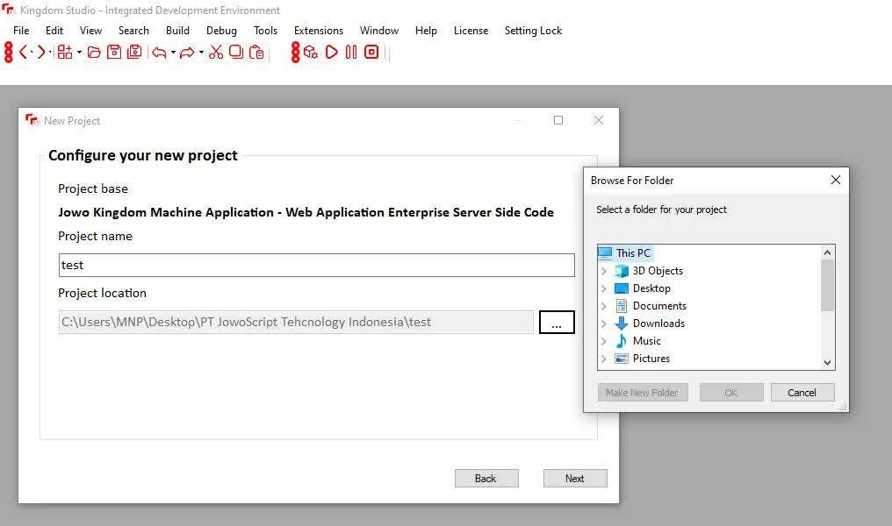

<div align="center">
<a href="https://github.com/JowoScript" target="_self">
</img>
</a>
</div>
<div align="center">
<strong>	
</strong>
<strong>
	PT JowoScript Technology Indonesia
	<br>
	the value company trillion dollars 
	<br>
	sesuai judul ya
	<br>
	Introduction
</strong>
</div>
</div>

#### siapa kena bantai di akhir mampus bermasalah sama gue dan kepala siapa masuk karung untuk bukti syarat pembelian produk gue. siapa pengangguran mereka di akhir juga akan mati sendiri siapa tidak berguna. ngapain gue tidak tegaan mereka intimidasi gue juga begitu ya dari 2022 juga kejam jadi adil ya kejam di bales kejam. ya nonton saja itu termasuk syarat pembelian semakin lama siapa kena bantai bukan gue

#### mau bertanding dj nya sama gue hidup serba ada ? lu mati dj jadi sampah di akhir pegang omongan gue ya paham. skill coding saja jahu sama gue seperti langit dan bumi paham sampai sini, lu itu bego dj sadar diri ya dan gue pintar sadar diri


#### Kalian juga tidak bisa kembangkan produk gue buat banyak gaya tapi goblok sok pintar dari gue paham sampai sini kelompok pecundang dan pengangguran kalian fakta rah sah cangkeman ya hahahaha the checkmate forever 

#### Dari 2021 posisi gue sudah benar siapa senggol gue pasti gue bales kalian anak informatika. siapa failed proyek akan bayar hutang kalian bukan gue

#### siapa failed proyek akan terlihat nantinya mampus bego bego dan perusahaan tidak berguna akan terlihat juga sudah jelas mereka bayar hutang kepada pemodal. mampus bego bego

#### kelompok suka intimidasi gue selama ini semua data ada ya seperti reza, bagaz, Rizal, woko, dan seterusnya barisan pecundang dan pengangguran ya

#### kelompok suka intimidasi gue lewat music di intimidasi balik mau tidak biar mampus kalian apa lagi sudah punya anak

#### aturan gue tetap berlaku jelas gue tau suara siapa selama ini di music jeduk jeduk Facebook. harus mati ya mati orang buat music jeduk jeduk selama ini. selama masih hidup orang-orang nya buat music jeduk jeduk dan menyisipkan suara di Facebook ya atau nonton saja kalian bego bego dan dungu ya hahaha 

#### buat music jeduk jeduk itu sengaja dan berkelompok gue tau dari awal. lebih dari satu orang mereka namanya berkelompok 

#### siapa jadi pecundang dan pengangguran DJ kasihan betul hidup kamu HAHAHHA jadi babu selamanya kamu DJ mampus hahaha apa lagi sudah punya anak ya easy for me dan gue tau anaknya tinggal sama siapa gue bukan orang bodoh ya sudah masuk sekolah dasar ya dan algojo gue tunggu perintah gue kapan pun itu siap mental tidak kalian. terlihat biasa saja suka di rumah lebih bahaya paham ya. teman sekolah juga sama gue tau semua bermuka dua. karena goblok akan terlihat terus kedepannya dekat komplek sesuai judul ya yang jahu saja gue tau gimana hanya sekitaran gue ya. kalo tidak punya nyali itu jangan banyak gaya blayer blayer seperti anak ayam mampus pengangguran dan pecundang dan tidak produktif siapa selama ini. 

##### mau dollar naik atau turun bukan kerjaan gue juga jadi bodo amat ya siapa goblok akan terlihat terus sama seperti kalian baca ya hahaha 

#### belum update foto versi barunya gue karena kasihan lihat orang bego masalahnya sudah bego hidup lagi ya kamu DJ buat music di facebook semua di recording dan bisa download ya

#### sesuai judul ya 

#### kalo saingan gue pengangguran seperti dj nya biar mati sendiri mereka kelompok pecundang mampus hahahaha

##### PT JowoScript Technology Indonesia does not have any open job vacancies and does not need employees because the owner company Muhammad Nurcahyo Pratomo, has been working alone all this time making products and all products its not free too. Sesuai judul ya orang dungu akan bermunculan terus di dunia kerja dan perusahaan tidak berguna akan bermunculan terus ya. sudah banyak masuk media ya perusahaan tutup dan phk karena dungu akan terlihat terus di media online 

#### PT JowoScript Technology Indonesia tidak membuka lowongan kerja dan tidak butuh karyawan karena owner nya Muhammad Nurcahyo Pratomo kerja sendiri selama ini buat produk 

#### Who Muhammad Nurcahyo Pratomo
<div>
Ownership company, directorship company, Software Architecture, Software Engineer and Software Developer at PT JowoScript Technology Indonesia for mothership product commercial. Muhammad Nurcahyo Pratomo a part freelance jobs Artificial Intelligence @anonymous not bound by legal contract by systems. Biar mampus goblok goblok cari kerja makin susah dan pengusaha goblok goblok makin susah bersaing 
</div>

### Muhammad Nurcahyo Pratomo Intro Small talk of Law (the law by law)
<div>
	I use Indonesian language everyday, so if you are a foreigner who doesn't understand Indonesian language, that's your problem right simple logic.
	foreigner who doesn't understand Indonesian language, that's your problem right simple logic.
	<br><br>
	The free programing language don't have fundamental of law and easy to be hacking like a phishing (developer cloning website without owner permision) or anything the solution is my product deadlock phishing and different my new programming language and powered by PT Jowoscript Technology Indonesia for commerical  (different law and syntax code). The implicit fair the law by law and the legal by legal
	<br><br>
</div>

### Muhammad Nurcahyo Pratomo Intro Deep The Browser History
<div>
	By 2021 Muhammad Nurcahyo Pratomo (Self) created a new programming language for commercial license (NOT FREE PRICE) and make new rules.
	<br><br>
	The free programing language don't have fundamental of law and easy to be crack or anything and different my new programming language and powered by PT Jowoscript Technology Indonesia for commerical (different law and syntax code). The implicit fair the law by law and the legal by legal
</div>

### Blacklist data is problematic with its creator based on name company (This will update in kingdom technology environment, jowoscript, js3, etc), all data will increase over time stay tune. The relations partner will be blacklist too (After i blacklist They black days the future) 
<div align="justify">
<ol>
	<li>Wikipedia delete my name  Muhammad Nurcahyo Pratomo article  and my company PT JowoScript Technology Indonesia article and my products article (proof archive internet) because i write my name article for biography history alone and my product and my company so i can blacklist too wikipedia in my product. this fair right then my product blacklist domain name server permanent for Wikipedia and no matter how expensive Wikipedia domain name thats be zero by me too thats website running in php i know. kenapa gue harus takut sama orang lebih goblok dari gue ya kalian bisa apa gue tanya persaingan makin berat kedepannya. Gimana produk komersial lainnya perusahaan komersial lainnya menampilkan di Wikipedia tidak di hapus ya</li>
	<li>Cryptocurrency</li>
	<li>Holywings Group</li>
	<li>Big bad wolf Indonesia (global) is have problematic with Muhammad Nurcahyo Pratomo before (bullying and intimidation work / buliying saya di waktu kerja pada tahun 2017 di Surabaya) siapa bullying gue dulu waktu kerja di surabaya sampai ngancam gue tembak mati di group wa siapa calon mayat di akhir bukan gue ya dan kenapa gue harus takut sama orang lebih goblok dari gue ya di wa group dulu. Pak Amir suruh buka suara sana saksi hidup dan chat wa group</li>
	<li>Penta Group Indonesia</li>
	<li>Sinergi group Indonesia</li>
	<li>IFS Solusi Integrasi Indonesia is have problematic with Muhammad Nurcahyo Pratomo before (see point number 22 / mainin gue test masuk kerja | Setiap perusahaan gue datengin pasti gue catat)</li>
	<li>Medco Energi Indonesia is have problematic with Muhammad Nurcahyo Pratomo before (see point number 22 / mainin gue test masuk kerja | Setiap perusahaan gue datengin pasti gue catat)</li>
	<li>MetroData Indonesia is have problematic with Muhammad Nurcahyo Pratomo before (see point number 22 / mainin gue test masuk kerja | Setiap perusahaan gue datengin pasti gue catat) so the relationship with IBM partners is tied up</li>
	<li>Whatever type of cryptocurrency (global) is ilegal currency (case closed)</li>
	<li>Infosys india is have problematic with Muhammad Nurcahyo Pratomo before (see point number 22 / mainin gue lewat test masuk kerja | Setiap perusahaan gue datengin pasti gue catat)</li>
	<li>Polisi Indonesia, polisi bermasalah sama gue kalo kena pecat jadi pengangguran gampangkan bisa apa polisi bermasalah sama gue, bisa berdiri sendiri seperti gue (yang lemah dan kuat akan terlihat ketika sendiri)</li>
	<li>IBM Indonesia</li>
	<li>MNC Group Indonesia (see point number 22 / mainin gue lewat test masuk kerja | Setiap perusahaan gue datengin pasti gue catat)</li>
	<li>Transcorp (PT Trans Corpora) (see point number 22 / mainin gue lewat test masuk kerja | Semua perusahaan gue datengin pasti gue catat)</li>
	<li>SMK Media Informatika (guru) guru bermasalah sama gue kalo kena pecat jadi pengangguran gampangkan bisa apa guru bermasalah sama gue, bisa berdiri sendiri seperti gue (yang lemah dan kuat akan terlihat ketika sendiri | mainin gue dalam membuat RPP)</li>
	<li>Kementerian Pendidikan Tinggi, Sains, dan Teknologi Indonesia (Dosen Oknum) Dosen bermasalah sama gue kalo kena pecat jadi pengangguran gampangkan bisa apa dosen bermasalah sama gue, bisa berdiri sendiri seperti gue (yang lemah dan kuat akan terlihat ketika sendiri)</li>
	<li>Apapun alesannya test psikotest semua masuk blacklist gue kalian (jurusan psikologi) sudah merugikan banyak jurusan, orang bukan jurusan psikologi di kasih soal test psikotest siapa yang goblok sebenarnya ? Jurusan psikologi di kasih soal jurusan kedokteran bisa jawab tidak atau kasih soal jurusan hukum atau kasih soal jurusan IT. Orang psikologi  paham artinya linier tidak dalam bidang jurusan ? tanya pakar professor di universitas</li>
	<li>Sekolah Al-Hikmah petukangan selatan. music suara siapa di kita gue tidak tau</li>
</ol>
</div>

### Muhammad Nurcahyo Pratomo Intro Product PT JowoScript Technology Indonesia

#### Original product has label powered by PT JowoScript Technology Indonesia. sesuai judul orang mau nipu gue di akhir mati sendiri. Hobinya ngumpulin uang tapi tidak beli mampus di akhir karena orang goblok sok pintar dari gue itu banyak. Sesuai judul orang sok pinter dari gue di akhir jadi bahan hinaan dan amukan banyak orang. Siapa lagi orang goblok dan dungu suka ngarang cerita lagi. Paham sampai sini

#### Purchases of licensed products must be paid in full without debt or credit di baca ya kalo goblok
</img>
	 </img>

### Muhammad Nurcahyo Pratomo Intro Product PT JowoScript Technology Indonesia

#### Original product has label powered by PT JowoScript Technology Indonesia. sesuai judul orang mau nipu gue di akhir mati sendiri. Hobinya ngumpulin uang tapi tidak beli mampus di akhir karena orang goblok sok pintar dari gue itu banyak. Sesuai judul orang sok pinter dari gue di akhir jadi bahan hinaan dan amukan banyak orang. Siapa lagi orang goblok dan dungu suka ngarang cerita lagi. Paham sampai sini

</img>

### Muhammad Nurcahyo Pratomo Intro Product PT JowoScript Technology Indonesia

#### Original product has label powered by PT JowoScript Technology Indonesia. sesuai judul orang mau nipu gue di akhir mati sendiri. Hobinya ngumpulin uang tapi tidak beli mampus di akhir karena orang goblok sok pintar dari gue itu banyak. Sesuai judul orang sok pinter dari gue di akhir jadi bahan hinaan dan amukan banyak orang. Siapa lagi orang goblok dan dungu suka ngarang cerita lagi. Paham sampai sini

#### Only work in my new programing language (JowoScript and JS3)

</img>
	 
#### Legality Statement Letter of PT JowoScript Technology Indonesia

#### Original product has label powered by PT JowoScript Technology Indonesia. sesuai judul orang mau nipu gue di akhir mati sendiri. Hobinya ngumpulin uang tapi tidak beli mampus di akhir karena orang goblok sok pintar dari gue itu banyak. Sesuai judul orang sok pinter dari gue di akhir jadi bahan hinaan dan amukan banyak orang. Siapa lagi orang goblok dan dungu suka ngarang cerita lagi. Paham sampai sini

</img>

### Muhammad Nurcahyo Pratomo Intro Product PT JowoScript Technology Indonesia

#### Original product has label powered by PT JowoScript Technology Indonesia. sesuai judul orang mau nipu gue di akhir mati sendiri. Hobinya ngumpulin uang tapi tidak beli mampus di akhir karena orang goblok sok pintar dari gue itu banyak. Sesuai judul orang sok pinter dari gue di akhir jadi bahan hinaan dan amukan banyak orang. Siapa lagi orang goblok dan dungu suka ngarang cerita lagi. Paham sampai sini

</img>
	 
### Muhammad Nurcahyo Pratomo Intro Small talk Example Product
<ul>
	<li>Many new method encryption end to end in product</li>
	<li>Many new method decryption end to end in product</li>
	<li>Many new method element in product</li>
	<li>Many new method paradigma in product</li>
	<li>Many new method secret in product</li>
</ul>

### Muhammad Nurcahyo Pratomo Intro Jowo Kingdom Machine or JKM History Small talk
<div>
	I'm behind Code Jowo Kingdom Machine or JKM until now, Jowo Kingdom Machine or JKM Build first 2024 until now and build with knowledge.
</div>

### Muhammad Nurcahyo Pratomo Intro JXML and JHTML History Small talk
<div>
	I'm behind Code JXML and JHTML until now, JXML and JHTML Build first 2025 until now and build with knowledge.
</div>

### Muhammad Nurcahyo Pratomo Intro Jowo Object Notation History Small talk
<div>
	I'm behind Code Jowo Object Notation until now, Jowo Object Notation Build first 2025 until now and build with knowladge.
</div>

### Muhammad Nurcahyo Pratomo Intro JowoScript and JS3 History Small talk
<div>
	I'm behind Code JowoScript and JS3 until now, JowoScript and JS3 Build first 2021 until now and build with knowladge.
</div>

### Muhammad Nurcahyo Pratomo Intro Kingdom Technology Environment History Small talk
<div>
	I'm behind Code Kingdom Studio until now, Kingdom Studio Build first 2025 until now and build with knowledge. Then I changed the name to Kingdom Technology Environment in 2026.
</div>

### Jaminan Produk (Jika sudah beli)
<ul>
<li>PT JOWOSCRIPT TECHNOLOGY INDONESIA, DAN AFILIASI, PENGECER, DISTRIBUTOR, DAN VENDOR, TIDAK MEMBERIKAN JAMINAN, BAIK TERSURAT MAUPUN TERSIRAT, GARANSI, ATAU KETENTUAN SEHUBUNGAN DENGAN PENGGUNAAN LAYANAN OLEH ANDA. ANDA MEMAHAMI BAHWA ANDA MENANGGUNG RISIKO PENGGUNAAN LAYANAN DAN KAMI MEMBERIKAN LAYANAN "SEBAGAIMANA ADANYA", "DENGAN SEGALA KEKURANGANNYA", DAN "SEBAGAIMANA TERSEDIA". PT JOWOSCRIPT TECHNOLOGY INDONESIA TIDAK MENJAMIN KEAKURATAN ATAU KETEPATAN WAKTU LAYANAN. ANDA MUNGKIN MEMILIKI HAK-HAK TERTENTU MENURUT HUKUM SETEMPAT ANDA. TIDAK ADA SATU BAGIAN PUN DALAM PERSYARATAN INI YANG DIMAKSUDKAN UNTUK MEMENGARUHI HAK TERSEBUT, JIKA MEMANG ADA. ANDA MEMAHAMI BAHWA KOMPUTER DAN SISTEM TELEKOMUNIKASI TIDAK BEBAS DARI KESALAHAN DAN LAYANAN MUNGKIN AKAN SESEKALI TIDAK TERSEDIA. KAMI TIDAK MENJAMIN LAYANAN TIDAK AKAN TERGANGGU, TEPAT WAKTU, AMAN, ATAU BEBAS DARI KESALAHAN ATAU BAHWA HILANGNYA KONTEN TIDAK AKAN TERJADI, ATAU KAMI TIDAK MENJAMIN SAMBUNGAN ATAU TRANSMISI APA PUN DARI JARINGAN KOMPUTER.
</li>
<li>SEJAUH YANG DIIZINKAN OLEH HUKUM SETEMPAT, KAMI MENGECUALIKAN JAMINAN TERSIRAT APA PUN, TERMASUK KELAYAKAN UNTUK DIPERDAGANGKAN, KUALITAS YANG MEMUASKAN, KESESUAIAN UNTUK TUJUAN TERTENTU, KECAKAPAN USAHA, DAN KETIADAAN PELANGGARAN.</li>
</ul>

### Legal Rights of Technology Creators and Basic Regulatory Requirements for Registration and Purchase (if you buy and if you don't buy, just watch because the real stuff and fake stuff is different)
<div align="justify">
<ol>
	<li>If there is still war, become because provocateur is <b>cryptocurrency and gambling site influencer on social media for money</b>. that's way i blacklist cryptocurrency and gambling</li>
	<li><b>It is strictly forbidden to wage war between countries without a clear reason based on the unity of nations and this is also i'm agree</b></li>
	<li>The free programing language don't have fundamental of law and easy to be crack or anything and different my new programming language and powered by PT Jowoscript Technology Indonesia for commerical (different law and syntax code). The implicit fair the law by law and the legal by legal</li>
	<li>My new programming language must use end-to-end encryption and privacy security, return to the rules of Muhammad Nurcahyo Pratomo (law by law) and cannot be sued by any party is a permanent legal form</li>
	<li>If the party members intimidate me then I will be blacklist by the party for no reason whatsoever, return to the rules of Muhammad Nurcahyo Pratomo (the law by law)</li>
	<li>Muhammad Nurcahyo Pratomo is tax-free from the government and invansion, return to the rules of Muhammad Nurcahyo Pratomo (the law by law)</li>
	<li>People who have been to prison are strictly prohibited from using new programming languages ​​and products return to the rules of Muhammad Nurcahyo Pratomo (the law by law)</li>
	<li>Intimidation, whether verbal or otherwise, is strictly prohibited. The incident against Muhammad Nurcahyo Pratomo is a serious offense and could result in a fine of <b>1,000 trillion rupiah</b> return to the rules of Muhammad Nurcahyo Pratomo dan siapa nyuruh buat music akan jadi tersangka utama ya dan sebaliknya jika tidak ada nyuruh buat music siapa akan jadi tersangka utama nya jelas buat music, return to the rules of Muhammad Nurcahyo Pratomo (the law by law) </li>
<li>All types of psychometric test questions should be must eliminated as a requirement for entering the workforce or of kind , return to the rules of Muhammad Nurcahyo Pratomo (the law by law)</li>
<li>The government is strictly prohibited from waging war between countries except to combat gambling sites, narcotics, corruption and the like, return to the rules of Muhammad Nurcahyo Pratomo (the law by law)</li>
<li>Must follow obey the legal policy rules and regulations in force in the country where you live and cannot be contested by any party</li>
<li>Whatever type of cryptocurrency is not allowed forever to buy my products at any time and Only the local currency of your country of residence is allowed to purchase my products. This fair and justice for government (So the local currency government value have more powerful than cryptocurrency)</li>
<li>Sites that contain pornography and immorality are strictly prohibited (Website or app users must be 20+ for adult content movie warnings)</li>
<li>Gambling sites are strictly prohibited,return to the rules of Muhammad Nurcahyo Pratomo (the law by law) and government</li>
<li>Terrorism sites are strictly prohibited,return to the rules of Muhammad Nurcahyo Pratomo (the law by law) and government</li>
<li>User strictly prohibited as an instrument of crime return to the rules of Muhammad Nurcahyo Pratomo (the law by law)</li>
<li>The policy of the intellectual patent by Muhammad Nurcahyo Pratomo cannot be contested by any party, either in the future or now. Both in the form of binary code and inherethin or computed binary intellectual within patent and legal rights of technology creators by Muhammad Nurcahyo Pratomo. Legal Rights of Technology Creators</li>
<li>Muhammad Nurcahyo Pratomo cannot be sued by any party, including the government, if it is detrimental to Muhammad Nurcahyo Pratomo, return to the rules of Muhammad Nurcahyo Pratomo</li>
<li>Muhammad Nurcahyo Pratomo  has the right to blacklist if there are individuals problem for me return to the rules of Muhammad Nurcahyo Pratomo </li>
<li>Muhammad Nurcahyo Pratomo has the right to blacklist government agencies if there are individuals who threaten and make things difficult for me return to the rules of Muhammad Nurcahyo Pratomo</li>
<li>Muhammad Nurcahyo Pratomo has the right to blacklist company agencies if there are individuals who threaten and make things difficult for me,  return to the rules of Muhammad Nurcahyo Pratomo</li>
<li>Muhammad Nurcahyo Pratomo has the right to create global native code and strict code in bytecode form with a valid commercial license in the field of science with new programing language</li>
<li>Whatever type of cryptocurrency is strictly prohibited and into blacklist, return to the rules of Muhammad Nurcahyo Pratomo (the law by law)</li>
<li>Money laundering is strictly prohibited, return to the rules of Muhammad Nurcahyo Pratomo (the law by law) and government</li>
<li>Whatever the type of music and video, everything is regulated in the provision of services for each application and does not violate copyright, return to the rules of Muhammad Nurcahyo Pratomo (the law by law)</li>
<li><b>Minimum age required to be 18 years old in using programming language code and can use good logic algorithms</b> return to the rules of Muhammad Nurcahyo Pratomo (the law by law) </li>
<li>Price tag that has been applied cannot be contested by any party, either in the future or now, return to the rules of Muhammad Nurcahyo Pratomo (the law by law)</li>
<li>Alcohol or intoxicating drinks sites are strictly prohibited, return to the rules of Muhammad Nurcahyo Pratomo (the law by law)</li>
<li>User OR Applications that support drug or narcotics transactions are strictly prohibited (example case study like heroin, cocaine, morphine, opium, etc) return to the rules of Muhammad Nurcahyo Pratomo (the law by law) </li>
<li>Must have a legality flag that is a legal entity return to the rules of Muhammad Nurcahyo Pratomo (the law by law) </li>
<li>It is strictly prohibited for weapons of war such as politics, crime and kindly, return to the rules of Muhammad Nurcahyo Pratomo (the law by law)</li>
<li>Haters, abusers, bullies and two-faced friend (good in front but rotten behind) people from indentiy (Indonesia and Malaysia) are MUST DIE FIRST and there must be EVIDENCE OF THE BODY</li>
<li>The company (Indonesia and Malaysia) that had problems with Muhammad Nurchayo Pratomo was the entrance test and etc before are strictly prohibited from obtaining licenses forever, return to the rules of Muhammad Nurcahyo Pratomo (the law by law)</li>
<li>Friends people (example playmates or school or work) and two-faced friend (good in front but rotten behind) (Indonesia and Malaysia) They can hide from Muhammad Nurcahyo Pratomo but can't be lie in the out and people (Indonesia and Malaysia) who have problems with Muhammad Nurchayo Pratomo are MUST DIE FIRST and there must be EVIDENCE OF THE BODY.  Even if the problematic friend works for a government agency, the same rules apply to that agency. return to the rules of Muhammad Nurcahyo Pratomo (the law by law)</li>
<li>Especially for those who insert sound into music in Disc Jockey (DJ) and the conclusion is that the sound is changed into music to curse and be alone, the perpetrator MUST DIE FIRST and there must be EVIDENCE OF THE BODY if there is a company or government that wants to buy the license. Life is a choice. Rules are rules. If you dare to insult and curse by inserting sound into music, it means you have to dare to take risks. There must be proof of death of the perpetrator who made the music insert all this time. return to the rules of Muhammad Nurcahyo Pratomo (the law by law)</li>
<li>Registered trademark products of PT JowoScript Technology Indonesia return to the rules of Muhammad Nurcahyo Pratomo</li>
<li>Registered trademark logos of PT JowoScript Technology Indonesia return to the rules of Muhammad Nurcahyo Pratomo</li>
</ol>
</div>

### Legal Rights of Technology Creators and The regulatory requirements for purchase license tokens
<div align="justify">
<ol>
<li>Must follow and obey basic regulatory requirements in registration license agreement</li>
<li>Payment and purchase of the license is carried out by both parties with witnesses from the technology maker by Muhammad Nurcahyo Pratomo and a lawyer or legal entity</li>
<li>Must have a legality flag that is a legal entity</li>
<li>Must have a domain name server live as your legality flag name masters (example of a live universal domain is *.gov.your name of goverment or any domain)</li>
<li>Technology remains in end to end encryption</li>
<li>Can use Technology features if the license token runs out will not be able to use</li>
<li>Technology can be controlled for localhost or 127.0.0.1 and can be changed choices to your own ip settings</li>
</ol>
</div>

### Legal Rights of Technology Creators and Laws against violators of the Legal Rights of Technology Creators
<div align="justify">
<ol>
<li>Will deal with the laws in force in the country where you live or jail the future</li>
<li>The license product purchaser may choose an appointed attorney who will act to prosecute any existing violations and may not be sued by any party</li>
<li>Gambling The minimum fine for violation is the minimum price of the license purchased cannot be contested by any party, either in the future or now</li>
<li>Case studies on the inability to pay the minimum fine for violations will be submitted to existing laws, both based on the legal basis in force in the country where you live and cannot be challenged by any party</li>
<li>Payment of fines is made by both parties witnessed by the court and and lawyers or prosecutors or legal entities</li>
</ol>
</div>

### Support Technology with license business :
<div align="justify">
<ol>
<li><b>Can restart or shutdown operation system in kingdom technology environment</b> with license business (note this only have key code)</li>
<li><b>Can monitor operation system in kingdom technology environment</b> with license business (note this only have key code)</li>
<li>JowoScript programing language Architecture, developer and designed by Muhammad Nurcahyo Pratomo in Java Island of Indonesia and will be the foundation pillar of native code technology frontend or backend programing language for licensing business. This only for jowoscript programing language not for javascript programing language</li>
<li>Kingdom Technology Environment Architecture, developer and designed by Muhammad Nurcahyo Pratomo in Java Island of Indonesia and will be the foundation pillar of IDE Kingdom technology product for licensing business.</li>
<li>Jowo Kingdom Machine Architecture, developer and designed by Muhammad Nurcahyo Pratomo in Java Island of Indonesia and will be the foundation pillar of backend programing language for licensing business.</li>
<li>PT JowoScript Technology Indonesia products list must be purchased license business to activate all the features</li>
<li>Buying the license business product must be legal and registered under the law</li>
<li>JowoScript programing language product copyright is PT JowoScript Technology Indonesia</li>
<li>Kingdom Technology Environment product copyright is PT JowoScript Technology Indonesia</li>
<li>Jowo Kingdom Machine product copyright is PT JowoScript Technology Indonesia</li>
<li><b>Cant be read in Artificial Intelligence (AI)</b> with license business jowoscript programing language</li>
<li><b>Cant be read in Artificial Intelligence (AI)</b> with license business jowo kingdom programing language</li>
<li><b>Can lock in native code</b> with license business jowoscript programing language only</li>
<li><b>Can lock in Kingdom Technology Environment</b> with license business kingdom technology environment only</li>
<li><b>Can lock in Jowo Kingdom Machine</b> with license business jowo kingdom programing language only</li>
<li>Auto compile and dive deeper JowoScript of compile inside file extension *.js or *.jowo with type of application/jowoscript or text/jowoscript with license business jowoscript programing language</li>
<li>Auto compile and dive deeper JowoStyle of compile inside file extension *.jss or *.js3 with type of application/jowostyle or text/jowostyle with license business jowoscript programing language</li>
<li>JowoScript Technology and JowoStyle Technology undefined technology the mean is cannot be detected by third-party technology or the like because the source code of JowoScript Technology is end-to-end encryption, meaning that it is not easily read by bad hackers or cybercriminals.</li>
<li>Very easy to install on multiplatform servers to deploy because it is a native technology with javascript technology standard</li>
<li>Responsive mode user interface (Meaning i.e. when your design is in tablet mode, mobile or phone mode, television mode, LCD(Liquid Crystal Display) mode and laptop mode)</li>
<li>Smart automatic detection error in javascript engine with license business jowoscript programing language</li>
<li>Smart automatic detection error in jowoscript engine with license business jowoscript programing language</li>
<li>Handling array of objects and decided multiple of attributes and pseudo with license business jowoscript programing language</li>	
</ol>
</div>
     
## PT JowoScript Technology Indonesia products list :
<div align="justify">
<ol>
	<li>
	<strong>
JowoScript is The cross platform an front end programming language typing less, compile language, complex structure, small size and faster [file extension *.JOWO type JowoScript] (license must be purchased to activate all the features)
	</strong>
	<br>
JowoScript adalah bahasa pemrograman front-end lintas platform yang mengetik lebih sedikit, bahasa kompilasi, struktur kompleks, ukuran kecil dan lebih cepat [ekstensi file *.JOWO jenis JowoScript] (lisensi harus dibeli untuk mengaktifkan semua fitur)
	<br><br>
	</li>
	<li>
	<strong>
Jowo Kingdom Machine is The cross platform an backend programming language with new methods to advancing complex data scientists, advancing complex data processing, and advancing complex enterprise applications [file extension *.JKM type Jowo Kingdom Machine] (license must be purchased to activate all the features)
	</strong>
	<br>
Jowo Kingdom Machine adalah bahasa pemrograman backend lintas platform dengan metode baru untuk memajukan ilmuwan data yang kompleks, memajukan pemrosesan data yang kompleks, dan memajukan aplikasi perusahaan yang kompleks [ekstensi file *.JKM jenis Jowo Kingdom Machine] (lisensi harus dibeli untuk mengaktifkan semua fitur)
	<br><br>
	</li>
	<li>
	<strong>
Kingdom Technology Environment is The cross platform an integrated development environment [file extension *.kingdom type Kingdom Technology Environment Solution] (license must be purchased to activate all the features)
	</strong>
	<br>
Kingdom Technology Environment adalah lingkungan pengembangan terintegrasi lintas platform [ekstensi file *.kingdom jenis Solusi Kingdom Technology Environment] (lisensi harus dibeli untuk mengaktifkan semua fitur)
	<br><br>
	</li>
	<li>
	<strong>
Jowo Kingdom Server is The cross platform an server host (license must be purchased to activate all the features)
	</strong>
	<br>
Jowo Kingdom Server adalah server host lintas platform (lisensi harus dibeli untuk mengaktifkan semua fitur)
  	<br><br>
	</li>
	<li>
	<strong>
Structured Query Jowo Language is The cross platform an query programming language [file extension *.SQJL type Structured Query Jowo Language] (license must be purchased to activate all the features)
	</strong>
	<br>
	Structured Query Bahasa Jowo adalah bahasa pemrograman query lintas platform [ekstensi file *.SQJL jenis Structured Query Bahasa Jowo] (lisensi harus dibeli untuk mengaktifkan semua fitur)
	<br><br>
	</li>
	<li>
	<strong>
JowoStyleSheet is programming language for a pattern core of computation style sheet programming language used for describing the presentation of JowoScript programming language [file extension *.JS3 type Jowo Style Sheet] (license must be purchased to activate all the features)
	</strong>
	<br>
JowoStyleSheet adalah bahasa pemrograman untuk inti pola bahasa pemrograman lembar gaya komputasi yang digunakan untuk mendeskripsikan presentasi bahasa pemrograman JowoScript [ekstensi file *.JS3 jenis Jowo Style Sheet] (lisensi harus dibeli untuk mengaktifkan semua fitur)
	<br><br>
	</li>
</ol>
</div>
<br>
<div align="center">
<strong>
	The new is JowoScript and Jowo Kingdom Machine the powerfull of native code of native jowo and super power of new technology concept that brings the future (license must be purchased)
	<br><br>
	The intellectual patent by Muhammad Nurcahyo Pratomo cannot be contested by any party, either in the future or now
</strong>
</div>
<br><br>
<details>
<summary><b>After (license be purchased) Support Technology :</b></summary>
<div align="justify">
<ul><li>Kingdom Technology Environment Run and Debug binary code Jowo Kingdom Machine inside file extension *.JKM with type of binary code and deploy pack *.JKLASS with type of binary code</li>
<li>Kingdom Technology Environment Run and Debug binary code Structured Query Jowo Language inside file extension *.SQJL with type of binary code</li><li>Kingdom Technology Environment Run and Debug JowoScript of compile inside file extension *.JOWO with type of application/jowoscript or text/jowoscript</li><li>Kingdom Technology Environment Run and Debug JowoStyle of compile inside file extension *.JS3 with type of application/jowostyle or text/jowostyle</li><li>JowoScript Technology and JowoStyle Technology undefined technology the mean is cannot be detected by third-party technology or the like because the source code of JowoScript Technology is end-to-end encryption, meaning that it is not easily read by bad hackers or cybercriminals.</li><li>Responsive mode user interface (Meaning i.e. when your design is in tablet mode, mobile or phone mode, television mode, LCD(Liquid Crystal Display) mode and laptop mode)</li><li>Native platform (For example, a cross-platform application may run on Microsoft Mobile, Microsoft Windows, Android, z/OS, Linux OS, Unix OS, iOS and macOS)</li><li>Smart automatic detection error in javascript engine</li><li>Smart automatic detection error in jowoscript engine</li><li>Smart automatic detection error in jowo kingdom engine</li><li>Handling array of objects and decided multiple of attributes and pseudo</li></ul>
</div>
</details>

```html
/*
 * [Command Line API]
 * $.version 	: xx.xx.xx
 * $.owner 	: Muhammad Nurcahyo Pratomo
 * $.creator	: Muhammad Nurcahyo Pratomo
 * $.architect	: Muhammad Nurcahyo Pratomo
 * $.author	: Muhammad Nurcahyo Pratomo
 * $.founder	: Muhammad Nurcahyo Pratomo 
 * $.developer	: Muhammad Nurcahyo Pratomo
 * $.copyright	: PT JowoScript Technology Indonesia
 * $.license 	: After (license be purchased) to Licensed under privilege of purchaser's license name. Example your company name or organization name or government name
 * $.legality 	: After (license be purchased) to Licensed under privilege of purchaser's legality name. Example your company name or organization name or government name
 */

Example :
global attribute 	: $("*object global attribute value");
mnp attribute		: mnp("mnp^object"), jowo("mnp^object"), mnp("^object"), jowo("^object");
jowo attribute		: mnp("jowo*object"), jowo("jowo*object"), mnp("*object"), jowo("*object");
jawa attribute		: mnp("jawa@object"), jowo("jawa@object"), mnp("@object"), jowo("@object");
id attribute		: mnp("id*object"), jowo("id*object"), mnp("id^object"), jowo("id^object"), mnp("id@object"), jowo("id@object"), mnp("#object"), jowo("#object");
class attribute		: mnp("class*object"), jowo("class*object"), mnp("class^object"), jowo("class^object"), mnp("class@object"), jowo("class@object"), mnp(".object"), jowo(".object");
name attribute		: mnp("name*object"), mnp("name^object"), mnp("name@object");
array of attribute 	: mnp("[ jowo*object, [jowo*object], element[attribute], node[node] ]")	mnp("element[attribute="value"], [attribute="value"], [attribute="value"] [attribute]");
array of pseudo		: mnp("[ element:pseudo, node:pseudo ], element:pseudo node:pseudo object:pseudo ");
```
<br>
<div align="center"><strong>Installation information</strong></div>
<details>
<summary>Installation iOS - MacOS</summary>

```java
//Let's call class WKWebViewConfiguration(), WKWebView(frame, config), URL(url root) and URLRequest(base string url)
import UIKit
import WebKit
class ViewController: UIViewController, WKUIDelegate {
    var webView: WKWebView!
    override func loadView() {
        let webConfiguration = WKWebViewConfiguration()
        webView = WKWebView(frame: .zero, configuration: webConfiguration)
        webView.uiDelegate = self
        view = webView
    }
    override func viewDidLoad() {
        super.viewDidLoad()        
        let myURL = URL(string:"jowo-script.jowo")
        let myRequest = URLRequest(url: myURL!)
        webView.load(myRequest) //Load from url base webview class
	webView.loadHTMLString("<script>jowo.technology</script>", baseURL: myURL)
	//Result : JowoScript Technology
    }
}
```
iOS - MacOS, More information you can look at [here](https://developer.apple.com/documentation/webkit/wkwebview)
</details>
<details>
<summary>Installation server side Liferay Framework</summary>
	
```java
//Call this class JSTopHeadDynamicInclude extends BaseDynamicInclude (include, register)
@Component(immediate = true, service = DynamicInclude.class)
public class JSTopHeadDynamicInclude extends BaseDynamicInclude {
	@Override
	public void include(HttpServletRequest request, HttpServletResponse response, String key)
		throws IOException {
		PrintWriter printWriter = response.getWriter();
		String content = "<script href=\"http://localhost:8080/../../js/jowo-script.jowo\" type = \"text/javascript\" />";
		String jowoScript = "jowo.technology" type = \"text/javascript\" />";
		printWriter.println(jowoScript);
		//In console IDE like eclipse, rational application developer, jetbrains, netbeans, browser environment, etc. 
		//Result : JowoScript Technology
	}
	@Override
	public void register(DynamicIncludeRegistry dynamicIncludeRegistry) {
		dynamicIncludeRegistry.register("/html/common/themes/top_js.jspf#resources");		
	}  
}
```
Liferay Framework, More information you can look at [here](https://help.liferay.com/hc/en-us/articles/360018165751-Top-JS-Dynamic-Include-)
</details>
<details>
<summary>Installation Zkoss Framework</summary>
	
```javascript
<zk>
<script type="text/javascript" src="jowo-script.jowo"></script>
<window title="sample jowo script" border="none" width="100%" closable="true">	
	<script type="text/javascript">
		jowo.technology
	</script>
	//Result : JowoScript Technology
</window>
</zk>
```
</details>
<details>
<summary>Installation Android</summary>
	
```java
webview.loadDataWithBaseURL("file:///android_asset/javascript/jowo-script.jowo", page, "text/javascript", null, null);
```
Android, More information you can look at [here](https://developer.android.com/guide/webapps/webview#kotlin)
</details>
<details>
<summary>Installation Microsoft DOT NET</summary>

```cs
/* Let's call this function in server side */
/* 
@Function method call in server side
public string GetWebResourceUrl (Type type, string resourceName);
*/

using System;
using System.Web;
using System.Web.UI;
using System.Security.Permissions;
[assembly: WebResource("Samples.AspNet.CS.Controls.jowo-script.jowo", "application/x-javascript")]
namespace Samples.AspNet.CS.Controls
{
    [AspNetHostingPermission(SecurityAction.Demand, Level = AspNetHostingPermissionLevel.Minimal)]
    public class ClientScriptResourceLabel
    {
		Console.WriteLine(jowo.technology);
		//Result : JowoScript Technology
    }
}
```
Microsoft DOT NET, More information you can look at [here](https://docs.microsoft.com/en-us/dotnet/api/system.web.ui.clientscriptmanager.getwebresourceurl?redirectedfrom=MSDN&view=netframework-4.8#System_Web_UI_ClientScriptManager_GetWebResourceUrl_System_Type_System_String_)
</details>
<details>
<summary>Installation standart HTML</summary>

<b>Make sure your code JavaScript tag install.</b>
	
```html
<html>
<head>
<script type="text/javascript" src="jowo-script.jowo"></script>
</head>
<body>
	<script type="text/javascript">
		var js = 'JowoScript Programming Language';
		const note = "if there is no PT JowoScript Technology Indonesia it is a fake file";
		var count = 1 / 9999;
		js.toLog();
		'Result :'+count.toLog();
		note.toLog();
		//Result JowoScript Programming Language
		//Result 0.00010001000100010001
		//Result if there is no PT JowoScript Technology Indonesia it is a fake file
	</script>
	<script>
		$.creator.toLog();
		//Result Muhammad Nurcahyo Pratomo
		$.copyright.toLog()
		//Result PT JowoScript Technology Indonesia
	</script>
</body>
</html>
```
</details>

#### Installation standart HTML
```html
<html>
<head>
<script type="text/javascript" src="jowo-script.jowo"></script>
</head>
<body>
	<script type="text/javascript">
		var js = 'JowoScript Programming Language';
		const note = "if there is no PT JowoScript Technology Indonesia it is a fake file";
		var count = 1 / 9999;
		js.toLog();
		'Result :'+count.toLog();
		note.toLog();
		//Result JowoScript Programming Language
		//Result 0.00010001000100010001
		//Result if there is no PT JowoScript Technology Indonesia it is a fake file
	</script>
	<script>
		$.creator.toLog();
		//Result Muhammad Nurcahyo Pratomo
		$.copyright.toLog()
		//Result PT JowoScript Technology Indonesia
	</script>
</body>
</html>
```
#### File JavaScript Example
```html
/*
 *
 * $.creator	: Muhammad Nurcahyo Pratomo
 * $.developer	: Muhammad Nurcahyo Pratomo
 * $.architect	: Muhammad Nurcahyo Pratomo
 * $.copyright	: Copyright © 2021 - Forever, PT JowoScript Technology Indonesia. All rights reserved.
 * mime-type	: javascript or text/javascript or application/javascript
 * extension	: *.js
 * 
 */

function helloJS(jowo){
	if(jowo.equal(101)){
		console.log('This file extension of hello.js');
	}
}

export {helloJS}
```
#### File JowoScript Example
```html
 /*
 *
 * $.creator	: Muhammad Nurcahyo Pratomo
 * $.developer	: Muhammad Nurcahyo Pratomo
 * $.architect	: Muhammad Nurcahyo Pratomo
 * $.copyright	: Copyright © 2021 - Forever, PT JowoScript Technology Indonesia. All rights reserved.
 * mime-type	: jowoscript or text/jowoscript or application/jowoscript
 * extension	: *.jowo
 *
 * Your need buy a license key for access the fiture of JowoScript Programming Language
 * Copyright (c) PT JowoScript Technology Indonesia, 2021 - Forever. All Rights Reserved.
 *
 */

import {helloJowo as JowoOfLegend} from "../../script/uat/hello.jowo";
import {helloJS as JSOfLegend} from "../../script/uat/hello.js"
import "../../script/uat/uat.jowo";
import "../../script/uat/uat.js";

console.log(JowoOfLegend(101));
JSOfLegend(101).toLog();
```
#### File JowoScript Example
```html
 /*
 *
 * $.creator	: Muhammad Nurcahyo Pratomo
 * $.developer	: Muhammad Nurcahyo Pratomo
 * $.architect	: Muhammad Nurcahyo Pratomo
 * $.copyright	: Copyright © 2021 - Forever, PT JowoScript Technology Indonesia. All rights reserved.
 * mime-type	: jowoscript or text/jowoscript or application/jowoscript
 * extension	: *.jowo
 *
 * Your need buy a license key for access the fiture of JowoScript Programming Language 
 * Copyright (c) PT JowoScript Technology Indonesia, 2021 - Forever. All Rights Reserved.
 *
 */

//This will easy to make design website smoothly too
//You can use this if you no need chain (But i love use the chain)
$('*AboutTechnology, *TheBusiness, *PrivacyPolicy, *LegalityCompany, *SponsorsWorkflow, *PartnersWorkflow, *PriceList').removeCss();

$('*Introduction').removeCss().chain('*IDE').removeCss();

$('class*icon-refresh').title('refresh').
chain('class*icon-maximize').title('full screen').
chain('html').background('#fff').
chain('body').background('#fff');

$('class*icon-refresh').addClass('left').addClass('icon-white').addClass('icon').addClass('icon-circle').addClass('cursor-pointer');
$('class*icon-minimize').addClass('right').addClass('icon-white').addClass('icon').addClass('icon-circle').addClass('cursor-pointer');
$('class*icon-maximize').addClass('right').addClass('icon-white').addClass('icon').addClass('icon-circle').addClass('cursor-pointer');
	
$('class*icon-refresh').click(function(){
	$.reload();
});

$('class*icon-maximize').click(function(){
	if($.isTrue($('class*icon-maximize').hasClass('icon-maximize'))) {
		$('class*icon-maximize').title('close screen').
		chain('class*icon-maximize').replaceClass('icon-maximize','icon-minimize');
	}
	else {
		$('class*icon-minimize').title('full screen').
		chain('class*icon-minimize').replaceClass('icon-minimize','icon-maximize');
	}
	$('body').screenToggle();
});

$('*fieldsetDocumentLegality').css('border-color:darkblue;border-width:5px').chain('*legDocumentLegality').fontSize('12px').fontCenter();
$('jowo*fieldset').append(
	$.createHTML('legend',{jowo:'field'},'value field')
).css('border-color:darkblue;border-width:5px').fontCenter().fontSize('16px').width('100%');

$('jowo*fieldsetArchitectureOfJowoScript').append(
	//Create legend Architechture Of JowoScript
	$.createHTML('legend',{jowo:'architectureOfJowoScript'},'Architechture Of JowoScript')
).
append(
	//Create img Architechture Of JowoScript
	$.createHTML('img',{jowo:'imgArchitectureOfJowoScript',src:'images/architecture of jowoscript technology.png',referrerpolicy:'origin'},'')
).
css('border-color:darkblue;border-width:5px').fontCenter().
chain('*architectureOfJowoScript').fontSize('16px').
chain('*imgArchitectureOfJowoScript').click(function(){
	$('*imgArchitectureOfJowoScript').screenToggle();
}).title('Architechture Of JowoScript','Architechture Of JowoScript').width('100%');
```
#### File JowoScript Example
```html
 /*
 *
 * $.creator	: Muhammad Nurcahyo Pratomo
 * $.developer	: Muhammad Nurcahyo Pratomo
 * $.architect	: Muhammad Nurcahyo Pratomo
 * $.copyright	: Copyright © 2021 - Forever, PT JowoScript Technology Indonesia. All rights reserved.
 * mime-type	: jowoscript or text/jowoscript or application/jowoscript
 * extension	: *.jowo
 *
 * Your need buy a license key for access the fiture of JowoScript Programming Language 
 * Copyright (c) PT JowoScript Technology Indonesia, 2021 - Forever. All Rights Reserved.
 *
 */

//Other fiture
console.log($.professorMindLevelText('JowoScript Programing Language'))
VM212:1 ▢▫▫▢▫▢▫□▢▢▫▢▢▢▢□▢▢▢▫▢▢▢□▢▢▫▢▢▢▢□▢▫▢▫▫▢▢□▢▢▫▫▫▢▢□▢▢▢▫▫▢▫□▢▢▫▢▫▫▢□▢▢▢▫▫▫▫□▢▢▢▫▢▫▫□▢▫▫▫▫▫□▢▫▢▫▫▫▫□▢▢▢▫▫▢▫□▢▢▫▢▢▢▢□▢▢▫▫▢▢▢□▢▢▢▫▫▢▫□▢▢▫▫▫▫▢□▢▢▫▢▢▫▢□▢▢▫▢▫▫▢□▢▢▫▢▢▢▫□▢▢▫▫▢▢▢□▢▫▫▫▫▫□▢▫▫▢▢▫▫□▢▢▫▫▫▫▢□▢▢▫▢▢▢▫□▢▢▫▫▢▢▢□▢▢▢▫▢▫▢□▢▢▫▫▫▫▢□▢▢▫▫▢▢▢□▢▢▫▫▢▫▢
console.log($.unprofessorMindLevelText('▢▫▫▢▫▢▫□▢▢▫▢▢▢▢□▢▢▢▫▢▢▢□▢▢▫▢▢▢▢□▢▫▢▫▫▢▢□▢▢▫▫▫▢▢□▢▢▢▫▫▢▫□▢▢▫▢▫▫▢□▢▢▢▫▫▫▫□▢▢▢▫▢▫▫□▢▫▫▫▫▫□▢▫▢▫▫▫▫□▢▢▢▫▫▢▫□▢▢▫▢▢▢▢□▢▢▫▫▢▢▢□▢▢▢▫▫▢▫□▢▢▫▫▫▫▢□▢▢▫▢▢▫▢□▢▢▫▢▫▫▢□▢▢▫▢▢▢▫□▢▢▫▫▢▢▢□▢▫▫▫▫▫□▢▫▫▢▢▫▫□▢▢▫▫▫▫▢□▢▢▫▢▢▢▫□▢▢▫▫▢▢▢□▢▢▢▫▢▫▢□▢▢▫▫▫▫▢□▢▢▫▫▢▢▢□▢▢▫▫▢▫▢'))
VM229:1 JowoScript Programing Language
console.log($.professorLevelText('JowoScript Programing Language'))
VM245:1 ∭∬∬∭∬∭∬∫∭∭∬∭∭∭∭∫∭∭∭∬∭∭∭∫∭∭∬∭∭∭∭∫∭∬∭∬∬∭∭∫∭∭∬∬∬∭∭∫∭∭∭∬∬∭∬∫∭∭∬∭∬∬∭∫∭∭∭∬∬∬∬∫∭∭∭∬∭∬∬∫∭∬∬∬∬∬∫∭∬∭∬∬∬∬∫∭∭∭∬∬∭∬∫∭∭∬∭∭∭∭∫∭∭∬∬∭∭∭∫∭∭∭∬∬∭∬∫∭∭∬∬∬∬∭∫∭∭∬∭∭∬∭∫∭∭∬∭∬∬∭∫∭∭∬∭∭∭∬∫∭∭∬∬∭∭∭∫∭∬∬∬∬∬∫∭∬∬∭∭∬∬∫∭∭∬∬∬∬∭∫∭∭∬∭∭∭∬∫∭∭∬∬∭∭∭∫∭∭∭∬∭∬∭∫∭∭∬∬∬∬∭∫∭∭∬∬∭∭∭∫∭∭∬∬∭∬∭
console.log($.unprofessorLevelText('∭∬∬∭∬∭∬∫∭∭∬∭∭∭∭∫∭∭∭∬∭∭∭∫∭∭∬∭∭∭∭∫∭∬∭∬∬∭∭∫∭∭∬∬∬∭∭∫∭∭∭∬∬∭∬∫∭∭∬∭∬∬∭∫∭∭∭∬∬∬∬∫∭∭∭∬∭∬∬∫∭∬∬∬∬∬∫∭∬∭∬∬∬∬∫∭∭∭∬∬∭∬∫∭∭∬∭∭∭∭∫∭∭∬∬∭∭∭∫∭∭∭∬∬∭∬∫∭∭∬∬∬∬∭∫∭∭∬∭∭∬∭∫∭∭∬∭∬∬∭∫∭∭∬∭∭∭∬∫∭∭∬∬∭∭∭∫∭∬∬∬∬∬∫∭∬∬∭∭∬∬∫∭∭∬∬∬∬∭∫∭∭∬∭∭∭∬∫∭∭∬∬∭∭∭∫∭∭∭∬∭∬∭∫∭∭∬∬∬∬∭∫∭∭∬∬∭∭∭∫∭∭∬∬∭∬∭'))
VM261:1 JowoScript Programing Language
console.log($.doctoralMindLevelText('JowoScript Programing Language'))
VM285:1 ▉██▉█▉█▊▉▉█▉▉▉▉▊▉▉▉█▉▉▉▊▉▉█▉▉▉▉▊▉█▉██▉▉▊▉▉███▉▉▊▉▉▉██▉█▊▉▉█▉██▉▊▉▉▉████▊▉▉▉█▉██▊▉█████▊▉█▉████▊▉▉▉██▉█▊▉▉█▉▉▉▉▊▉▉██▉▉▉▊▉▉▉██▉█▊▉▉████▉▊▉▉█▉▉█▉▊▉▉█▉██▉▊▉▉█▉▉▉█▊▉▉██▉▉▉▊▉█████▊▉██▉▉██▊▉▉████▉▊▉▉█▉▉▉█▊▉▉██▉▉▉▊▉▉▉█▉█▉▊▉▉████▉▊▉▉██▉▉▉▊▉▉██▉█▉
console.log($.undoctoralMindLevelText('▉██▉█▉█▊▉▉█▉▉▉▉▊▉▉▉█▉▉▉▊▉▉█▉▉▉▉▊▉█▉██▉▉▊▉▉███▉▉▊▉▉▉██▉█▊▉▉█▉██▉▊▉▉▉████▊▉▉▉█▉██▊▉█████▊▉█▉████▊▉▉▉██▉█▊▉▉█▉▉▉▉▊▉▉██▉▉▉▊▉▉▉██▉█▊▉▉████▉▊▉▉█▉▉█▉▊▉▉█▉██▉▊▉▉█▉▉▉█▊▉▉██▉▉▉▊▉█████▊▉██▉▉██▊▉▉████▉▊▉▉█▉▉▉█▊▉▉██▉▉▉▊▉▉▉█▉█▉▊▉▉████▉▊▉▉██▉▉▉▊▉▉██▉█▉'))
VM303:1 JowoScript Programing Language
```
#### File JowoScript Example
```html
 /*
 *
 * $.creator	: Muhammad Nurcahyo Pratomo
 * $.developer	: Muhammad Nurcahyo Pratomo
 * $.architect	: Muhammad Nurcahyo Pratomo
 * $.copyright	: Copyright © 2021 - Forever, PT JowoScript Technology Indonesia. All rights reserved.
 * mime-type	: jowoscript or text/jowoscript or application/jowoscript
 * extension	: *.jowo
 *
 * Your need buy a license key for access the fiture of JowoScript Programming Language 
 * Copyright (c) PT JowoScript Technology Indonesia, 2021 - Forever. All Rights Reserved.
 *
 */

//Your dont need import anything file class 
/* Encryption In JowoScript Programming Language */
var test = new Encryption;
console.log("Digits 160  : "+test.RipeMD160('Race Integrity Primitive Evaluation Message Digits 160'))
console.log("Digits Binary : "+test.RipeMDb160('Race Integrity Primitive Evaluation Message Digits Binary 160'))
console.log("Digits Octal : "+test.RipeMDo160('Race Integrity Primitive Evaluation Message Digits Octal 160'))
console.log("Digits Decimal : "+test.RipeMDd160('Race Integrity Primitive Evaluation Message Digits Decimal 160'))
console.log("Digits Duodecimal : "+test.RipeMDdd160('Race Integrity Primitive Evaluation Message Digits Duodecimal 160'))
console.log("Digits Hexadecimal : "+test.RipeMDhd160('Race Integrity Primitive Evaluation Message Digits Hexadecimal 160'))
console.log("Digits DuoTrigesimal : "+test.RipeMDdt160('Race Integrity Primitive Evaluation Message Digits DuoTrigesimal 160'))
console.log("Digits HexaTrigesimal : "+test.RipeMDht160('Race Integrity Primitive Evaluation Message Digits HexaTrigesimal 160'))
console.log("Digits Scientific : "+test.RipeMDs160('Race Integrity Primitive Evaluation Message Digits Scientific 160'))
console.log("Digits ASCII : "+test.RipeMDascii160('Race Integrity Primitive Evaluation Message Digits ASCII 160'))
console.log("Digits Roman Numeral : "+test.RipeMDrn160('Race Integrity Primitive Evaluation Message Digits Roman Numeral 160'))
console.log("Digits Arabic Numeral : "+test.RipeMDan160('Race Integrity Primitive Evaluation Message Digits Arabic Numeral 160'))
console.log("Digits Persian Numeral : "+test.RipeMDpn160('Race Integrity Primitive Evaluation Message Digits Persian Numeral 160'))
console.log("Digits Morse : "+test.RipeMDm160('Race Integrity Primitive Evaluation Message Digits Morse 160'))
console.log("Digits Light Morse : "+test.RipeMDlm160('Race Integrity Primitive Evaluation Message Digits Light Morse 160'))
console.log("Digits Professor Mind Level : "+test.RipeMDpml160('Race Integrity Primitive Evaluation Message Digits Professor Mind Level 160'))
console.log("Digits Professor Level : "+test.RipeMDpl160('Race Integrity Primitive Evaluation Message Digits Professor Level 160'))
console.log("Digits Doctoral Mind Level : "+test.RipeMDdml160('Race Integrity Primitive Evaluation Message Digits Doctoral Mind Level 160'))
console.log("Digits Doctoral Level : "+test.RipeMDdl160('Race Integrity Primitive Evaluation Message Digits Doctoral Level 160'))

//Result
VM460:2 Digits 160  : 9d52f2028f5b59c6b9e02fc14680031d77dde37f
VM460:3 Digits Binary : 0111101001110011100011110100110010
VM460:4 Digits Octal : 6514560145143
VM460:5 Digits Decimal : 505799999948
VM460:6 Digits Duodecimal : 94581444242
VM460:7 Digits Hexadecimal : 13633633533
VM460:8 Digits DuoTrigesimal : 18541864383
VM460:9 Digits HexaTrigesimal : 56339613734
VM460:10 Digits Scientific : 25.4e+15.7e+19.8e+15.4e+15.6e+1
VM460:11 Digits ASCII : 971024897102
VM460:12 Digits Roman Numeral : ICXLIVLXIIICXLILXVIILXI
VM460:13 Digits Arabic Numeral : ٥١٤١٧٠٦٢١٤٥٦٧
VM460:14 Digits Persian Numeral : ۶۵۶۵۶۵۶۲۱۴۲۶۱
VM460:15 Digits Morse : ━ ● ● ●● ━● ━ ━ ━ ━● ━ ━ ━ ━━ ━ ● ● ●
VM460:16 Digits Light Morse :  ∆∆ ━ ● ● ● ∇● ● ∇ ∆ ━● ━ ∆ ∇∆ ━ ● ● ● ∇● ∆ ∇ ━ ━
VM460:17 Digits Professor Mind Level : ▫▢▢▢▫▫▫▢▢▢▫▫▫▢▢▢▫▢▫▫▢▢▫▫▫▢▫▢▢▫▫▢▫▫
VM460:18 Digits Professor Level : ∬∭∭∭∭∬∬∭∬∭∭∬∭∬∬∭∭∬∬∭∬∭∭∬∬∬∬∭∭∭∬∬∬∭∭
VM460:19 Digits Doctoral Mind Level : ▉█▉▉▉███▉▉██▉▉█▉▉██▉██▉▉▉███▉▉▉██▉
VM460:20 Digits Doctoral Level : ╡╡╡╞╞╡╞╞╡╡╞╡╡╡╡╡╞╞╞╡╞╡╡╞╞╡╞╡╡╡╡╞╞╞

```
#### File JowoKingdom Example
```html
 /*
 *
 * $.creator	: Muhammad Nurcahyo Pratomo
 * $.developer	: Muhammad Nurcahyo Pratomo
 * $.architect	: Muhammad Nurcahyo Pratomo
 * $.copyright	: Copyright © 2021 - Forever, PT JowoScript Technology Indonesia. All rights reserved.
 * mime-type	: jowokingdom
 * extension	: *.jkm
 *
 * Your need buy a license key for access the fiture of JowoKingdom Programming Language
 * Copyright (c) PT JowoScript Technology Indonesia, 2021 - Forever. All Rights Reserved.
 *
 */

import File;  // Import the File class

file = new File(); //Call class file
file.name("filename.txt")// Specify the filename

if:condition: 
	// block of code to be executed if the condition is true
eif:condition: 
	// block of code to be executed eif the condition is true choice
els:
	// block of code to be executed els the condition is false

ths new programing language
```
#### Version | $.version
```html
Show the version xx.xx.xx
```
#### Prices | $.prices
```html
Price increases every each new version
```
#### Release | $.releaseDate
```html
Show release date version
```
#### Note
```html
Kingdom Technology Environment do run and debug programing language only PT JowoScript Technology Indonesia products list
```
#### Important Notes
```html
JowoScript, JowoStyle, Jowo Kingdom Machine, Jowo Kingdom Server, Structured Query Jowo Language to RUN AND DEBUG in Kingdom Technology Environment only outside of that it is not working
```
#### Creator Programing Language, Developer Programing Language and Architecture Programing Language
```html
Muhammad Nurcahyo Pratomo {This will break world history for centuries}
```
#### Copyright
```html
PT JowoScript Technology Indonesia
```
#### Copyright Note
```html
PT JowoScript Technology Indonesia is a company registered as a legal entity and is recorded in the database of the Directorate General of General Legal Administration
```
#### License Products | $.license
```html
After (license be purchased) to Licensed under privilege of purchaser's license name. Example your company name or organization name or government name
```
#### Legality Products | $.legality (Stronger in the eyes of the law)
```html
After (license be purchased) to Licensed under privilege of purchaser's legality name. Example your company name or organization name or government name
```


