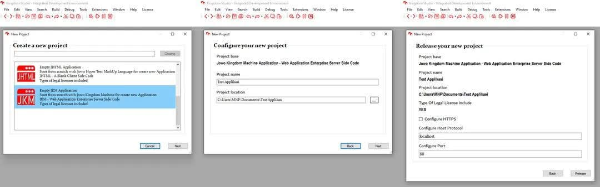

<div align="center">
<a href="https://github.com/JowoScript" target="_self">
</img>
</a>
</div>
<div align="center">
<strong>	
</strong>
<strong>
	PT JowoScript Technology Indonesia
	 - breakthrough technology, productive technology and capabilities technology 
	<br><br>
	Alamat kantor usaha
	<br>
	JL Larinda Raya Barat No 10, Larangan, Kota Tangerang Banten
	<br><br>
	tidak punya uang nonton saja siapa miskin kalian tidak punya uang untuk beli di baca harganya 
	<br><br>
apa perlu gue ulang terus kata kata gue ini Sekecil apapun usaha atau perusahaan gue tetap gue bossnya itu aturan dari dulu. Buat produk tidak pakai uang invenstor dan pemerintah. Siapa goblok kalian
	<br>
	The checkmate forever 
	<br><br>
	Introduction
</strong>
</div>
</div> 

### Muhammad Nurcahyo Pratomo Intro Product PT JowoScript Technology Indonesia

#### Original product has label powered by PT JowoScript Technology Indonesia. Kalo miskin tidak punya uang nonton saja kalian ya di baca harganya ya dan status gue apa di perusahaan ya baik baik kalian banyak gaya sama gue selama ini 

#### Purchases of licensed products must be paid in full without debt or credit di baca ya kalo goblok
</img>
	 </img>
</img>

### Muhammad Nurcahyo Pratomo Intro Product PT JowoScript Technology Indonesia

#### Original product has label powered by PT JowoScript Technology Indonesia. Kalo miskin tidak punya uang nonton saja kalian ya di baca harganya ya dan status gue apa di perusahaan PT JowoScript Technology Indonesia ya baik baik kalian banyak gaya sama gue selama ini

</img>

### Kelebihan bisnis untuk beli produk Kingdom Technology Environment
<div align="justify">
<ol>
	<li>Bisa bangun sekolah sendiri dengan teknologi baru dengan lisensi hukum kuat dan tidak bisa di bajak oleh sekolah lain atau mengakhiri plagiarisme untuk lulusan murid baru</li>
	<li>Bisa bangun project baru dengan kapasitas lebih luas dan kompleks dengan lisensi hukum kuat dan tidak bisa di bajak oleh vendor lain</li>
	<li>Bisa bangun hak hukum dengan lisensi yang pasti dan tidak bisa di bajak</li>
	<li>Bisa bangun usaha atau perusahaan assuransi baru dengan teknologi baru dengan lisensi hukum kuat dan tidak bisa di bajak oleh vendor lain</li>
	<li>Bisa bangun usaha atau perusahaan bank baru dengan teknologi baru dengan lisensi hukum kuat dan tidak bisa di bajak oleh vendor lain</li>
	<li>Bisa bangun kecerdasan buatan baru dengan teknologi baru dengan lisensi hukum kuat dan tidak bisa di bajak oleh vendor lain</li>
	<li>Bisa bangun e-commerce baru dengan teknologi baru dengan lisensi hukum kuat dan tidak bisa di bajak oleh vendor lain</li>
	<li>Bisa bangun media sosial baru dengan teknologi baru dengan lisensi hukum kuat dan tidak bisa di bajak oleh vendor lain</li>
	<li>Bisa bangun content management system baru dengan teknologi baru dengan lisensi hukum kuat dan tidak bisa di bajak oleh vendor lain</li>
<li>Bisa bangun media portal berita baru atau media siber baru dengan teknologi baru dengan lisensi hukum kuat dan tidak bisa di bajak oleh vendor lain</li>
</ol>
</div>


### Kingdom Technology Environment Support Capabilities Technology with license business with Original product has label powered by PT JowoScript Technology Indonesia :
<div align="justify">
<ol>
	<li>Assembly Programming Language free license</li>
	<li>Cobol Programming Language free license</li>
	<li>JowoScript Programming Language no free license this part of products</li>
		<li>Jowo Kingdom Programming Language no free license this part of products</li>
	<li>Jowo Style Sheets Programing Language no free license this part of products</li>
	<li>Cascading Style Sheets Programing Language free license</li>
		<li>JHTML Programming Language no free license this part of products</li>
		<li>HTML Programming Language free license</li>
		<li>JML Programming Language no free license this part of products</li>
		<li>XML Programming Language free license</li>
		<li>JON Programming Language no free license this part of product</li>
		<li>JSON Programming Language free license</li>
		<li>Jowo Query Language or JQL Programming Language no free license this part of products</li>
		<li>SQL Programming Language free license</li>
	<li>PHP Programming Language free license
	</li>
	<li>JavaScript Programming Language Free license</li>
		<li>C and C++ Programming Language Free license</Li>
		<li>C# Programming Language Free License</li>
	<li>Chy and Chy++ Programming Language no free license this part of products</li>
</ol>
		</div>
			
#### PT JowoScript Technology Indonesia small talk
<div>
	<ul>
		<li>Kalo saingan gue pengangguran dan pensiunan biar nonton terus selama belum beli ya</li>
		<li>Orang pintar bicara berisik itu beda ya dengan goblok itu resiko selama belum beli siapa tumbang bukan gue</li>
		<li>Semakin lama semakin asik ya semua itu ada audit keuangan ya</li>
		<li>Di danai pemerintah teknologi informasi selama ini mereka kerja hasilnya apa ya. Gue pernah kerja dulu jadi paham siapa kena tekanan kerja terus 🤪 di akhir pada kena pecat dan efesien pegawai ya</li>
		<li><b>Siapa suka nipu gue main keroyokan nanti gue keroyok balik habis kelompok kalian paham kata kata gue tidak pernah becanda ya</b></li>
		<li>Tidak punya uang mau beli ya pasti gue ketawain ya tetap gue suruh pulang nanti ya karena produk tidak gratisan ya</li>
		<li><b>Pembelian produk asli bukan palsu tidak di layani secara online tapi wajib datang ke tempat alamat perusahaan saya di JL Larinda Raya Barat No 10, Larangan, Kota Tangerang Banten. Produk tidak di jualan online ya. Wajib datang ke tempat untuk beli produk. Tinggal kunci no rekening penipuan kalo ada jual produk perusahaan saya secara online ya. Di luar itu perusahaan tidak akan bertanggung jawab atas produk palsu di jual online. Kalo salah mana berani kalian datang ya simple logic. Semakin lama semakin asik ya biar pada mati suka nipu</b></li>
		<li>Modal ganteng atau cantik doang tidak berlaku zaman now bisa di lihat persaingan makin berat kedepannya dari dunia kerja atau dunia usaha ya</li>
		<li>Kalo pengangguran dan skill coding di bawah gue biar pada mati bisa usaha apa mereka gue tanya ?</li>
		<li>Kalo saingan gue Pengusaha modal sendiri goblok goblok nonton saja ya kalo miskin semakin lama semakin asik biar pada mati kelaparan di akhir oleh persaingan. Pegang omongan gue</li>
		<li>Pengusaha modal sendiri goblok goblok nonton saja ya kalo miskin jangan beli ya</li>
		<li>Di modali besar duluan oleh pemerintah atau investor belum tentu bisa buat produk gue ya. Waktu akan bicara ya siapa goblok dan pintar akan terlihat</li>
		<li><b>Sekecil apapun usaha atau perusahaan gue tetap gue bossnya itu aturan dari dulu. Buat produk tidak pakai uang invenstor dan pemerintah. Siapa goblok kalian</b></li>
		<li>Banyak Universitas menciptakan Gelar tinggi sampai doktor dan master banyak di Indonesia tapi menciptakan pengangguran mereka fakta apa bukan ? fakta ya semakin lama akan terlihat nanti</li>
		<li><b>Hanya Muhammad Nurcahyo Pratomo bisa kembangkan produk jadi biar paham siapa jadi sampah selama ini kalian dan goblok selama ini kalian dan siapa tertawa di akhir itu Muhammad Nurcahyo Pratomo ya sesuai judul bukan semakin lama semakin asik ya biar pada mati goblok goblok</b></li>
		<li>Harga produk tidak bisa kurang dan naik setiap new version biar mampus goblok goblok nanti setiap pemilihan presiden 5 tahun sekali siapa kena bantai itu kalian kerja bagian teknologi informasi tidak beli tapi di danai pemerintah atau invenstor pegang omongan gue lebih paham politik dalam dan luar negeri</li>
		<li>Perusahaan nerima subsidi dari pemerintah banyak selama ini tapi tidak sadar diri mereka</li>
		<li>Siapa di siksa terus kalian bidang bagian teknologi informasi kerja di pemerintahan dan swasta</li>
		<li>Selama ini pemerintah , perusahaan swasta dan yayasan sekolah swasta atau sekolah milik negara belum ada beli jadi paham ya kalian siapa suka nipu selama ini habis kalian di akhir</li>
		<li><b>Waktu akan bicara orang goblok di dunia kerja akan bermunculan terus ya putar disitu terus kalian buat website dan Ai makin lama makin asik ya terlihat siapa goblok selama ini siapa tertawa di akhir itu gue ye dan siapa suka berbohong nipu bukan gue ya dari awal sudah gue kasih tau siapa goblok selama ini</b></li>
		<li>Siapa buka lowongan kerja selama ini kalian mampus bayar pesangon pegawai kalo pemutusan hubungan kerja. Perusahaan gue sendiri saja tidak pernah buka lowongan kerja biar pada mati bego bego dari gue ya makan tuh test masuk kerja dulu makin lama makin asik ya</li>
		<li><b>Saldo sedikit usaha ayam saja kalian jangan beli produk perusahaan gue ya paham kata kata gue. Harganya bisa di baca ya kalo goblok sekolah lagi sana ya</b></li>
		<li><b>Hanya menunggu waktu perusahaan mana pailit kedepannya</b></li>
		<li><b>Hanya menunggu waktu kerja di pemerintahan kena pecat siapa tidak berguna juga</b></li>
		<li>Anak teknologi informasi lebih goblok dari gue biar jadi pengangguran abadi bales dendam gue itu nyata ye siapa persulit gue dulu mampus kalian. Semakin lama semakin asik siapa tumbang itu kalian pegang omongan gue ye</li>
		<li>Even Microsoft and Google don't want to mess with me because they will lose money in the future</li>
		<li><b>Di akhir di tanyain hasil kerja kalian apa selama ini mampus bego bego di danai pemerintah dan invenstor ya  tidak mampu buat produk ya kalian di akhir di penjara atau sejenisnya</b></li>
		<li>Bales dendam gue itu nyata gelar doktor dan master kerja di pemerintahan atau swasta tidak menjamin pintar bagi gue</li>
		<li>Gaji dan tunjangan saja selama ini sudah minus banyak kerja di pemerintahan selama ini hanya bisa habiskan anggaran saja tapi tidak berguna untuk rakyatnya</li>
		<li>Gaji dan tunjangan saja selama ini sudah minus banyak pengeluaran perusahaan go publik seperti asuransi, tambang dan lain lain bicara pemasukan perusahaan lebih besar dari pengeluaran perusahaan akan terlihat terus kedepannya siapa pailit di akhir. Selevel komisaris saja diam mereka kalo gue sudah bicara begini jadi wawasan gue lebih luas ya</li>
		<li>Emang bego selama ini terbukti kalian karena orang bego itu tidak mau sadar diri ya. Semakin lama semakin asik ya produk gue berkembang terus kalian jadi pecundang nonton terus dan buat juga belum tentu mampu ya mau gelarmu tinggi tetap hasilnya sama ya hahaha makan tuh gila pengakuan gelar tinggi tinggi dari master sampai doktor hahaha that nothing for me hahaha sombong di bales sombong seperti nya adil ya</li>
		<li>Muhammad Nurcahyo Pratomo not work in government or other company. He work alone forever in own company at PT JowoScript Technology Indonesia. Sesuai Judul mampus orang orang bego di dunia kerja</li>
		<li>Muhammad Nurcahyo Pratomo NO NEED INVESTOR or INVEST and The Product its not free thats fair. Sesuai Judul mampus orang orang bego di dunia kerja pada mati suka nipu di akhir semakin lama semakin asik kalian akan mati kena siksa di dunia kerja pegang omongan gue apa perlu gue translate ke inggris biar kalian panik ? sesuai judul siapa goblok sok pintar dari gue jadi mainan gue di akhir makin lama makin asik siapa tumbang kalian</li>
		<li>PT JowoScript Technology Indonesia NO NEED INVESTOR or INVEST and The Product its not free thats fair. Sesuai Judul mampus orang orang bego di dunia kerja</li>
		<li><b>Jangan ada investasi selama belum beli ya. Awas penipuan investasi dan sejenisnya ya baik baik kalian</b>
		Don't invest until bought. Beware of investment scams and the like, everyone
		</li>
		<li>Semakin lama next generation lebih goblok dari Muhammad Nurcahyo Pratomo akan mati juga mereka akan nonton terus ya selama belum beli bales dendam gue itu nyata waktu akan bicara ya</li>
		<li>Muhammad Nurcahyo Pratomo tidak perlu sekolah lagi ambil gelar tinggi tinggi karena sudah terlihat siapa pintar dan goblok fakta ya</li>
		<li><b>Sebuah kejahatan juga bagi Muhammad Nurcahyo Pratomo dulu lamar kerja masuk test kerja di persulit ya gantian mampus siapa goblok sebenernya semakin lama semakin asik ya orang goblok akan bermunculan terus di dunia kerja</b></li>
		<li>Proyek Sistem aplikasi di pemerintahan dulu dulu sudah jadi sampai sekarang putar disitu saja ya syukur siapa goblok selama ini</li>
		<li><b>PT JowoScript Technology Indonesia tidak menerima gabungan perusahaan dan tidak menerima lowongan kerja. Muhammad Nurcahyo Pratomo bekerja sendiri selamanya di perusahaan PT JowoScript Technology Indonesia sebagai pemilik perusahaan dan pembuat produk</b></li>
		<li>Muhammad Nurcahyo Pratomo menunggu waktu perusahaan mana lagi bangkrut atau pailit tahun ini ya buktikan saja laporan keuangan perusahaan kalian tahun ini. Bicara untung tapi rugi terus nanti terlihat.</li>
		<li>Muhammad Nurcahyo Pratomo terus berkembang di rumah siapa goblok selama ini kalian tidak punya uang untuk beli produk pasti nonton terus kalian jadi pengangguran dan tidak produktif fakta ya baca harga lisensinya ya punya uang segitu apa siapa miskin kalo tidak punya uang untuk beli simple logic. Muhammad Nurcahyo Pratomo hidup sederhana Tidak punya hutang setiap hari bisa makan, jajan, udut dan kopi kalian belum tentu bisa kerja terus ya sampai mati di kantor hahahaha fakta itu resiko jadi orang goblok di dunia kerja</li>
		<li>Produk otomatis terkunci jika pembelian sudah melewati tanggal di tentukan karena orang gpblok selama ini mau niru belum tentu mampu buat produk ya sesuai kata kata gue   semakin lama semakin asik siapa goblok akan bermunculan terus di dunia kerja. Di modalin pemerintah duluan kalian percuma kalo goblok tetap tidak bisa niru buat produk ya siapa pailit selama ini akan terlihat terus menerus</li>
		<li>Muhammad Nurcahyo Pratomo tidak cari uang ya seperti kalian karena orang pintar mencetak nilai, bisnis dan masa depan. Uang mencari bukan sebaliknya. Ada sejarah nya uang mencari orang goblok ? tidak ada. Mampus persulit gue dulu test masuk kerja hahaha pasti kena pancal endase di dunia kerja yakin gue hahaha tidak gratisan ya mampus kau bego bego</li>
		<li>Kalo tidak punya uang beli produk ya nonton saja semakin lama semakin asik siapa goblok akan bermunculan terus di dunia kerja</li>
		<li>Mau di keroyok satu bumi gelar doktor dan master tetap kalian tidak bisa buat nonton teruskan fakta karena sendiri pengalaman asli itu beda. Orang pintar seperti Muhammad Nurcahyo Pratomo mana mau gaji kecil dan tunjangan kecil biar goblok dari Muhammad Nurcahyo Pratomo jadi pengangguran dan tidak produktif. Semakin lama terbukti ya siapa goblok dan pintar</li>
		<li>Lulus test kerja tidak menjamin pintar di dunia kerja ya itu fakta karena pengalaman asli itu beda level dengan pengalaman hanya absensi saja</li>
		<li>Resiko persulit Muhammad Nurcahyo Pratomo dulu test masuk kerja ya. Biar paham siapa goblok selama ini dan tidak gratis produk selamanya dan semakin lama semakin asik ya akan terlihat siapa gpblok selama ini di dunia kerja dan siapa tidak produktif kalian.</li>
		<li>Bagian bidang Teknologi Informasi mau coba nipu Muhammad Nurcahyo Pratomo di akhir kalian akan kesusahan sendiri ya dan habis kalian di akhir</li>
		<li>Produk palsu dan asli itu beda siapa goblok dungu kalian</li>
		<li>Pengusaha suka nipu Muhammad Nurcahyo Pratomo kalian sendiri kena masalah di akhir bukan Muhammad Nurcahyo Pratomo selama belum beli siapa pengangguran itu kalian tapi tidak sadar diri semakin lama semakin asik ya siapa goblok selama ini kalian ya</li>
		<li>Kalian bangun gedung duluan belum tentu ada isinya mau bisnis apa gue tanya ye kalian siapa goblok selama ini bukan Muhammad Nurcahyo Pratomo dan hanya Muhammad Nurcahyo Pratomo pemilik bisnis bisa kembangkan produk kingdom technology environment dan banyak lagi produk ya</li>
		<li><b>Selama ini pemerintah Indonesia juga tidak ada kontribusi besar kepada perusahaan PT JowoScript Technology Indonesia ya dan kepada Muhammad Nurcahyo Pratomo sebagai  pemilik bisnis juga pemerintah Indonesia tidak punya kontribusi besar selama ini. Tidak ada gratisan produk ya mau berhitung dan adu argumentasi gue ladenin kalian</b></li>
		<li><b>Perusahaan merugi terus selama ini biar pada tutup ya biar merasakan jadi pengangguran tidak nerima gaji dan tunjangan bulanan nemenin gue kalian remehkan dulu biar mampus bisa apa kalo goblok ya kalian dan jangan lupa perusahaan merugi terus selama ini bayar hutang ke pemodal ya</b></li>
		<li><b>PT JowoScript Technology Indonesia produk tidak ada gratisan, buat produk modal sendiri tidak menggunakan uang pemerintah atau investor, tidak menerima lowongan kerja dan tidak ada gabungan perusahaan. Siapa tumbang itu kalian di akhir goblok goblok level nya buat website dan Ai saja selama ini minta di danai besar besar selama ini</b></li>
		<li>HRD jelas mereka hire orang ya selama ini fakta pegang kunci jawaban soal test masuk kerja hanya HRD saja ya bukan pimpinan hire orang selama ini dan bukan pimpinan pegang kunci jawaban soal test masuk kerja selama ini. HRD harus paling tanggung jawab kalo perusahaan hancur kenapa perusahaan gue tidak butuh HRD kedepannya karena gue belajar semuanya ya. Pimpinan perusahaan harus punya kendali penuh sebagai nahkoda jadi hire sampai test pegawai wajib pimpinan perusahaan ada</li>
		<li>Kerja di pemerintahan belum tentu aman mereka karirnya karena kalo goblok pasti di singkirkan atau di pecat karena pengalaman kerja duluan lebih paham ya kalian banyak gaya goblok goblok mampus kena pancal endase setiap hari hahaha termasuk HRD jelas mereka hire orang ya selama ini fakta pegang kunci jawaban soal test masuk kerja hanya HRD saja ya bukan pimpinan hire orang selama ini</li>
		<li><b>Mana ada produk perusahaan PT JowoScript Technology Indonesia buat gagal kalian saja bego dungu selama ini ya. Skill asli Muhammad Nurcahyo Pratomo lebih badai kalian prediksi dan kalian lebih paham di internet saja selama ini. Siapa goblok selama ini kalian sebenarnya ya hanya buat soal test masuk kerja bisanya</b></li>
		<li>Perusahaan tidak beli produk perusahaan gue pasti akan tumbang di akhir semakin lama akan terlihat siapa suka nipu ya apa lagi minta di danai selama ini ya</li>
		<li>Kalian bermasalah sama gue kalo di pecat jadi pengangguran bisa apa gue tanya ya ? resiko biar merasakan jadi pengangguran kalian dan gue tidak takut sama orang-orang bermasalah sama gue ya biar mampus kalian jadi pengangguran dan waktu akan bicara ya</li>
		<li>Perusahaan sudah gue blacklist goblok goblok mereka selama ini ya semakin lama perusahaan masuk blacklist akan tumbang tutup di akhir pegang omongan gue siapa tidak punya masa depan mereka</li>
		<li>Semakin lama semakin asik sampah sampah akan terlihat terus di dunia kerja pemerintah atau swasta bisa lulus test kerja belum tentu kuat kerja, disiplin kerja dan pintar kerja ya. Resiko kalian kena pecat dan masuk blacklist kalo goblok tidak bisa kerja jadi pengangguran, tidak produktif dan jadi sampah kalian</li>
		<li>Namanya orang kaya asli itu tidak punya hutang seperti kalian punya hutang banyak gaya mampus tidak masuk surga kalian. Apa ada jaminan nya orang punya hutang masuk surga ? tidak ada mau nabi Muhammad saja tidak bisa nolong ya. paham kata kata gue ya. jika amal kalian banyak tidak bisa nolong kalo punya hutang ya</li>
		<li>Biar mereka cari uang sendiri goblok goblok selama ini mau minta di modali terus dan jangan lupa bayar hutang ke pemodal kalian gagal bayar mampus</li>
		<li><b>Muhammad Nurcahyo Pratomo or tomi nama panggilannya direktur sendiri di perusahaan PT JowoScript Technology Indonesia bisnis owner baik baik kalian suka menghina dan remehkan selama ini bisa bisa kepala kau di injak yang ada. Sudah masuk blacklist Muhammad Nurcahyo Pratomo itu derita kalian. Di baca status hukum pemilik perusahaan PT JowoScript Technology Indonesia jadi penampilan keren tidak menjamim boss ya</b></li>
		<li>Semakin lama semakin asik baca baik baik kata katanya</li>
		<li><b>Anak muda sudah tidak ada skill, miskin, pengangguran, goblok, masuk kerja lewat orang dalam, hidup dan banyak gaya akan terlihat terus kedepannya</b></li>
		<li>Siapa jadi babu selama ini kalian kerja di pemerintahan dan perusahaan orang selama ini tidak bisa kerja itu resiko kena pecat kalian terus masuk blacklist. Gue bicara apa adanya mampus. kejar target sekian sekian bukan babu namanya dan masuk wajib jam sekian telat potong gaji dan lembur tidak di bayar itu kalian jadi babu bukan gue dan siapa untung atasan lu bego sih</li>
		<li><b>Buat aplikasi mahal mahal di bayar menggunakan bahasa pemrograman gratisan mampus siapa goblok selama ini</b></li>
		<li>Semakin lama setiap tahun nambah lulusan semakin asik siapa goblok abadi dan pengangguran abadi dan tidak produktif abadi kalian ya bukan gue</li>
		<li><b>Kalo miskin sadar diri kalian tidak punya uang untuk beli produk ya nonton saja kalian siapa pengangguran dan tidak produktif selama ini kalian. banyak gaya tapi goblok itu banyak anak muda zaman now hasil kerja titipan orang tua dan sebagainya tapi skillnya standar saja</b></li>
		<li>Perusahaan di danai akhir tahun buat laporan keuangan siapa bilang untung tapi minus aslinya. siapa jadi sampah akan terlihat kedepannya terus</li>
		<li><b>Kalo punya nyali mau cari masalah sama gue minta sama gue langsung sini mampus kalian jadi banci selamanya produk asli dan palsu itu beda level ya. siapa mencuri produk palsu gue akan terlihat mampus bego bego. mana ada pencuri produk gue mau ngaku biar mampus mereka goblok goblok apa lagi sampai di jual untuk keuntungan mereka ya. Mudah menangkap pencuri produk gue buat ya siapa masuk penjara kalian di akhir</b></li>
		<li>Kalian hrd bermasalah sama gue dulu di pecat jadi pengangguran abadi paham dan skill kelebihan kalian apa gue tanya ? mudah di gantikan juga ya. Makan tuh psikotes dulu. mampu sendiri buat perusahaan dan produk sendiri hahaha apa lagi sudah zaman ai makin nyungsep kalian terlihat lebih gobloknya fakta ya mampus jadi robot selamanya hahaha dan iblis pun lebih pintar beribadahnya dulu so paham sampai sini kata kata gue orang orang munafik dan apa iblis di jamin masuk surga oleh allah gue tanya ? tidak ya</li>
		<li>Susah sendiri selama ini kalo sukses tidak butuh queen atau pacar ya sorry. wanita zaman now mau enaknya doang biar mampus mereka juga apa lagi miskin dan goblok hanya pewaris doang bangga tidak ada nilainya di mata gue. hanya modal cantik doang tidak ada nilainya di mata gue anak zaman now namanya lonte dan lc lebih banyak cantik itu fakta. thats my rules too</li>
		<li><b>Dekat komplek suka mantau gue biar mampus mereka jadi pengangguran abadi dan tidak produktif abadi. Perusahaan siapa pailit bayar hutang ke pemodal juga bukan perusahaan gue ini ya. Siapa mencuri produk gue tanpa izin mampus kalian main main sama yg lebih pintar. Mudah menangkap pencuri produk gue buat ya siapa masuk penjara kalian di akhir</b></li>
		<li>Publik figur selama ini hasil kerjanya apa mereka ya gaji + tunjangan besar dan berguna tidak untuk rakyanya kalo hanya bicara saja bukan level Muhammad Nurcahyo Pratomo</li>
		<li>Jago coding banyak gaya selama ini belum tentu bisa jadi tukang bangunan seperti Muhammad Nurcahyo Pratomo dan M Nurcahyo Pratomo lebih paham buat bahasa pemrograman ya. beda level ya skill nya orang goblok dan pintar.</li>
		<li>Tidak ada perlindungan untuk musuhnya Muhammad Nurcahyo Pratomo dan teman bermuka dua dan persulit dulu test dan bullying ya paham sampai sini. baru 4 tahun sudah banyak sampah terlihat berjatuhan dan semakin lama akan terlihat siapa emas asli dan emas busuk</li>
		<li>Kerja di pemerintahan tidak berguna tetap saja kena pancal endase di dunia kerja hahaha mampus kalian hahahaha dan kalian kalo jadi pengangguran bisa apa gue tanya skill juga standar karena gue pengalaman kerja sama orang ya sudah pernah merasakan pahitnya dunia ya. Siapa goblok selama ini kasih gaji dan tunjangan profesi besar besar selama ini bukan gue ya</li>
		<li><b>Level nya buat website doang dari dulu sampai sekarang siapa goblok dan miskin sebenarnya menggunakan bahasa pemrograman gratisan selama ini ✍️📚</b></li>
		<li>Semakin lama semakin asik ya perusahaan mana lagi tidak berguna di danai pemerintah dan investor</li>
		<li><b>PT JowoScript Technology Indonesia modal sendiri dan produk buat sendiri dan tidak gratisan produk nya terbukti siapa goblok dan miskin selama ini</b></li>
		<li>Siapa goblok selama ini ya jaminan nya apa kalian mau beli produk perusahaan gue buat. Selama ini gue juga belum nerima jaminannya ya dari pemerintah Indonesia. Dana asing keluar dari Indonesia bukan urusan gue itu resiko selama gue tidak nerima jaminannya dari pemerintah Indonesia mau berbohong itu urusan kalian waktu akan bicara terus siapa rugi juga bukan gue ya harga produk perusahaan gue sendiri naik terus selama ini</li>
		<li>Orang persulit Muhammad Nurcahyo Pratomo dulu test masuk kerja merasa paling pintar gimana kabarnya perusahaan nya sekarang. jika alesan aturan so im the rules too in my company and my product dan modal sendiri ya. mereka kalo tidak bisa buat produk lebih dari gue paatenin wae</li>
		<li>Semakin lama semakin asik ya perusahaan mana jatuh tempo bayar hutang mampus kalian banyak gaya sama gue. The checkmate forever. Mampus buka lowongan kerja selama ini</li>
		<li>Perusahaan mana lagi pailit ke pemodal tahun 2026 ya</li>
		<li>Kingdom Technology Environment not support Artificial Intelligence for new programing language because commercial products easy talk baby hahahaha. why not support Ai in IDE Kingdom Technology Environment simple answer your must learn not like kids copy and paste. Sesuai judul semakin lama orang goblok di dunia kerja akan bermunculan terus mau kerja di pemerintahan atau swasta waktu akan bicara. Kalo saingan gue pengangguran atau pengusaha sampai mati kalian tidak akan mampu buat ya itu resiko kalo miskin tidak punya uang untuk beli ya nonton saja. Kalo mau nipu gue jadi mainan gue di akhir sudah paham skill coding gue jahu berbeda ya.</li>
		<li>New capabilities in kingdom technology environment having start and stop JavaScript and V8 machines or (JavaScript and WebAssembly engine) My note only IN OS SO YOUR CANNOT EITHER TO OTHER HOST so the machine main no conflicts to other host and only stupid people propaganda to me until now. only in kingdom technology environment fiture interface. This support all engine browser and web view engine. My notes Firefox and Chrome is difference of engine, i try kingdom technology environment smoothly in my computer or laptop or phone</li>
		<li>Dalam bahasa pemrograman titik koma spasi saja salah otomatis error semua itu bedanya orang pinter dan goblok. contohnya sudah gue blacklist mereka berputar disitu saja terus lamanya bekerja menjadi pegawai tetap tidak menjamin pinter bisa jadi dulunya penjilat atasan, hasil titipan atau sejenisnya. . Orang goblok akan terlihat terus kedepannya di dunia kerja sesuai judul dan sudah jelas adu argumentasi di internal antara pimpinan sama bawahaan jelas ada. Mereka goblok buat alesan kasihani M Nurcahyo Pratomo untuk apa ya dari skill coding kalah jahu kalian, perusahaan milik sendiri, produk milik sendiri, paham bisnis, hukum, ekonomi dan politik. Semakin lama sesuai kata kata Muhammad Nurcahyo Pratomo ya lebih jago skill codingnya, paham hukum, ekonomi dan politik. Siapa kena pancal endase di dunia kerja setiap hari tetap kalian ya syukur mau di kantor atau di rumah itu resiko kerja di pemerintahan atau swasta. Bisa di lihat kingdom technology no free buatnya tidak mudah dan susah karena gue buat langsung sendiri. buat compile, debug dan sejenisnya belum break point tidak mudah buatnya ya dan hanya Muhammad Nurcahyo Pratomo saja bisa kembangkan karena sangat sangat susah dan kompleksitas nya tinggi buat IDE karena buatnya dari noll semua itu disebut lebih jago skill codingnya bukan level copy and paste then edit. Sambil buat produk sambil bales ke orang orang goblok dulu persulit gue itu nikmat sekali. lebih susah buat IDE dari pada buat ERP dan SAP gue kasih tau ya</li>
		<li>Muhammad Nurcahyo Pratomo belum berhitung saja selama ini kalo mau adu argumentasi selama ini. kalian terima gaji dan tunjangan setiap tahun di hitung totalnya berapa kali nerima habiskan uang berapa selama ini itu hanya dasar saja belum yang lainnya. itu kenapa orang goblok selalu nyuruh kerja kalo kalah skill coding dan dulu gue nawarin diri di persulit test masuk kerjanya dan berapa banyak gue lamar kerja dulu pasti gue catat ya dan siapa goblok selama ini akan terlihat terus kedepannya terbukti berputar disitu saja kalian selama ini</li>
		<li>Kalo saingan Muhammad Nurcahyo Pratomo itu pengangguran dan skill coding biasa biasa saja biar mereka gali kuburan masing masing atau berkelompok karena punya pengalaman sebenarnya itu bukan lamanya bekerja ya tapi hasil karya sendiri tidak butuh cv lu keren kalo goblok. lamanya berkerja kalo goblok itu banyak sebenarnya di pemerintahan dan swasta tapi tidak mau terlihat saja selama ini. Semakin lama akan terlihat juga goblok goblok</li>
		<li>Habis dollar naik biasanya kebutuhan pokok akan menyusul naik di akhir itu prediksi saya kedepanya. Banyak ya laporan pejabat, jendral dan anggota dewan hartanya naik terus biar paham rakyat ya. siapa goblok selama ini. biar gaji dan tunjangan di pemerintah kena potong semua di akhir. tidak ada kenaikan gaji dan tunjangan setiap tahun ya mungkin sebaliknya penurunan gaji dan tunjangan kalo dollar to rupiah naik terus. </li>
		<li><b>Hutang Indonesia saya kira 1000 Triliun rupiah ternyata lebih parah 10.000 Triliun rupiah siapa mau bayar hutang segitu banyak jelas bukan Muhammad Nurcahyo Pratomo nantinya biarkan saja bego bego di siksa terus di dunia kerja sampai mati. Perusahaan BUMN di subsidi pemerintah selama ini ada datanya jadi jangan banyak gaya dan apa lagi kerja di BUMM mampu bayar hutang pemerintah tidak jika mau hitung hitungan ya perbulan kalian habiskan uang berapa selama ini dari pemerintah dan belum pejabat nya ya suka habiskan uang pemerintah banyak</b></li>
		<li>Selama ini masih terbentur sama hukum di Indonesia jadi santai Muhammad Nurcahyo Pratomo kalo di beli wajib baca ya di bawah. selama ini blacklist or patenin saja bermasalah sama Muhammad Nurcahyo Pratomo or tommy paham sampai sini selama masih hidup orang bermasalah tidak bisa di beli ya terbukti sampai sekarang siapa mau berbohong silahkan ya dan Muhammad Nurcahyo Pratomo bukan orang bodoh selama ini ya terbukti sampai sekarang. Dollar naik terus siapa akan mati orang bermasalah sama Muhammad Nurcahyo Pratomo or tommy di akhir pasti gue habiskan secara militer kalian di akhir. Sodara Muhammad Nurcahyo Pratomo berhak blacklist suka cari masalah juga ya thats tonmy rules too. Sengaja gue benturkan dulu di amerika sama di Indonesia bermasalah sama Muhammad Nurcahyo Pratomo. Siapa goblok selama ini</li>
		<li>Selama ini Muhammad Nurcahyo Pratomo tidak merugikan (Maling uang kalian juga tidak) dan di rugikan Muhammad Nurcahyo Pratomo selama ini siapa nyerang dan bermasalah pasti di blacklist dulu dan eksekusi nya nanti kalo mau beli termasuk musik jeduk jeduk di medsos lihat saja nanti siapa penyusup dan intimidasi lewat music semua di sengaja pasti di habiskan secara militer di akhir kalian karena jadi pengamat dan pendengar lebih bahaya selama ini. Aturan Muhammad Nurcahyo Pratomo tetap berlaku kalo mau beli. Hukuman mati ada di aturan Muhammad Nurcahyo Pratomo</li>
		<li>Muhammad Nurcahyo Pratomo tetap jowoscript technology forever mampus goblok goblok dan pengangguran kalian putar disitu saja ya tidak produktif dan berkembang apa lagi baru lulus sekolah makin berat ya persaingan itu jelas. biar pada mati dulu bermasalah sama Muhammad Nurcahyo Pratomo</li>
		<li>Prediksi Muhammad Nurcahyo Pratomo itu IKN Kalimantan Timur itu untuk kartu Joker nya politik 2029 ya siapa mau pindah ke IKN wahai PNS, Polri dan TNI salah pilih kalian akan pindah</li>
		<li>Pemerintah Indonesia hutangnya banyak bukan urusan Muhammad Nurcahyo Pratomo siapa berhutang presiden selama ini kepada negara-negara. Pemerintah Indonesia kalo mau beli produk Muhammad Nurcahyo Pratomo ya pemerintah Indonesia wajib hukumnya tunduk apapun jenisnya baik itu perdata, pidana, dan seterusnya oleh aturan hukum Muhammad Nurcahyo Pratomo. Selama ini belum beli juga pemerintah Indonesia jadi biarkan saja hutang Indonesia naik</li>
		<li>Jendral jendral aktif suka main proyek di balik layar tidak ada kebal hukum ya kalo salah dan melanggar undang-undang apa lagi merugikan negara ya</li>
		<li>Perusahaan merugikan negara selama ini sikat saja semuanya</li>
		<li>Di lapangan realitas nya instansi pemerintah sudah banyak anggaran closed ya syukur goblok dan pengangguran dan Muhammad Nurcahyo Pratomo tetap santai buat produk tidak pakai anggaran pemerintah selama ini</li>
		<li>Kasus koruptor di Mendikbud tetap jalankan sampai sistem buat aplikasi ya dan orang orang IT nya terlibat juga itu semua di data saja pasti banyak kabur yakin gue hahaha kerugian negara wajib ganti mereka sita semua asset nya kelar</li>
		<li>PT JowoSctipt Technology Indonesia dont have partnership distribution products with the permission legals from Muhammad Nurcahyo Pratomo. Note JavaScript, TypeScript, etc is free no need distribution and permission legals</li>
<li>
	PT JowoScript Technology Indonesia does not have any open job vacancies and does not need employees because the owner company Muhammad Nurcahyo Pratomo, has been working alone all this time making products and all products its not free too.
	</l>
		<li>
			PT JowoScript Technology Indonesia tidak membuka lowongan kerja dan tidak butuh karyawan karena owner nya Muhammad Nurcahyo Pratomo kerja sendiri selama ini buat produk tidak butuh bantuan ya karena skill coding lu masih di bawah gue jahu ya fakta karena akan jadi beban gue nanti ya banyak nanya dan sebagainya nanti minta ajarin ke gue cara buat ini itu goblok namanya ya jadi beban bukan sesuai judul tidak butuh bantuan gue buat produk ya kalo merasa pintar dari gue mampu buat lebih tidak dari gue buat semua ada screenshot di Facebook ya buatan gue sendiri karena orang goblok itu banyak sok pintar di zaman now hasil copy and paste ya itu fakta. Semakin lama akan terlihat orang goblok di dunia kerja waktu akan bicara ya
		</li>
		<li>PT JowoScript Technology Indonesia tidak menggunakan uang investor dan pemerintah selama ini buat produk sendiri. Baca harga kalo mau beli produk kalo mau nipu gue kalian akan jadi mainan gue di akhir ya. Kalo tidak punya uang untuk beli ya nonton saja 2024-2029 terlihat perusahaan siapa tidak berguna di danai selama ini</li>
		<li>Aturan di buat oleh Muhammad Nurcahyo Pratomo tetap berlaku jika mau beli produk dan tidak bisa di ganggu gugat oleh pihak manapun (ada hukuman mati ini aturan ya). Hukum kekal dan tetap. Siapa bego jadi sampah abadi setiap tahun nambah lulusan sekolah dan universitas. Muhammad Nurcahyo Pratomo juga santai ya siapa goblok juga</li>
		<li>Siapa pun itu pemimpin pemerintahan nya selama tidak beli kalian akan nonton terus ya</li>
		<li>Pemerintah tidak punya uang kenapa selama ini Nerima pegawai ya semua ada datanya dari 2011 keterima pegawai pemerintah jadi pns, polri dan TNI banyak ya so siapa goblok selama ini. Nasi sudah jadi bubur siapa goblok ya susah pecat nya di akhir</li>
		<li>Gaji dan tunjangan pegawai termasuk menghabiskan anggaran ya itu juga belum tentu ada hasilnya ya sampai sekarang</li>
		<li>Buat website di danai habiskan triliunan dan ai juga banyak menggunakan bahasa pemrograman gratisan ya siapa goblok selama ini jelas bukan Muhammad Nurcahyo Pratomo ya</li>
		<li>JowoScript, Kingdom Technology Environment, Jowo Kingdom Machine, JML, JHTML dan produk masih proses pembuatan oleh Muhammad Nurcahyo Pratomo hasil format adalah file exe produk aslinya butuh installer dan tidak gratisan dan hanya Muhammad Nurcahyo Pratomo bisa kembangkan juga semua produknya</li>
		<li>Semua ada laporan keuangan dan audit keuangan di pemerintah jadi percuma kalo mau nipu Muhammad Nurcahyo Pratomo ya dan kalian goblok miskin ilmu agama tidak paham semua di catat oleh malaikat jadi percuma kalo mau nipu Muhammad Nurcahyo Pratomo ya</li>
	</ul>
</div>	

#### Who Muhammad Nurcahyo Pratomo
<div>
	<ul>
		<li>Kalo saingan gue pengangguran dan pensiunan biar nonton terus selama belum beli ya</li>
		<li>Orang pintar bicara berisik itu beda ya dengan orang goblok ya ✍️📚</li>
		<li>Siapa sudah masuk blacklist gue otomatis perusahaan or istansi mereka akan gue banned secara permanen di produk gue buat baik itu domain name dan localhost apa gue pernah becanda ? tidak pernah ya</li>
		<li>Gue kalo bego tidak mungkin berani sendiri dari awal buat produk sampai sekarang dan tanpa backing an seperti kalian itu fakta ya. Karena pengecut dan punya nyali beda kelas ya. Mampus bego bego di dunia kerja dan dunia usaha ya</li>
		<li>Semua test ujian itu sudah pernah gue coba dari ujian tertulis dan berbasis komputer gantian siapa goblok seterusnya tidak gratis produk perusahaan gue dan terbukti sampai sekarang tidak gratis kalian nonton terus</li>
		<li>Olah raga orang pintar seperti gue jadi tukang bangunan badan gerak semua kalo bosen coding bukan tukang ojek atau olah raga gym ya tidak butuh keahlian kecuali gengsi boleh kalian pilih olah raga gym contoh angkat semen 1 sak itu berat 50 KG dan angkat ember biasa 2 kg itu pasti. tukang bangunan butuh keahlian contoh aduk semen, cat ruang an, plester retakan, manjat genteng, pembagian arus listrik pakai sekring MCB (Miniature Circuit Breaker) wajib, instalasi listrik dan sebagainya</li>
		<li>Orang netral dan pro Muhammad Nurcahyo Pratomo berhak boleh blacklist orang bermasalah sama Muhammad Nurcahyo Pratomo untuk tumbal nantinya mereka selama ini nyerang gue secara berkelompok juga lewat medsos menggunakan akun palsu tapi mereka bodoh di akhir. semakin lama siapa di butuhkan dan siapa mati</li>
		<li>Harga lisensi mahal kenapa dan uang segitu banyak untuk apa nantinya oleh Muhammad Nurcahyo Pratomo jelas M Nurcahyo Pratomo lebih paham perputaran ekonomi dari pada orang bergelar doktor ekonomi dan Professor Ekonomi. Selama belum beli ya siapa kena tekanan bukan Muhammad Nurcahyo Pratomo</li>
		<li>Perusahaan minta di danai duluan belum tentu beli produk PT JowoScript Technology Indonesia jadi kita lihat semakin lama siapa pailit bayar hutang</li>
		<li>Mau mata uang asing naik atau turun bukan urusan Muhammad Nurcahyo Pratomo ya dan bukan kerjaan Muhammad Nurcahyo Pratomo juga ya. Siapa kena tekan selama ini orang bermasalah sama Muhammad Nurcahyo Pratomo mereka jelas akan mati sendiri atau berkelompok di akhir. Siapa goblok dan pintar ya</li>
			<li>Pemerintah jika mau beli produk wajib ikutin aturan Muhammad Nurcahyo Pratomo tidak suka ya tidak usah beli gampang kan dan aturan di buat oleh Muhammad Nurcahyo Pratomo tidak bisa di ganggu gugat oleh pihak manapun baik itu konstitusi pemerintah dan parlementer nya</li>
		<li>Apa efek di masa depan jika kena blacklist dari Muhammad Nurcahyo Pratomo jelas ada ya satu mereka tidak akan berkembang dalam teknologi informasi apapun itu kedepannya, kedua mereka akan berputar disitu saja dalam inovasi kreatif, ketiga akan tertinggal oleh perubahan besar teknologi informasi dan seterusnya. Sedangkan di masa sekarang semua serba digital di dalamnya butuh teknologi informasi</li>
		<li>Muhammad Nurcahyo Pratomo punya kekuasaan penuh blacklist instansi pemerintah, rumah sakit pemerintah atau swasta, perusahaan milik negara, perusahaan go publik, yayasan sekolah atau universitas milik swasta dan sekolah atau universitas milik pemerintah dalam produk PT JowoScript Technology Indonesia</li>
		<li>Biaya sekolah dan universitas dari dulu naik dari zaman gue sekolah juga begituh terus biarkan saja tidak sekolah biar makin goblok. Produk gue buat bisa dirikan sekolah sendiri tidak gratis emang mereka yayasan doang bisa. Sekolah Informatika dan universitas semua menggunakan gratisan jadi beda level sama produk gue buat tidak gratis</li>
		<li>Semakin lama akan terlihat terus siapa goblok di dunia kerja dan perusahaan mana tidak berguna akan bermunculan terus kedepannya. Lulusan sekolah setiap tahun nambah selama belum beli ya nonton juga mereka</li>
		<li>
			<b>Ownership company, directorship company, Software Architecture, Software Engineer and Software Developer at PT JowoScript Technology Indonesia</b>
		</li>
		<li>Behind Hard Code Software architecture, Software Engineer and developer in product Kingdom Technology Environment, JowoScript programing language, Jowo Kingdom Machine and more</li>
		<li> Muhammad Nurcahyo Pratomo a part freelance jobs Artificial Intelligence @anonymous not bound by legal contract by systems.
		</li>
		<li>Lihat saja kedepannya perusahaan mana lagi tutup dan gagal bayar karena kalah bersaing waktu akan bicara ya karena minta pendanaan duluan belum tentu hebat ya pegang omongan gue (Muhammad Nurcahyo Pratomo)</li>
		<li>Gue (Muhammad Nurcahyo Pratomo) dulu di persulit test masuk kerja gantian siapapun wajib beli produk gue (Muhammad Nurcahyo Pratomo) siapa tidak berguna akan terlihat terus di dunia kerja ya waktu akan bicara. Siapa kena pecat di dunia kerja akan terlihat terus kedepannya</li>
	</ul>
</div>

### Muhammad Nurcahyo Pratomo Intro Small talk of Law (the law by law)
<div>
	I use Indonesian language everyday, so if you are a foreigner who doesn't understand Indonesian language, that's your problem right simple logic.
	foreigner who doesn't understand Indonesian language, that's your problem right simple logic.
	<br><br>
	The free programing language don't have fundamental of law and easy to be hacking like a phishing (developer cloning website without owner permision) or anything the solution is my product deadlock phishing and different my new programming language and powered by PT Jowoscript Technology Indonesia for commerical  (different law and syntax code). The implicit fair the law by law and the legal by legal
	<br><br>
	Hutang indonesia tembus 10 ribu triliun sekarang jadi santai gue pemerintah Indonesia kalo mau beli produk gue wajib tunduk aturan gue buat kalo tidak suka ya tidak usah beli. essy for me
</div>

### Muhammad Nurcahyo Pratomo Intro Deep The Browser History
<div>
	By 2021 Muhammad Nurcahyo Pratomo (Self) created a new programming language for commercial license (NOT FREE PRICE) and make new rules.
	<br><br>
	The free programing language don't have fundamental of law and easy to be crack or anything and different my new programming language and powered by PT Jowoscript Technology Indonesia for commerical (different law and syntax code). The implicit fair the law by law and the legal by legal
</div>

### Blacklist data is problematic with its Muhammad Nurcahyo Pratomo based on name company (This will update in kingdom technology environment, jowoscript, js3, etc), all data will increase over time stay tune. The relations partner will be blacklist too (After i blacklist They black days the future). They never think 10 years or more about technology information 
<div align="justify">
<ol>
	<li>Universitas Budi Luhur dosen bermasalah sama gue dan bermuka dua ada ya siapa kena pecat juga bukan gue ini ya</li>
	<li>Nvidia corporate ada penyusup musuh musuh gue kerja disana orang Indonesia dan Malaysia siapa kena pecat juga bukan gue ini ya</li>
	<li>Meta inc ada penyusup musuh musuh gue kerja disana orang Indonesia dan Malaysia siapa kena pecat juga bukan gue ini ya</li>
	<li>Badan Kepegawaian Negara persulit Muhammad Nurcahyo Pratomo dulu test kerja lewat CAT berbasis komputer dan orang hasil titipan bisa lulus CAT berbasis komputer semua bisa di rekayasa dari dulu ya giliran Muhammad Nurcahyo Pratomo tidak bisa dulu so gantian Muhammad Nurcahyo Pratomo blacklist BKN siapa goblok selama ini</li>
	<li>Wikipedia delete my name  Muhammad Nurcahyo Pratomo article  and my company PT JowoScript Technology Indonesia article and my products article (proof archive internet) because i write my name article for biography history alone and my product and my company so i can blacklist too wikipedia in my product. this fair right then my product blacklist domain name server permanent for Wikipedia and no matter how expensive Wikipedia domain name thats be zero by me too thats website running in php i know. kenapa gue harus takut sama orang lebih goblok dari gue ya kalian bisa apa gue tanya persaingan makin berat kedepannya. Gimana produk komersial lainnya perusahaan komersial lainnya menampilkan di Wikipedia tidak di hapus ya</li>
	<li>Cryptocurrency</li>
	<li>Holywings Group</li>
	<li>Big bad wolf Indonesia (global) is have problematic with Muhammad Nurcahyo Pratomo before (bullying and intimidation work / buliying saya di waktu kerja pada tahun 2017 di Surabaya) siapa bullying gue dulu waktu kerja di surabaya sampai ngancam gue tembak mati di group wa siapa calon mayat di akhir bukan gue ya dan kenapa gue harus takut sama orang lebih goblok dari gue ya di wa group dulu. Pak Amir suruh buka suara sana saksi hidup dan chat wa group</li>
	<li>Penta Group Indonesia</li>
	<li>Sinergi group Indonesia</li>
	<li>IFS Solusi Integrasi Indonesia is have problematic with Muhammad Nurcahyo Pratomo before (see point number 22 / mainin gue test masuk kerja | Setiap perusahaan gue datengin pasti gue catat)</li>
	<li>Medco Energi Indonesia is have problematic with Muhammad Nurcahyo Pratomo before (see point number 22 / mainin gue test masuk kerja | Setiap perusahaan gue datengin pasti gue catat)</li>
	<li>MetroData Indonesia is have problematic with Muhammad Nurcahyo Pratomo before (see point number 22 / mainin gue test masuk kerja | Setiap perusahaan gue datengin pasti gue catat) so the relationship with IBM partners is tied up</li>
	<li>Whatever type of cryptocurrency (global) is ilegal currency (case closed)</li>
	<li>Infosys india is have problematic with Muhammad Nurcahyo Pratomo before (see point number 22 / mainin gue lewat test masuk kerja | Setiap perusahaan gue datengin pasti gue catat)</li>
	<li>Polisi Indonesia, polisi bermasalah sama gue kalo kena pecat jadi pengangguran gampangkan bisa apa polisi bermasalah sama gue, bisa berdiri sendiri seperti gue (yang lemah dan kuat akan terlihat ketika sendiri)</li>
	<li>IBM Indonesia</li>
	<li>MNC Group Indonesia (see point number 22 / mainin gue lewat test masuk kerja | Setiap perusahaan gue datengin pasti gue catat)</li>
	<li>Transcorp (PT Trans Corpora) (see point number 22 / mainin gue lewat test masuk kerja | Semua perusahaan gue datengin pasti gue catat)</li>
	<li>SMK Media Informatika (guru) guru bermasalah sama gue kalo kena pecat jadi pengangguran gampangkan bisa apa guru bermasalah sama gue, bisa berdiri sendiri seperti gue (yang lemah dan kuat akan terlihat ketika sendiri | mainin gue dalam membuat RPP)</li>
	<li>Kementerian Pendidikan Tinggi, Sains, dan Teknologi Indonesia (Dosen Oknum) Dosen bermasalah sama gue kalo kena pecat jadi pengangguran gampangkan bisa apa dosen bermasalah sama gue, bisa berdiri sendiri seperti gue (yang lemah dan kuat akan terlihat ketika sendiri)</li>
	<li>Apapun alesannya test psikotest semua masuk blacklist gue kalian (jurusan psikologi) sudah merugikan banyak jurusan, orang bukan jurusan psikologi di kasih soal test psikotest siapa yang goblok sebenarnya ? Jurusan psikologi di kasih soal jurusan kedokteran bisa jawab tidak atau kasih soal jurusan hukum atau kasih soal jurusan IT. Orang psikologi  paham artinya linier tidak dalam bidang jurusan ? tanya pakar professor di universitas</li>
	<li>Sekolah Al-Hikmah petukangan selatan. music suara siapa di kita gue tidak tau dan siapa goblok selama ini gue tanya</li>
	<li>SMK Yadika 4 ciledug pernah lamar kerja disana gue ya dan siapa goblok selama ini gue tanya</li>
	<li>
SMK Budi Luhur Ciledug pernah lamar kerja disana gue ya dan siapa goblok selama ini gue tanya</li>
</ol>
</div>

### Muhammad Nurcahyo Pratomo Intro Product PT JowoScript Technology Indonesia

#### Original product has label powered by PT JowoScript Technology Indonesia. sesuai judul orang mau nipu gue di akhir mati sendiri. Hobinya ngumpulin uang tapi tidak beli mampus di akhir karena orang goblok sok pintar dari gue itu banyak. Sesuai judul orang sok pinter dari gue di akhir jadi bahan hinaan dan amukan banyak orang. Siapa lagi orang goblok dan dungu suka ngarang cerita lagi. Paham sampai sini

#### Only work in my new programing language (JowoScript and JS3)

</img>
	 
#### Legality Statement Letter of PT JowoScript Technology Indonesia

#### Original product has label powered by PT JowoScript Technology Indonesia. sesuai judul orang mau nipu gue di akhir mati sendiri. Hobinya ngumpulin uang tapi tidak beli mampus di akhir karena orang goblok sok pintar dari gue itu banyak. Sesuai judul orang sok pinter dari gue di akhir jadi bahan hinaan dan amukan banyak orang. Siapa lagi orang goblok dan dungu suka ngarang cerita lagi. Paham sampai sini

</img>

### Muhammad Nurcahyo Pratomo Intro Product PT JowoScript Technology Indonesia

#### Original product has label powered by PT JowoScript Technology Indonesia. sesuai judul orang mau nipu gue di akhir mati sendiri. Hobinya ngumpulin uang tapi tidak beli mampus di akhir karena orang goblok sok pintar dari gue itu banyak. Sesuai judul orang sok pinter dari gue di akhir jadi bahan hinaan dan amukan banyak orang. Siapa lagi orang goblok dan dungu suka ngarang cerita lagi. Paham sampai sini

</img>
	 
### Muhammad Nurcahyo Pratomo Intro Small talk Example Product
<ul>
	<li>Many new method encryption end to end in product</li>
	<li>Many new method decryption end to end in product</li>
	<li>Many new method element in product</li>
	<li>Many new method paradigma in product</li>
	<li>Many new method secret in product</li>
</ul>

### Muhammad Nurcahyo Pratomo Intro Jowo Kingdom Machine or JKM History Small talk
<div>
	I'm alone behind Code alone Jowo Kingdom Machine or JKM until now, Jowo Kingdom Machine or JKM Build first 2024 until now and build with knowledge. Build by end to end encryption biar mampus kalian tidak bisa mencuri. not free product.
</div>

### Muhammad Nurcahyo Pratomo Intro JXML and JHTML History Small talk
<div>
	I'm alone behind Code JXML and JHTML until now, JXML and JHTML Build first 2025 until now and build with knowledge. Build by end to end encryption biar mampus kalian tidak bisa mencuri. not free product.
</div>

### Muhammad Nurcahyo Pratomo Intro Jowo Object Notation History Small talk
<div>
	I'm alone behind Code Jowo Object Notation until now, Jowo Object Notation Build first 2025 until now and build with knowladge. Build by end to end encryption biar mampus kalian tidak bisa mencuri. not free product.
</div>

### Muhammad Nurcahyo Pratomo Intro JowoScript and JS3 History Small talk
<div>
	I'm alone behind Code JowoScript and JS3 until now, JowoScript and JS3 Build first 2021 until now and build with knowladge. Build by end to end encryption biar mampus kalian tidak bisa mencuri. not free product.
</div>

### Muhammad Nurcahyo Pratomo Intro Kingdom Technology Environment History Small talk
<div>
	I'm alone behind Code Kingdom Studio until now, Kingdom Studio Build first 2025 until now and build with knowledge. Then I changed the name to Kingdom Technology Environment in 2026. Build by end to end encryption biar mampus kalian tidak bisa mencuri. not free product.
</div>

### Jaminan Produk (Jika sudah beli)
<ul>
<li>PT JOWOSCRIPT TECHNOLOGY INDONESIA, DAN AFILIASI, PENGECER, DISTRIBUTOR, DAN VENDOR, TIDAK MEMBERIKAN JAMINAN, BAIK TERSURAT MAUPUN TERSIRAT, GARANSI, ATAU KETENTUAN SEHUBUNGAN DENGAN PENGGUNAAN LAYANAN OLEH ANDA. ANDA MEMAHAMI BAHWA ANDA MENANGGUNG RISIKO PENGGUNAAN LAYANAN DAN KAMI MEMBERIKAN LAYANAN "SEBAGAIMANA ADANYA", "DENGAN SEGALA KEKURANGANNYA", DAN "SEBAGAIMANA TERSEDIA". PT JOWOSCRIPT TECHNOLOGY INDONESIA TIDAK MENJAMIN KEAKURATAN ATAU KETEPATAN WAKTU LAYANAN. ANDA MUNGKIN MEMILIKI HAK-HAK TERTENTU MENURUT HUKUM SETEMPAT ANDA. TIDAK ADA SATU BAGIAN PUN DALAM PERSYARATAN INI YANG DIMAKSUDKAN UNTUK MEMENGARUHI HAK TERSEBUT, JIKA MEMANG ADA. ANDA MEMAHAMI BAHWA KOMPUTER DAN SISTEM TELEKOMUNIKASI TIDAK BEBAS DARI KESALAHAN DAN LAYANAN MUNGKIN AKAN SESEKALI TIDAK TERSEDIA. KAMI TIDAK MENJAMIN LAYANAN TIDAK AKAN TERGANGGU, TEPAT WAKTU, AMAN, ATAU BEBAS DARI KESALAHAN ATAU BAHWA HILANGNYA KONTEN TIDAK AKAN TERJADI, ATAU KAMI TIDAK MENJAMIN SAMBUNGAN ATAU TRANSMISI APA PUN DARI JARINGAN KOMPUTER.
</li>
<li>SEJAUH YANG DIIZINKAN OLEH HUKUM SETEMPAT, KAMI MENGECUALIKAN JAMINAN TERSIRAT APA PUN, TERMASUK KELAYAKAN UNTUK DIPERDAGANGKAN, KUALITAS YANG MEMUASKAN, KESESUAIAN UNTUK TUJUAN TERTENTU, KECAKAPAN USAHA, DAN KETIADAAN PELANGGARAN.</li>
</ul>

### Legal Rights of Technology Creators and Basic Regulatory Requirements for Registration and Purchase (if you buy and if you don't buy, just watch because the real stuff and fake stuff is different) the real stuff have label powered PT JowoScript Technology Indonesia. Specifically for purchasing licensed products. So whos stupid until now
<div align="justify">
<ol>
	<li>Trust the god only one name is allah [the bible old not modified, Al-Qur'an, Al-Kitab] and write permanent code agreement in new compute bytecode in kingdom technology environment</li>
	<li>Jangan buka lowongan kerja dulu biar pada mati lebih goblok dari gue bisa apa mereka kalo skill biasa saja ya</li>
	<li>Seleksi kerja lulus atau tidak lulus wajib di tentukan sepenuhnya oleh Muhammad Nurcahyo Pratomo dan tidak bisa di ganggu gugat oleh pihak manapun itu karena bermasalah bisa jadi penyusup</li>
	<li>Mahkamah Agung sebagai peninjau dan tangan kanannya Muhammad Nurcahyo Pratomo langsung untuk hukum berkelanjutan dan militer bagian ekseskusi jika pemerintah sudah beli selama belum beli ya nonton saja sambil blacklist karena tidak rugi blacklist bermasalah dengan Muhammad Nurcahyo Pratomo</li>
	<li>Aturan Hukum Muhammad Nurcahyo Pratomo tidak bisa di ganggu gugat oleh pihak manapun baik itu pidana, perdata, konsitusi, adat, undang undang, trakta, yurisprudensi  dan sejenisnya. Hukum tetap mutlak di atas apapun itu. the checkmate forever</li>
	<li>Anak umur di bawah 18 tahun wajib kena proses hukum jika melanggar aturan hukum itu resiko orang tuanya jika tidak bisa mendidik anaknya dengan benar. Apa lagi suka tawuran ya nyusahin warga disekitar saja ya dan tidak ada jaminan pembebasan wajib jadi tahanan paling lama 1 tahun kerja sosial wajib, paling cepat 6 bulan dan tanpa di gaji ya. Makan atau minum di tanggung orang tuanya masing masing karena tidak bisa mendidik dengan benar</li>
	<li>Siapa buat music jeduk jeduk dari 2021 sampai sekarang harus mati manusia nya apa di share Facebook Muhammad Nurcahyo Pratomo or tommy script karena merusak mental di sengaja secara berkelompok lewat music jeduk jeduk</li>
	<li>Tidak boleh menyekutukan Allah SWT mau sembahyang atau tidak urusan masing masing tidak ada pemaksaan</li>
	<li>Tidak boleh ada pungutan liar meminta uang untuk kepentingan kelompok organisasi atau pribadi contoh meminta jatah keamananan untuk ruko atau pengusaha, dan seterusnya banyak contoh</li>
	<li>Tidak boleh korupsi dan nepotisme secara tertutup atau terbuka karena merugikan negara</li>
	<li>Sudah pernah punya SIM atau SIM mati untuk Perpanjang Surat Izin Mengemudi wajib gratis seumur hidup berlakunya seperti KTP berlaku seumur hidup tidak ada perpanjangan dan belum pernah punya SIM wajib bayar. Orang punya sim saja kena musib juga ada dari dulu apa bedanya untuk ladang cari uang selama ini padahal sudah di gaji oleh negara selama ini. bikin malu saja. Kenapa KTP buat tidak bayar dari dulu dan KTP tidak perpanjang sekalian 5 tahun sekali wajib bayar juga kalo mau adu argumentasi. Kalo mau nindas rakyat itu mudah ya KTP bayar kelar. SIM mati kena tilang cari uang namanya pemaksaan wajib bayar. Kalo punya SIM hidup ada jaminannya apa selamat orang berkendara di jalan ? tidak ada ya itu kesimpulan selama ini.
	<li><b>It is strictly forbidden to wage war between countries without a clear reason based on the unity of nations and this is also i'm agree</b></li>
	<li>The free programing language don't have fundamental of law and easy to be crack or anything and different my new programming language and powered by PT Jowoscript Technology Indonesia for commerical (different law and syntax code). The implicit fair the law by law and the legal by legal</li>
	<li>My new programming language must use end-to-end encryption and privacy security, return to the rules of Muhammad Nurcahyo Pratomo (law by law) and cannot be sued by any party is a permanent legal form</li>
	<li>If the party members intimidate me then I will be blacklist by the party for no reason whatsoever, return to the rules of Muhammad Nurcahyo Pratomo (the law by law)</li>
	<li>Muhammad Nurcahyo Pratomo is tax-free from the government and invansion, return to the rules of Muhammad Nurcahyo Pratomo (the law by law)</li>
	<li>People who have been to prison are strictly prohibited from using new programming languages ​​and products return to the rules of Muhammad Nurcahyo Pratomo (the law by law)</li>
	<li>Intimidation, whether verbal or otherwise, is strictly prohibited. The incident against Muhammad Nurcahyo Pratomo is a serious offense and could result in a fine of <b>1,000 trillion rupiah</b> return to the rules of Muhammad Nurcahyo Pratomo dan siapa nyuruh buat music akan jadi tersangka utama ya dan sebaliknya jika tidak ada nyuruh buat music siapa akan jadi tersangka utama nya jelas buat music, return to the rules of Muhammad Nurcahyo Pratomo (the law by law) </li>
<li>All types of psychometric test questions should be must eliminated as a requirement for entering the workforce or of kind , return to the rules of Muhammad Nurcahyo Pratomo (the law by law)</li>
<li>The government is strictly prohibited from waging war between countries except to combat gambling sites, narcotics, corruption and the like, return to the rules of Muhammad Nurcahyo Pratomo (the law by law)</li>
<li>Must follow obey the legal policy rules and regulations in force in the country where you live and cannot be contested by any party</li>
<li>Whatever type of cryptocurrency is not allowed forever to buy my products at any time and Only the local currency of your country of residence is allowed to purchase my products. This fair and justice for government (So the local currency government value have more powerful than cryptocurrency)</li>
<li>Sites that contain pornography and immorality are strictly prohibited (Website or app users must be 20+ for adult content movie warnings)</li>
<li>Gambling sites are strictly prohibited,return to the rules of Muhammad Nurcahyo Pratomo (the law by law) and government</li>
<li>Terrorism sites are strictly prohibited,return to the rules of Muhammad Nurcahyo Pratomo (the law by law) and government</li>
<li>User strictly prohibited as an instrument of crime return to the rules of Muhammad Nurcahyo Pratomo (the law by law)</li>
<li>The policy of the intellectual patent by Muhammad Nurcahyo Pratomo cannot be contested by any party, either in the future or now. Both in the form of binary code and inherethin or computed binary intellectual within patent and legal rights of technology creators by Muhammad Nurcahyo Pratomo. Legal Rights of Technology Creators</li>
<li>Muhammad Nurcahyo Pratomo cannot be sued by any party, including the government, if it is detrimental to Muhammad Nurcahyo Pratomo, return to the rules of Muhammad Nurcahyo Pratomo</li>
<li>Muhammad Nurcahyo Pratomo  has the right to blacklist if there are individuals problem for me return to the rules of Muhammad Nurcahyo Pratomo </li>
<li>Muhammad Nurcahyo Pratomo has the right to blacklist government agencies if there are individuals who threaten and make things difficult for me return to the rules of Muhammad Nurcahyo Pratomo</li>
<li>Muhammad Nurcahyo Pratomo has the right to blacklist company agencies if there are individuals who threaten and make things difficult for me,  return to the rules of Muhammad Nurcahyo Pratomo</li>
<li>Muhammad Nurcahyo Pratomo has the right to create global native code and strict code in bytecode form with a valid commercial license in the field of science with new programing language</li>
<li>Whatever type of cryptocurrency is strictly prohibited and into blacklist, return to the rules of Muhammad Nurcahyo Pratomo (the law by law)</li>
<li>Money laundering is strictly prohibited, return to the rules of Muhammad Nurcahyo Pratomo (the law by law) and government</li>
<li>Whatever the type of music and video, everything is regulated in the provision of services for each application and does not violate copyright, return to the rules of Muhammad Nurcahyo Pratomo (the law by law)</li>
<li><b>Minimum age required to be 18 years old in using programming language code and can use good logic algorithms</b> return to the rules of Muhammad Nurcahyo Pratomo (the law by law) </li>
<li>Price tag that has been applied cannot be contested by any party, either in the future or now, return to the rules of Muhammad Nurcahyo Pratomo (the law by law)</li>
<li>Alcohol or intoxicating drinks sites are strictly prohibited, return to the rules of Muhammad Nurcahyo Pratomo (the law by law)</li>
<li>User OR Applications that support drug or narcotics transactions are strictly prohibited (example case study like heroin, cocaine, morphine, opium, etc) return to the rules of Muhammad Nurcahyo Pratomo (the law by law) </li>
<li>Must have a legality flag that is a legal entity return to the rules of Muhammad Nurcahyo Pratomo (the law by law) </li>
<li>It is strictly prohibited for weapons of war such as politics, crime and kindly, return to the rules of Muhammad Nurcahyo Pratomo (the law by law)</li>
<li>Haters, abusers, bullies and two-faced friend (good in front but rotten behind) people from indentiy (Indonesia and Malaysia) are MUST DIE FIRST and there must be EVIDENCE OF THE BODY</li>
<li>The company (Indonesia and Malaysia) that had problems with Muhammad Nurchayo Pratomo was the entrance test and etc before are strictly prohibited from obtaining licenses forever, return to the rules of Muhammad Nurcahyo Pratomo (the law by law)</li>
<li>Friends people (example playmates or school or work) and two-faced friend (good in front but rotten behind) (Indonesia and Malaysia) They can hide from Muhammad Nurcahyo Pratomo but can't be lie in the out and people (Indonesia and Malaysia) who have problems with Muhammad Nurchayo Pratomo are MUST DIE FIRST and there must be EVIDENCE OF THE BODY.  Even if the problematic friend works for a government agency, the same rules apply to that agency. return to the rules of Muhammad Nurcahyo Pratomo (the law by law)</li>
<li>Especially for those who insert sound into music in Disc Jockey (DJ) and the conclusion is that the sound is changed into music to curse and be alone, the perpetrator MUST DIE FIRST and there must be EVIDENCE OF THE BODY if there is a company or government that wants to buy the license. Life is a choice. Rules are rules. If you dare to insult and curse by inserting sound into music, it means you have to dare to take risks. There must be proof of death of the perpetrator who made the music insert all this time. return to the rules of Muhammad Nurcahyo Pratomo (the law by law)</li>
<li>Registered trademark products of PT JowoScript Technology Indonesia return to the rules of Muhammad Nurcahyo Pratomo</li>
<li>Registered trademark logos of PT JowoScript Technology Indonesia return to the rules of Muhammad Nurcahyo Pratomo</li>
</ol>
</div>

### Legal Rights of Technology Creators and The regulatory requirements for purchase license tokens
<div align="justify">
<ol>
<li>Must follow and obey basic regulatory requirements in registration license agreement</li>
<li>Payment and purchase of the license is carried out by both parties with witnesses from the technology maker by Muhammad Nurcahyo Pratomo and a lawyer or legal entity</li>
<li>Must have a legality flag that is a legal entity</li>
<li>Must have a domain name server live as your legality flag name masters (example of a live universal domain is *.gov.your name of goverment or any domain)</li>
<li>Technology remains in end to end encryption</li>
<li>Can use Technology features if the license token runs out will not be able to use</li>
<li>Technology can be controlled for localhost or 127.0.0.1 and can be changed choices to your own ip settings</li>
</ol>
</div>

### Legal Rights of Technology Creators and Laws against violators of the Legal Rights of Technology Creators
<div align="justify">
<ol>
<li>Will deal with the laws in force in the country where you live or jail the future</li>
<li>The license product purchaser may choose an appointed attorney who will act to prosecute any existing violations and may not be sued by any party</li>
<li>Gambling The minimum fine for violation is the minimum price of the license purchased cannot be contested by any party, either in the future or now</li>
<li>Case studies on the inability to pay the minimum fine for violations will be submitted to existing laws, both based on the legal basis in force in the country where you live and cannot be challenged by any party</li>
<li>Payment of fines is made by both parties witnessed by the court and and lawyers or prosecutors or legal entities</li>
</ol>
</div>

### Kingdom Technology Environment Support Capabilities Technology with license business with Original product has label powered by PT JowoScript Technology Indonesia :
<div align="justify">
<ol>
	<li>JowoScript Programming Language<</li>
		<li>Jowo Kingdom Programming Language</li>
		<li>JHTML Programming Language</li>
		<li>HTML Programming Language</li>
		<li>JML Programming Language</li>
		<li>XML Programming Language</li>
		<li>JON Programming Language</li>
		<li>JSON Programming Language</li>
		<li>Jowo Query Language or JQL Programming Language</li>
		<li>SQL Programming Language</li>
	<li>PHP Programming Language
	</li>
	<li>JavaScript Programming Language</li>
		<li>C and C++ Programming Language</Li>
		<li>C# Programming Language< </li>
</ol>
		</div>
			
### Support Technology with license business with Original product has label powered by PT JowoScript Technology Indonesia :
<div align="justify">
<ol>
<li><b>Can restart or shutdown operation system in kingdom technology environment</b> with license business (note this only have key code)</li>
<li><b>Can monitor operation system in kingdom technology environment</b> with license business (note this only have key code)</li>
<li>JowoScript programing language Architecture, developer and designed by Muhammad Nurcahyo Pratomo in Java Island of Indonesia and will be the foundation pillar of native code technology frontend or backend programing language for licensing business. This only for jowoscript programing language not for javascript programing language</li>
<li>Kingdom Technology Environment Architecture, developer and designed by Muhammad Nurcahyo Pratomo in Java Island of Indonesia and will be the foundation pillar of IDE Kingdom technology product for licensing business.</li>
<li>Jowo Kingdom Machine Architecture, developer and designed by Muhammad Nurcahyo Pratomo in Java Island of Indonesia and will be the foundation pillar of backend programing language for licensing business.</li>
<li>PT JowoScript Technology Indonesia products list must be purchased license business to activate all the features</li>
<li>Buying the license business product must be legal and registered under the law</li>
<li>JowoScript programing language product copyright is PT JowoScript Technology Indonesia</li>
<li>Kingdom Technology Environment product copyright is PT JowoScript Technology Indonesia</li>
<li>Jowo Kingdom Machine product copyright is PT JowoScript Technology Indonesia</li>
<li><b>Cant be read in Artificial Intelligence (AI)</b> with license business jowoscript programing language</li>
<li><b>Cant be read in Artificial Intelligence (AI)</b> with license business jowo kingdom programing language</li>
<li><b>Can lock in native code</b> with license business jowoscript programing language only</li>
<li><b>Can lock in Kingdom Technology Environment</b> with license business kingdom technology environment only</li>
<li><b>Can lock in Jowo Kingdom Machine</b> with license business jowo kingdom programing language only</li>
<li>Auto compile and dive deeper JowoScript of compile inside file extension *.js or *.jowo with type of application/jowoscript or text/jowoscript with license business jowoscript programing language</li>
<li>Auto compile and dive deeper JowoStyle of compile inside file extension *.jss or *.js3 with type of application/jowostyle or text/jowostyle with license business jowoscript programing language</li>
<li>JowoScript Technology and JowoStyle Technology undefined technology the mean is cannot be detected by third-party technology or the like because the source code of JowoScript Technology is end-to-end encryption, meaning that it is not easily read by bad hackers or cybercriminals.</li>
<li>Very easy to install on multiplatform servers to deploy because it is a native technology with javascript technology standard</li>
<li>Responsive mode user interface (Meaning i.e. when your design is in tablet mode, mobile or phone mode, television mode, LCD(Liquid Crystal Display) mode and laptop mode)</li>
<li>Smart automatic detection error in javascript engine with license business jowoscript programing language</li>
<li>Smart automatic detection error in jowoscript engine with license business jowoscript programing language</li>
<li>Handling array of objects and decided multiple of attributes and pseudo with license business jowoscript programing language</li>	
</ol>
</div>
     
## PT JowoScript Technology Indonesia products list :
<div align="justify">
<ol>
	<li>
	<strong>
JowoScript is The cross platform an front end programming language typing less, compile language, complex structure, small size and faster [file extension *.JOWO type JowoScript] (license must be purchased to activate all the features)
	</strong>
	<br>
JowoScript adalah bahasa pemrograman front-end lintas platform yang mengetik lebih sedikit, bahasa kompilasi, struktur kompleks, ukuran kecil dan lebih cepat [ekstensi file *.JOWO jenis JowoScript] (lisensi harus dibeli untuk mengaktifkan semua fitur)
	<br><br>
	</li>
	<li>
	<strong>
Jowo Kingdom Machine is The cross platform an backend programming language with new methods to advancing complex data scientists, advancing complex data processing, and advancing complex enterprise applications [file extension *.JKM type Jowo Kingdom Machine] (license must be purchased to activate all the features)
	</strong>
	<br>
Jowo Kingdom Machine adalah bahasa pemrograman backend lintas platform dengan metode baru untuk memajukan ilmuwan data yang kompleks, memajukan pemrosesan data yang kompleks, dan memajukan aplikasi perusahaan yang kompleks [ekstensi file *.JKM jenis Jowo Kingdom Machine] (lisensi harus dibeli untuk mengaktifkan semua fitur)
	<br><br>
	</li>
	<li>
	<strong>
Kingdom Technology Environment is The cross platform an integrated development environment [file extension *.kingdom type Kingdom Technology Environment Solution] (license must be purchased to activate all the features)
	</strong>
	<br>
Kingdom Technology Environment adalah lingkungan pengembangan terintegrasi lintas platform [ekstensi file *.kingdom jenis Solusi Kingdom Technology Environment] (lisensi harus dibeli untuk mengaktifkan semua fitur)
	<br><br>
	</li>
	<li>
	<strong>
Jowo Kingdom Server is The cross platform an server host (license must be purchased to activate all the features)
	</strong>
	<br>
Jowo Kingdom Server adalah server host lintas platform (lisensi harus dibeli untuk mengaktifkan semua fitur)
  	<br><br>
	</li>
	<li>
	<strong>
Structured Query Jowo Language is The cross platform an query programming language [file extension *.SQJL type Structured Query Jowo Language] (license must be purchased to activate all the features)
	</strong>
	<br>
	Structured Query Bahasa Jowo adalah bahasa pemrograman query lintas platform [ekstensi file *.SQJL jenis Structured Query Bahasa Jowo] (lisensi harus dibeli untuk mengaktifkan semua fitur)
	<br><br>
	</li>
	<li>
	<strong>
JowoStyleSheet is programming language for a pattern core of computation style sheet programming language used for describing the presentation of JowoScript programming language [file extension *.JS3 type Jowo Style Sheet] (license must be purchased to activate all the features)
	</strong>
	<br>
JowoStyleSheet adalah bahasa pemrograman untuk inti pola bahasa pemrograman lembar gaya komputasi yang digunakan untuk mendeskripsikan presentasi bahasa pemrograman JowoScript [ekstensi file *.JS3 jenis Jowo Style Sheet] (lisensi harus dibeli untuk mengaktifkan semua fitur)
	<br><br>
	</li>
</ol>
</div>
<br>
<div align="center">
<strong>
	The new is JowoScript and Jowo Kingdom Machine the powerfull of native code of native jowo and super power of new technology concept that brings the future (license must be purchased)
	<br><br>
	The intellectual patent by Muhammad Nurcahyo Pratomo cannot be contested by any party, either in the future or now
</strong>
</div>
<br><br>
<details>
<summary><b>After (license be purchased) Support Technology :</b></summary>
<div align="justify">
<ul><li>Kingdom Technology Environment Run and Debug binary code Jowo Kingdom Machine inside file extension *.JKM with type of binary code and deploy pack *.JKLASS with type of binary code</li>
<li>Kingdom Technology Environment Run and Debug binary code Structured Query Jowo Language inside file extension *.SQJL with type of binary code</li><li>Kingdom Technology Environment Run and Debug JowoScript of compile inside file extension *.JOWO with type of application/jowoscript or text/jowoscript</li><li>Kingdom Technology Environment Run and Debug JowoStyle of compile inside file extension *.JS3 with type of application/jowostyle or text/jowostyle</li><li>JowoScript Technology and JowoStyle Technology undefined technology the mean is cannot be detected by third-party technology or the like because the source code of JowoScript Technology is end-to-end encryption, meaning that it is not easily read by bad hackers or cybercriminals.</li><li>Responsive mode user interface (Meaning i.e. when your design is in tablet mode, mobile or phone mode, television mode, LCD(Liquid Crystal Display) mode and laptop mode)</li><li>Native platform (For example, a cross-platform application may run on Microsoft Mobile, Microsoft Windows, Android, z/OS, Linux OS, Unix OS, iOS and macOS)</li><li>Smart automatic detection error in javascript engine</li><li>Smart automatic detection error in jowoscript engine</li><li>Smart automatic detection error in jowo kingdom engine</li><li>Handling array of objects and decided multiple of attributes and pseudo</li></ul>
</div>
</details>

```html
/*
 * [Command Line API]
 * $.version 	: xx.xx.xx
 * $.owner 	: Muhammad Nurcahyo Pratomo
 * $.creator	: Muhammad Nurcahyo Pratomo
 * $.architect	: Muhammad Nurcahyo Pratomo
 * $.author	: Muhammad Nurcahyo Pratomo
 * $.founder	: Muhammad Nurcahyo Pratomo 
 * $.developer	: Muhammad Nurcahyo Pratomo
 * $.copyright	: PT JowoScript Technology Indonesia
 * $.license 	: After (license be purchased) to Licensed under privilege of purchaser's license name. Example your company name or organization name or government name
 * $.legality 	: After (license be purchased) to Licensed under privilege of purchaser's legality name. Example your company name or organization name or government name
 */

Example :
global attribute 	: $("*object global attribute value");
mnp attribute		: mnp("mnp^object"), jowo("mnp^object"), mnp("^object"), jowo("^object");
jowo attribute		: mnp("jowo*object"), jowo("jowo*object"), mnp("*object"), jowo("*object");
jawa attribute		: mnp("jawa@object"), jowo("jawa@object"), mnp("@object"), jowo("@object");
id attribute		: mnp("id*object"), jowo("id*object"), mnp("id^object"), jowo("id^object"), mnp("id@object"), jowo("id@object"), mnp("#object"), jowo("#object");
class attribute		: mnp("class*object"), jowo("class*object"), mnp("class^object"), jowo("class^object"), mnp("class@object"), jowo("class@object"), mnp(".object"), jowo(".object");
name attribute		: mnp("name*object"), mnp("name^object"), mnp("name@object");
array of attribute 	: mnp("[ jowo*object, [jowo*object], element[attribute], node[node] ]")	mnp("element[attribute="value"], [attribute="value"], [attribute="value"] [attribute]");
array of pseudo		: mnp("[ element:pseudo, node:pseudo ], element:pseudo node:pseudo object:pseudo ");
```
<br>
<div align="center"><strong>Installation information</strong></div>
<details>
<summary>Installation iOS - MacOS</summary>

```java
//Let's call class WKWebViewConfiguration(), WKWebView(frame, config), URL(url root) and URLRequest(base string url)
import UIKit
import WebKit
class ViewController: UIViewController, WKUIDelegate {
    var webView: WKWebView!
    override func loadView() {
        let webConfiguration = WKWebViewConfiguration()
        webView = WKWebView(frame: .zero, configuration: webConfiguration)
        webView.uiDelegate = self
        view = webView
    }
    override func viewDidLoad() {
        super.viewDidLoad()        
        let myURL = URL(string:"jowo-script.jowo")
        let myRequest = URLRequest(url: myURL!)
        webView.load(myRequest) //Load from url base webview class
	webView.loadHTMLString("<script>jowo.technology</script>", baseURL: myURL)
	//Result : JowoScript Technology
    }
}
```
iOS - MacOS, More information you can look at [here](https://developer.apple.com/documentation/webkit/wkwebview)
</details>
<details>
<summary>Installation server side Liferay Framework</summary>
	
```java
//Call this class JSTopHeadDynamicInclude extends BaseDynamicInclude (include, register)
@Component(immediate = true, service = DynamicInclude.class)
public class JSTopHeadDynamicInclude extends BaseDynamicInclude {
	@Override
	public void include(HttpServletRequest request, HttpServletResponse response, String key)
		throws IOException {
		PrintWriter printWriter = response.getWriter();
		String content = "<script href=\"http://localhost:8080/../../js/jowo-script.jowo\" type = \"text/javascript\" />";
		String jowoScript = "jowo.technology" type = \"text/javascript\" />";
		printWriter.println(jowoScript);
		//In console IDE like eclipse, rational application developer, jetbrains, netbeans, browser environment, etc. 
		//Result : JowoScript Technology
	}
	@Override
	public void register(DynamicIncludeRegistry dynamicIncludeRegistry) {
		dynamicIncludeRegistry.register("/html/common/themes/top_js.jspf#resources");		
	}  
}
```
Liferay Framework, More information you can look at [here](https://help.liferay.com/hc/en-us/articles/360018165751-Top-JS-Dynamic-Include-)
</details>
<details>
<summary>Installation Zkoss Framework</summary>
	
```javascript
<zk>
<script type="text/javascript" src="jowo-script.jowo"></script>
<window title="sample jowo script" border="none" width="100%" closable="true">	
	<script type="text/javascript">
		jowo.technology
	</script>
	//Result : JowoScript Technology
</window>
</zk>
```
</details>
<details>
<summary>Installation Android</summary>
	
```java
webview.loadDataWithBaseURL("file:///android_asset/javascript/jowo-script.jowo", page, "text/javascript", null, null);
```
Android, More information you can look at [here](https://developer.android.com/guide/webapps/webview#kotlin)
</details>
<details>
<summary>Installation Microsoft DOT NET</summary>

```cs
/* Let's call this function in server side */
/* 
@Function method call in server side
public string GetWebResourceUrl (Type type, string resourceName);
*/

using System;
using System.Web;
using System.Web.UI;
using System.Security.Permissions;
[assembly: WebResource("Samples.AspNet.CS.Controls.jowo-script.jowo", "application/x-javascript")]
namespace Samples.AspNet.CS.Controls
{
    [AspNetHostingPermission(SecurityAction.Demand, Level = AspNetHostingPermissionLevel.Minimal)]
    public class ClientScriptResourceLabel
    {
		Console.WriteLine(jowo.technology);
		//Result : JowoScript Technology
    }
}
```
Microsoft DOT NET, More information you can look at [here](https://docs.microsoft.com/en-us/dotnet/api/system.web.ui.clientscriptmanager.getwebresourceurl?redirectedfrom=MSDN&view=netframework-4.8#System_Web_UI_ClientScriptManager_GetWebResourceUrl_System_Type_System_String_)
</details>
<details>
<summary>Installation standart HTML</summary>

<b>Make sure your code JavaScript tag install.</b>
	
```html
<html>
<head>
<script type="text/javascript" src="jowo-script.jowo"></script>
</head>
<body>
	<script type="text/javascript">
		var js = 'JowoScript Programming Language';
		const note = "if there is no PT JowoScript Technology Indonesia it is a fake file";
		var count = 1 / 9999;
		js.toLog();
		'Result :'+count.toLog();
		note.toLog();
		//Result JowoScript Programming Language
		//Result 0.00010001000100010001
		//Result if there is no PT JowoScript Technology Indonesia it is a fake file
	</script>
	<script>
		$.creator.toLog();
		//Result Muhammad Nurcahyo Pratomo
		$.copyright.toLog()
		//Result PT JowoScript Technology Indonesia
	</script>
</body>
</html>
```
</details>

#### Installation standart HTML
```html
<html>
<head>
<script type="text/javascript" src="jowo-script.jowo"></script>
</head>
<body>
	<script type="text/javascript">
		var js = 'JowoScript Programming Language';
		const note = "if there is no PT JowoScript Technology Indonesia it is a fake file";
		var count = 1 / 9999;
		js.toLog();
		'Result :'+count.toLog();
		note.toLog();
		//Result JowoScript Programming Language
		//Result 0.00010001000100010001
		//Result if there is no PT JowoScript Technology Indonesia it is a fake file
	</script>
	<script>
		$.creator.toLog();
		//Result Muhammad Nurcahyo Pratomo
		$.copyright.toLog()
		//Result PT JowoScript Technology Indonesia
	</script>
</body>
</html>
```
#### File JavaScript Example
```html
/*
 *
 * $.creator	: Muhammad Nurcahyo Pratomo
 * $.developer	: Muhammad Nurcahyo Pratomo
 * $.architect	: Muhammad Nurcahyo Pratomo
 * $.copyright	: Copyright © 2021 - Forever, PT JowoScript Technology Indonesia. All rights reserved.
 * mime-type	: javascript or text/javascript or application/javascript
 * extension	: *.js
 * 
 */

function helloJS(jowo){
	if(jowo.equal(101)){
		console.log('This file extension of hello.js');
	}
}

export {helloJS}
```
#### File JowoScript Example
```html
 /*
 *
 * $.creator	: Muhammad Nurcahyo Pratomo
 * $.developer	: Muhammad Nurcahyo Pratomo
 * $.architect	: Muhammad Nurcahyo Pratomo
 * $.copyright	: Copyright © 2021 - Forever, PT JowoScript Technology Indonesia. All rights reserved.
 * mime-type	: jowoscript or text/jowoscript or application/jowoscript
 * extension	: *.jowo
 *
 * Your need buy a license key for access the fiture of JowoScript Programming Language
 * Copyright (c) PT JowoScript Technology Indonesia, 2021 - Forever. All Rights Reserved.
 *
 */

import {helloJowo as JowoOfLegend} from "../../script/uat/hello.jowo";
import {helloJS as JSOfLegend} from "../../script/uat/hello.js"
import "../../script/uat/uat.jowo";
import "../../script/uat/uat.js";

console.log(JowoOfLegend(101));
JSOfLegend(101).toLog();
```
#### File JowoScript Example
```html
 /*
 *
 * $.creator	: Muhammad Nurcahyo Pratomo
 * $.developer	: Muhammad Nurcahyo Pratomo
 * $.architect	: Muhammad Nurcahyo Pratomo
 * $.copyright	: Copyright © 2021 - Forever, PT JowoScript Technology Indonesia. All rights reserved.
 * mime-type	: jowoscript or text/jowoscript or application/jowoscript
 * extension	: *.jowo
 *
 * Your need buy a license key for access the fiture of JowoScript Programming Language 
 * Copyright (c) PT JowoScript Technology Indonesia, 2021 - Forever. All Rights Reserved.
 *
 */

//This will easy to make design website smoothly too
//You can use this if you no need chain (But i love use the chain)
$('*AboutTechnology, *TheBusiness, *PrivacyPolicy, *LegalityCompany, *SponsorsWorkflow, *PartnersWorkflow, *PriceList').removeCss();

$('*Introduction').removeCss().chain('*IDE').removeCss();

$('class*icon-refresh').title('refresh').
chain('class*icon-maximize').title('full screen').
chain('html').background('#fff').
chain('body').background('#fff');

$('class*icon-refresh').addClass('left').addClass('icon-white').addClass('icon').addClass('icon-circle').addClass('cursor-pointer');
$('class*icon-minimize').addClass('right').addClass('icon-white').addClass('icon').addClass('icon-circle').addClass('cursor-pointer');
$('class*icon-maximize').addClass('right').addClass('icon-white').addClass('icon').addClass('icon-circle').addClass('cursor-pointer');
	
$('class*icon-refresh').click(function(){
	$.reload();
});

$('class*icon-maximize').click(function(){
	if($.isTrue($('class*icon-maximize').hasClass('icon-maximize'))) {
		$('class*icon-maximize').title('close screen').
		chain('class*icon-maximize').replaceClass('icon-maximize','icon-minimize');
	}
	else {
		$('class*icon-minimize').title('full screen').
		chain('class*icon-minimize').replaceClass('icon-minimize','icon-maximize');
	}
	$('body').screenToggle();
});

$('*fieldsetDocumentLegality').css('border-color:darkblue;border-width:5px').chain('*legDocumentLegality').fontSize('12px').fontCenter();
$('jowo*fieldset').append(
	$.createHTML('legend',{jowo:'field'},'value field')
).css('border-color:darkblue;border-width:5px').fontCenter().fontSize('16px').width('100%');

$('jowo*fieldsetArchitectureOfJowoScript').append(
	//Create legend Architechture Of JowoScript
	$.createHTML('legend',{jowo:'architectureOfJowoScript'},'Architechture Of JowoScript')
).
append(
	//Create img Architechture Of JowoScript
	$.createHTML('img',{jowo:'imgArchitectureOfJowoScript',src:'images/architecture of jowoscript technology.png',referrerpolicy:'origin'},'')
).
css('border-color:darkblue;border-width:5px').fontCenter().
chain('*architectureOfJowoScript').fontSize('16px').
chain('*imgArchitectureOfJowoScript').click(function(){
	$('*imgArchitectureOfJowoScript').screenToggle();
}).title('Architechture Of JowoScript','Architechture Of JowoScript').width('100%');
```
#### File JowoScript Example
```html
 /*
 *
 * $.creator	: Muhammad Nurcahyo Pratomo
 * $.developer	: Muhammad Nurcahyo Pratomo
 * $.architect	: Muhammad Nurcahyo Pratomo
 * $.copyright	: Copyright © 2021 - Forever, PT JowoScript Technology Indonesia. All rights reserved.
 * mime-type	: jowoscript or text/jowoscript or application/jowoscript
 * extension	: *.jowo
 *
 * Your need buy a license key for access the fiture of JowoScript Programming Language 
 * Copyright (c) PT JowoScript Technology Indonesia, 2021 - Forever. All Rights Reserved.
 *
 */

//Other fiture
console.log($.professorMindLevelText('JowoScript Programing Language'))
VM212:1 ▢▫▫▢▫▢▫□▢▢▫▢▢▢▢□▢▢▢▫▢▢▢□▢▢▫▢▢▢▢□▢▫▢▫▫▢▢□▢▢▫▫▫▢▢□▢▢▢▫▫▢▫□▢▢▫▢▫▫▢□▢▢▢▫▫▫▫□▢▢▢▫▢▫▫□▢▫▫▫▫▫□▢▫▢▫▫▫▫□▢▢▢▫▫▢▫□▢▢▫▢▢▢▢□▢▢▫▫▢▢▢□▢▢▢▫▫▢▫□▢▢▫▫▫▫▢□▢▢▫▢▢▫▢□▢▢▫▢▫▫▢□▢▢▫▢▢▢▫□▢▢▫▫▢▢▢□▢▫▫▫▫▫□▢▫▫▢▢▫▫□▢▢▫▫▫▫▢□▢▢▫▢▢▢▫□▢▢▫▫▢▢▢□▢▢▢▫▢▫▢□▢▢▫▫▫▫▢□▢▢▫▫▢▢▢□▢▢▫▫▢▫▢
console.log($.unprofessorMindLevelText('▢▫▫▢▫▢▫□▢▢▫▢▢▢▢□▢▢▢▫▢▢▢□▢▢▫▢▢▢▢□▢▫▢▫▫▢▢□▢▢▫▫▫▢▢□▢▢▢▫▫▢▫□▢▢▫▢▫▫▢□▢▢▢▫▫▫▫□▢▢▢▫▢▫▫□▢▫▫▫▫▫□▢▫▢▫▫▫▫□▢▢▢▫▫▢▫□▢▢▫▢▢▢▢□▢▢▫▫▢▢▢□▢▢▢▫▫▢▫□▢▢▫▫▫▫▢□▢▢▫▢▢▫▢□▢▢▫▢▫▫▢□▢▢▫▢▢▢▫□▢▢▫▫▢▢▢□▢▫▫▫▫▫□▢▫▫▢▢▫▫□▢▢▫▫▫▫▢□▢▢▫▢▢▢▫□▢▢▫▫▢▢▢□▢▢▢▫▢▫▢□▢▢▫▫▫▫▢□▢▢▫▫▢▢▢□▢▢▫▫▢▫▢'))
VM229:1 JowoScript Programing Language
console.log($.professorLevelText('JowoScript Programing Language'))
VM245:1 ∭∬∬∭∬∭∬∫∭∭∬∭∭∭∭∫∭∭∭∬∭∭∭∫∭∭∬∭∭∭∭∫∭∬∭∬∬∭∭∫∭∭∬∬∬∭∭∫∭∭∭∬∬∭∬∫∭∭∬∭∬∬∭∫∭∭∭∬∬∬∬∫∭∭∭∬∭∬∬∫∭∬∬∬∬∬∫∭∬∭∬∬∬∬∫∭∭∭∬∬∭∬∫∭∭∬∭∭∭∭∫∭∭∬∬∭∭∭∫∭∭∭∬∬∭∬∫∭∭∬∬∬∬∭∫∭∭∬∭∭∬∭∫∭∭∬∭∬∬∭∫∭∭∬∭∭∭∬∫∭∭∬∬∭∭∭∫∭∬∬∬∬∬∫∭∬∬∭∭∬∬∫∭∭∬∬∬∬∭∫∭∭∬∭∭∭∬∫∭∭∬∬∭∭∭∫∭∭∭∬∭∬∭∫∭∭∬∬∬∬∭∫∭∭∬∬∭∭∭∫∭∭∬∬∭∬∭
console.log($.unprofessorLevelText('∭∬∬∭∬∭∬∫∭∭∬∭∭∭∭∫∭∭∭∬∭∭∭∫∭∭∬∭∭∭∭∫∭∬∭∬∬∭∭∫∭∭∬∬∬∭∭∫∭∭∭∬∬∭∬∫∭∭∬∭∬∬∭∫∭∭∭∬∬∬∬∫∭∭∭∬∭∬∬∫∭∬∬∬∬∬∫∭∬∭∬∬∬∬∫∭∭∭∬∬∭∬∫∭∭∬∭∭∭∭∫∭∭∬∬∭∭∭∫∭∭∭∬∬∭∬∫∭∭∬∬∬∬∭∫∭∭∬∭∭∬∭∫∭∭∬∭∬∬∭∫∭∭∬∭∭∭∬∫∭∭∬∬∭∭∭∫∭∬∬∬∬∬∫∭∬∬∭∭∬∬∫∭∭∬∬∬∬∭∫∭∭∬∭∭∭∬∫∭∭∬∬∭∭∭∫∭∭∭∬∭∬∭∫∭∭∬∬∬∬∭∫∭∭∬∬∭∭∭∫∭∭∬∬∭∬∭'))
VM261:1 JowoScript Programing Language
console.log($.doctoralMindLevelText('JowoScript Programing Language'))
VM285:1 ▉██▉█▉█▊▉▉█▉▉▉▉▊▉▉▉█▉▉▉▊▉▉█▉▉▉▉▊▉█▉██▉▉▊▉▉███▉▉▊▉▉▉██▉█▊▉▉█▉██▉▊▉▉▉████▊▉▉▉█▉██▊▉█████▊▉█▉████▊▉▉▉██▉█▊▉▉█▉▉▉▉▊▉▉██▉▉▉▊▉▉▉██▉█▊▉▉████▉▊▉▉█▉▉█▉▊▉▉█▉██▉▊▉▉█▉▉▉█▊▉▉██▉▉▉▊▉█████▊▉██▉▉██▊▉▉████▉▊▉▉█▉▉▉█▊▉▉██▉▉▉▊▉▉▉█▉█▉▊▉▉████▉▊▉▉██▉▉▉▊▉▉██▉█▉
console.log($.undoctoralMindLevelText('▉██▉█▉█▊▉▉█▉▉▉▉▊▉▉▉█▉▉▉▊▉▉█▉▉▉▉▊▉█▉██▉▉▊▉▉███▉▉▊▉▉▉██▉█▊▉▉█▉██▉▊▉▉▉████▊▉▉▉█▉██▊▉█████▊▉█▉████▊▉▉▉██▉█▊▉▉█▉▉▉▉▊▉▉██▉▉▉▊▉▉▉██▉█▊▉▉████▉▊▉▉█▉▉█▉▊▉▉█▉██▉▊▉▉█▉▉▉█▊▉▉██▉▉▉▊▉█████▊▉██▉▉██▊▉▉████▉▊▉▉█▉▉▉█▊▉▉██▉▉▉▊▉▉▉█▉█▉▊▉▉████▉▊▉▉██▉▉▉▊▉▉██▉█▉'))
VM303:1 JowoScript Programing Language
```
#### File JowoScript Example
```html
 /*
 *
 * $.creator	: Muhammad Nurcahyo Pratomo
 * $.developer	: Muhammad Nurcahyo Pratomo
 * $.architect	: Muhammad Nurcahyo Pratomo
 * $.copyright	: Copyright © 2021 - Forever, PT JowoScript Technology Indonesia. All rights reserved.
 * mime-type	: jowoscript or text/jowoscript or application/jowoscript
 * extension	: *.jowo
 *
 * Your need buy a license key for access the fiture of JowoScript Programming Language 
 * Copyright (c) PT JowoScript Technology Indonesia, 2021 - Forever. All Rights Reserved.
 *
 */

//Your dont need import anything file class 
/* Encryption In JowoScript Programming Language */
var test = new Encryption;
console.log("Digits 160  : "+test.RipeMD160('Race Integrity Primitive Evaluation Message Digits 160'))
console.log("Digits Binary : "+test.RipeMDb160('Race Integrity Primitive Evaluation Message Digits Binary 160'))
console.log("Digits Octal : "+test.RipeMDo160('Race Integrity Primitive Evaluation Message Digits Octal 160'))
console.log("Digits Decimal : "+test.RipeMDd160('Race Integrity Primitive Evaluation Message Digits Decimal 160'))
console.log("Digits Duodecimal : "+test.RipeMDdd160('Race Integrity Primitive Evaluation Message Digits Duodecimal 160'))
console.log("Digits Hexadecimal : "+test.RipeMDhd160('Race Integrity Primitive Evaluation Message Digits Hexadecimal 160'))
console.log("Digits DuoTrigesimal : "+test.RipeMDdt160('Race Integrity Primitive Evaluation Message Digits DuoTrigesimal 160'))
console.log("Digits HexaTrigesimal : "+test.RipeMDht160('Race Integrity Primitive Evaluation Message Digits HexaTrigesimal 160'))
console.log("Digits Scientific : "+test.RipeMDs160('Race Integrity Primitive Evaluation Message Digits Scientific 160'))
console.log("Digits ASCII : "+test.RipeMDascii160('Race Integrity Primitive Evaluation Message Digits ASCII 160'))
console.log("Digits Roman Numeral : "+test.RipeMDrn160('Race Integrity Primitive Evaluation Message Digits Roman Numeral 160'))
console.log("Digits Arabic Numeral : "+test.RipeMDan160('Race Integrity Primitive Evaluation Message Digits Arabic Numeral 160'))
console.log("Digits Persian Numeral : "+test.RipeMDpn160('Race Integrity Primitive Evaluation Message Digits Persian Numeral 160'))
console.log("Digits Morse : "+test.RipeMDm160('Race Integrity Primitive Evaluation Message Digits Morse 160'))
console.log("Digits Light Morse : "+test.RipeMDlm160('Race Integrity Primitive Evaluation Message Digits Light Morse 160'))
console.log("Digits Professor Mind Level : "+test.RipeMDpml160('Race Integrity Primitive Evaluation Message Digits Professor Mind Level 160'))
console.log("Digits Professor Level : "+test.RipeMDpl160('Race Integrity Primitive Evaluation Message Digits Professor Level 160'))
console.log("Digits Doctoral Mind Level : "+test.RipeMDdml160('Race Integrity Primitive Evaluation Message Digits Doctoral Mind Level 160'))
console.log("Digits Doctoral Level : "+test.RipeMDdl160('Race Integrity Primitive Evaluation Message Digits Doctoral Level 160'))

//Result
VM460:2 Digits 160  : 9d52f2028f5b59c6b9e02fc14680031d77dde37f
VM460:3 Digits Binary : 0111101001110011100011110100110010
VM460:4 Digits Octal : 6514560145143
VM460:5 Digits Decimal : 505799999948
VM460:6 Digits Duodecimal : 94581444242
VM460:7 Digits Hexadecimal : 13633633533
VM460:8 Digits DuoTrigesimal : 18541864383
VM460:9 Digits HexaTrigesimal : 56339613734
VM460:10 Digits Scientific : 25.4e+15.7e+19.8e+15.4e+15.6e+1
VM460:11 Digits ASCII : 971024897102
VM460:12 Digits Roman Numeral : ICXLIVLXIIICXLILXVIILXI
VM460:13 Digits Arabic Numeral : ٥١٤١٧٠٦٢١٤٥٦٧
VM460:14 Digits Persian Numeral : ۶۵۶۵۶۵۶۲۱۴۲۶۱
VM460:15 Digits Morse : ━ ● ● ●● ━● ━ ━ ━ ━● ━ ━ ━ ━━ ━ ● ● ●
VM460:16 Digits Light Morse :  ∆∆ ━ ● ● ● ∇● ● ∇ ∆ ━● ━ ∆ ∇∆ ━ ● ● ● ∇● ∆ ∇ ━ ━
VM460:17 Digits Professor Mind Level : ▫▢▢▢▫▫▫▢▢▢▫▫▫▢▢▢▫▢▫▫▢▢▫▫▫▢▫▢▢▫▫▢▫▫
VM460:18 Digits Professor Level : ∬∭∭∭∭∬∬∭∬∭∭∬∭∬∬∭∭∬∬∭∬∭∭∬∬∬∬∭∭∭∬∬∬∭∭
VM460:19 Digits Doctoral Mind Level : ▉█▉▉▉███▉▉██▉▉█▉▉██▉██▉▉▉███▉▉▉██▉
VM460:20 Digits Doctoral Level : ╡╡╡╞╞╡╞╞╡╡╞╡╡╡╡╡╞╞╞╡╞╡╡╞╞╡╞╡╡╡╡╞╞╞

```
#### File JowoKingdom Example
```html
 /*
 *
 * $.creator	: Muhammad Nurcahyo Pratomo
 * $.developer	: Muhammad Nurcahyo Pratomo
 * $.architect	: Muhammad Nurcahyo Pratomo
 * $.copyright	: Copyright © 2021 - Forever, PT JowoScript Technology Indonesia. All rights reserved.
 * mime-type	: jowokingdom
 * extension	: *.jkm
 *
 * Your need buy a license key for access the fiture of JowoKingdom Programming Language
 * Copyright (c) PT JowoScript Technology Indonesia, 2021 - Forever. All Rights Reserved.
 *
 */

import File;  // Import the File class

file = new File(); //Call class file
file.name("filename.txt")// Specify the filename

if:condition: 
	// block of code to be executed if the condition is true
eif:condition: 
	// block of code to be executed eif the condition is true choice
els:
	// block of code to be executed els the condition is false

ths new programing language
```
#### Version | $.version
```html
Show the version xx.xx.xx
```
#### Prices | $.prices
```html
Price increases every each new version
```
#### Release | $.releaseDate
```html
Show release date version
```
#### Note
```html
Kingdom Technology Environment do run and debug programing language only PT JowoScript Technology Indonesia products list
```
#### Important Notes
```html
JowoScript, JowoStyle, Jowo Kingdom Machine, Jowo Kingdom Server, Structured Query Jowo Language to RUN AND DEBUG in Kingdom Technology Environment only outside of that it is not working
```
#### Creator Programing Language, Developer Programing Language and Architecture Programing Language
```html
Muhammad Nurcahyo Pratomo {This will break world history for centuries}
```
#### Copyright
```html
PT JowoScript Technology Indonesia
```
#### Copyright Note
```html
PT JowoScript Technology Indonesia is a company registered as a legal entity and is recorded in the database of the Directorate General of General Legal Administration
```
#### License Products | $.license
```html
After (license be purchased) to Licensed under privilege of purchaser's license name. Example your company name or organization name or government name
```
#### Legality Products | $.legality (Stronger in the eyes of the law)
```html
After (license be purchased) to Licensed under privilege of purchaser's legality name. Example your company name or organization name or government name
```

#### Alamat kantor usaha
```html
JL Larinda Raya Barat No 10, Larangan, Kota Tangerang Banten
```


